# MOF予算全体とRS対象範囲の可視化

## 概要

このドキュメントでは、財務省（MOF）の2023年度予算全体（556.3兆円）とRSシステムの対象範囲（151.1兆円）の関係をMermaid図で可視化します。

サンキー図アプリの「予算総額」ビューのイメージで、一般会計・特別会計の内訳とRS対象/対象外の範囲を明確にします。

---

## 1. 予算全体フロー（サンキー風）

### 1.1 基本フロー図

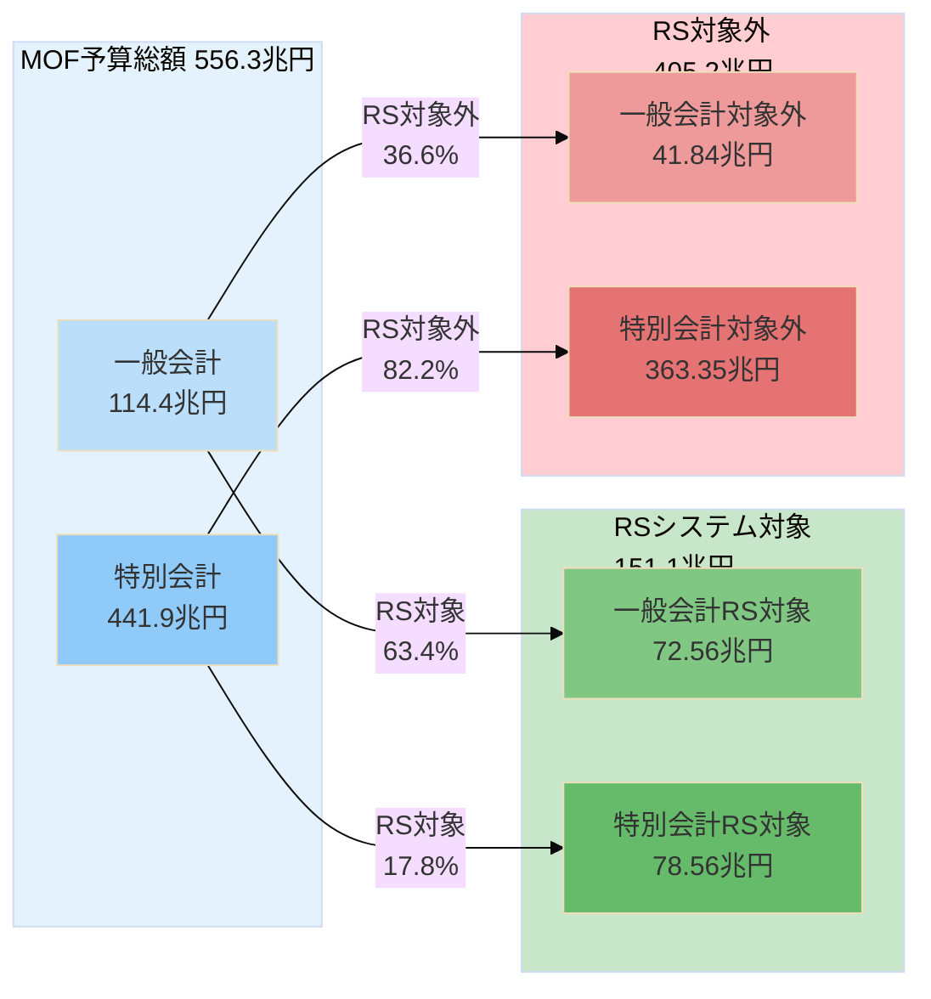

---

### 1.2 詳細フロー図（主要項目付き）

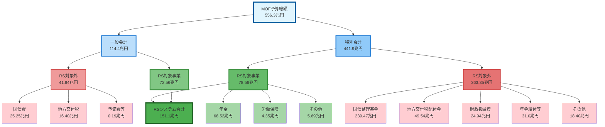

---

## 2. サンキー風詳細フロー（5列構成）

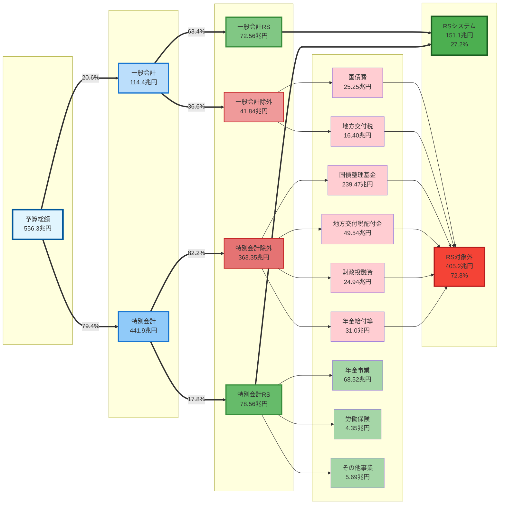

---

## 2.5 一般会計の財源構成（歳入と歳出の関係）

### 2.5.1 一般会計の財源（歳入）構成

一般会計114.4兆円は以下の財源で賄われています：

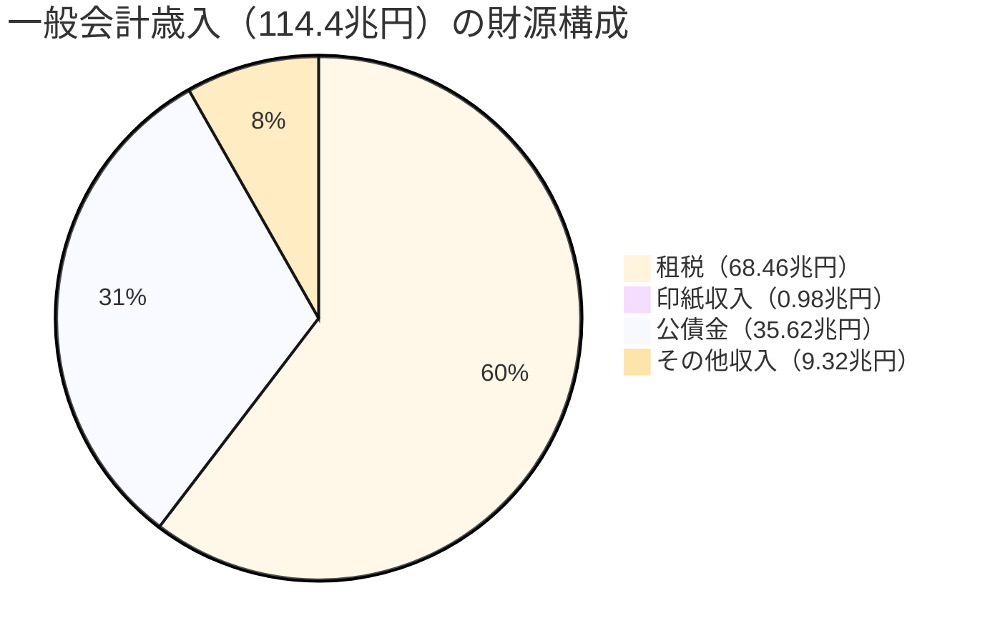

| 財源 | 金額 | 構成比 | 説明 |
|------|------|--------|------|
| **租税** | 68.46兆円 | 59.9% | 所得税、法人税、消費税等 |
| **印紙収入** | 0.98兆円 | 0.9% | 印紙税 |
| **公債金** | **35.62兆円** | **31.1%** | **新規国債発行による収入** |
| **その他収入** | 9.32兆円 | 8.1% | 諸収入、納付金、国有財産処分等 |
| **合計** | **114.38兆円** | **100%** | - |

**重要**: 公債金35.62兆円は**新規国債発行**であり、一般会計歳出の「国債費25.25兆円」（既存国債の返済）とは異なります。

---

### 2.5.2 公債金（歳入）と国債費（歳出）の違い

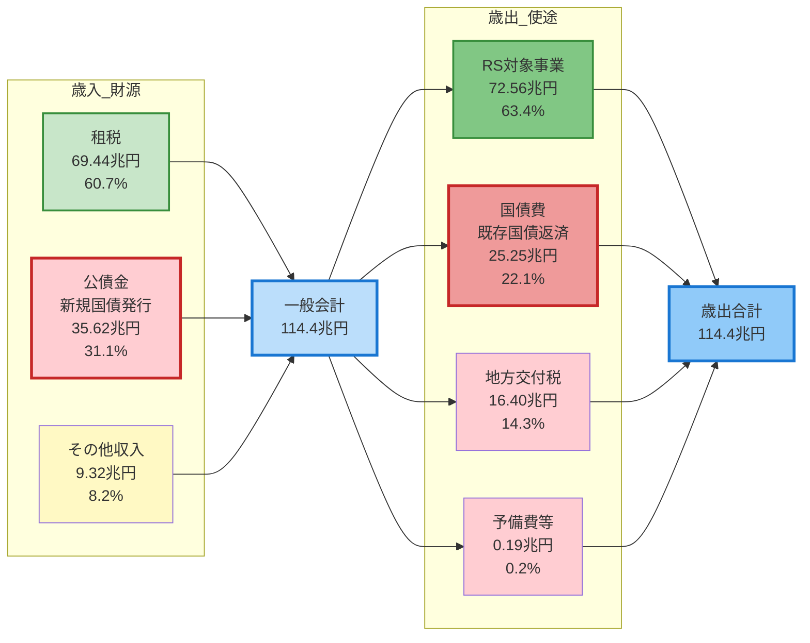

**重要な発見**:
- 🔴 **公債金（歳入）35.62兆円** > 🔴 **国債費（歳出）25.25兆円**
- 差額: **10.37兆円** = 新規国債発行額が既存国債返済額を上回る
- これは**国債残高が増加**していることを意味する

---

### 2.5.3 財源別の歳出配分（サンキー風）

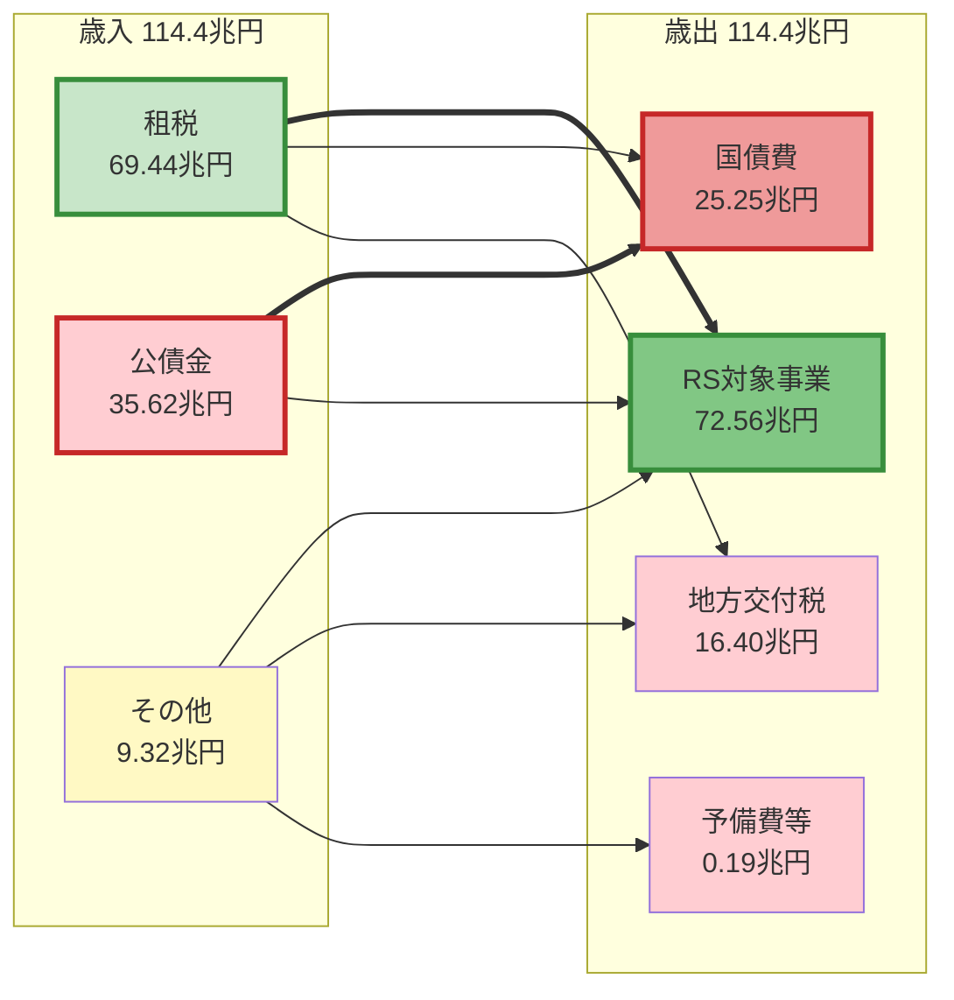

**概算配分**（単純化）:
- **租税69.44兆円**の配分:
  - RS対象事業: ~50兆円
  - 国債費: ~10兆円
  - 地方交付税: ~9兆円

- **公債金35.62兆円**の配分:
  - RS対象事業: ~20兆円
  - 国債費: ~15兆円

→ **RS対象事業の約28%（20/72.56兆円）が公債金で賄われている**

---

### 2.5.4 国債の流れ（借金のサイクル）

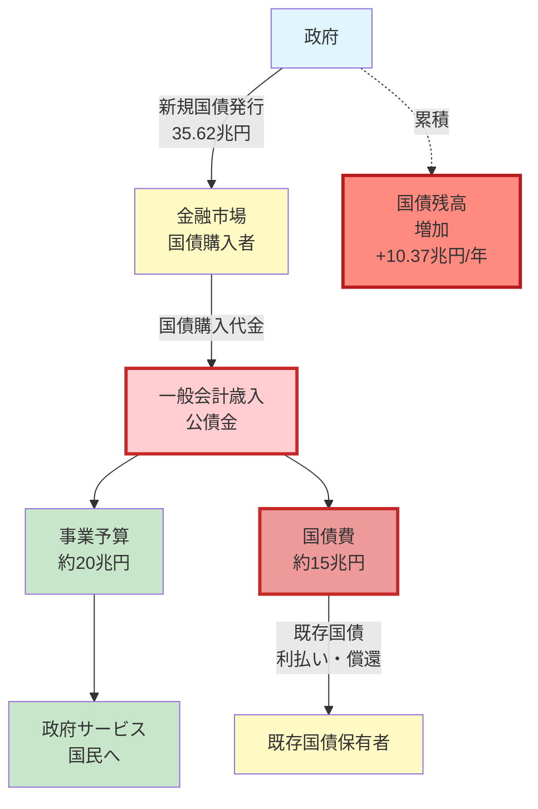

**借金のサイクル**:
1. 政府が新規国債を35.62兆円発行（歳入）
2. そのうち25.25兆円を既存国債の返済に使用（歳出）
3. 差額10.37兆円が国債残高の純増
4. 残りは事業予算等に配分

---

### 2.5.5 租税収入と公債金の推移（2023年度）

| 項目 | 金額 | 構成比 | 備考 |
|------|------|--------|------|
| **租税及印紙収入** | **69.44兆円** | **60.7%** | 持続可能な財源 |
| **公債金** | **35.62兆円** | **31.1%** | 将来世代の負担 |
| **公債依存度** | - | **31.1%** | 歳入の3割が借金 |

**比較**:
- **租税69.44兆円** vs **公債金35.62兆円** = 約2:1の比率
- 公債依存度31.1%は、歳入の約3割が借金で賄われていることを意味

---

### 2.5.6 租税収入の内訳（実データ）

2023年度租税収入（68.46兆円）の税目別内訳（MOF実データ）:

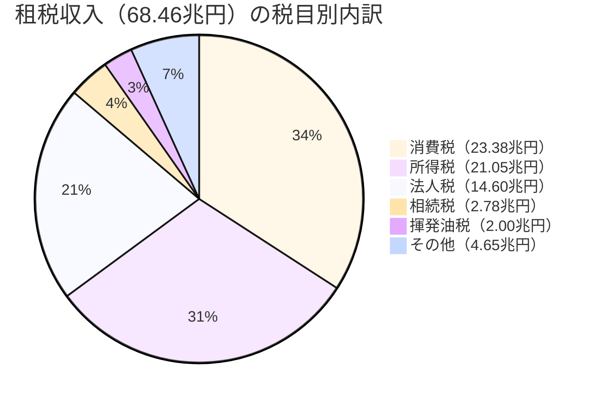

| 順位 | 税目 | 金額 | 構成比 | 備考 |
|------|------|------|--------|------|
| 1 | **消費税** | **23.38兆円** | **34.2%** | 最大の税収源 |
| 2 | **所得税** | **21.05兆円** | **30.7%** | 個人所得への課税 |
| 3 | **法人税** | **14.60兆円** | **21.3%** | 企業利益への課税 |
| 4 | 相続税 | 2.78兆円 | 4.1% | 資産課税 |
| 5 | 揮発油税 | 2.00兆円 | 2.9% | ガソリン税 |
| 6 | 酒税 | 1.18兆円 | 1.7% | - |
| 7 | 関税 | 1.12兆円 | 1.6% | 輸入品への課税 |
| 8 | たばこ税 | 0.94兆円 | 1.4% | - |
| 9 | 石油石炭税 | 0.65兆円 | 0.9% | - |
| 10 | 自動車重量税 | 0.38兆円 | 0.6% | - |
| 11 | 電源開発促進税 | 0.32兆円 | 0.5% | - |
| 12 | その他 | 0.06兆円 | 0.1% | 航空機燃料税、国際観光旅客税等 |
| - | **合計** | **68.46兆円** | **100%** | - |

**主要3税の合計**: 59.03兆円（86.2%）
- 消費税 + 所得税 + 法人税で租税収入の約9割を占める

**データソース**: `data/download/mof_2023/DL202311001a.csv`（一般会計歳入）

---

## 3. RS対象範囲の可視化（円グラフ）

### 3.1 予算全体のRS対象率

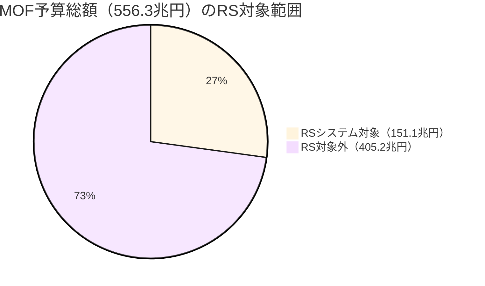

**RS対象率**: 27.2%

---

### 3.2 一般会計のRS対象率

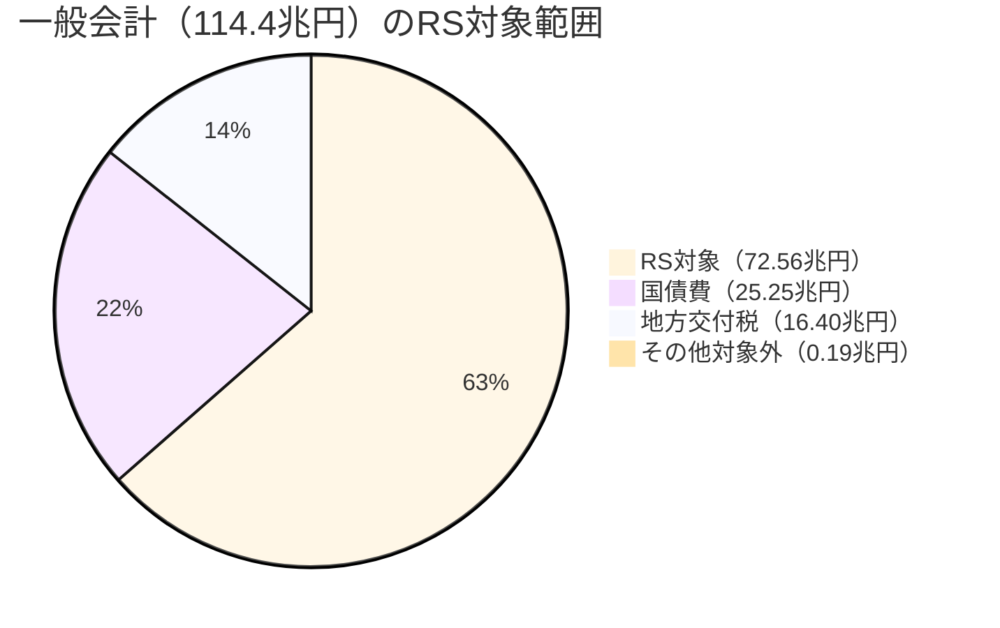

**RS対象率**: 63.4%

---

### 3.3 特別会計のRS対象率

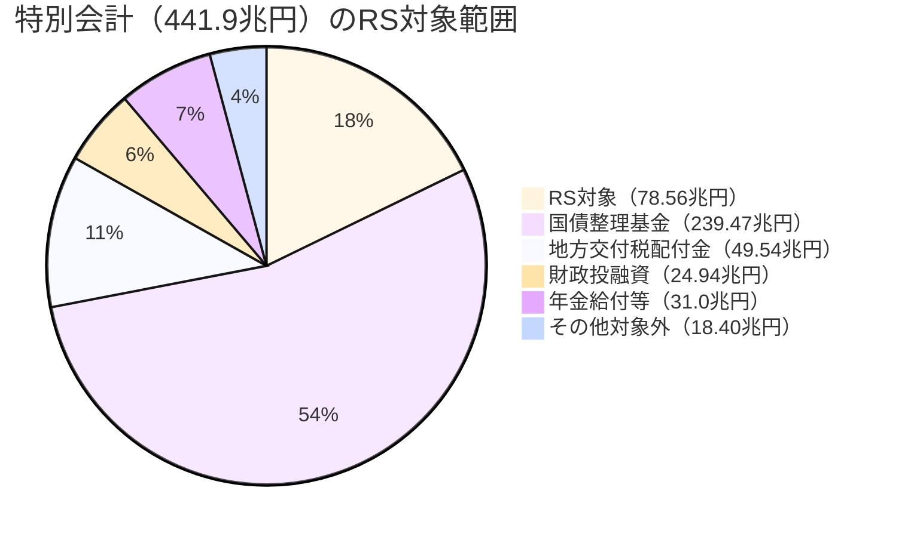

**RS対象率**: 17.8%

---

## 4. 予算構造の階層図

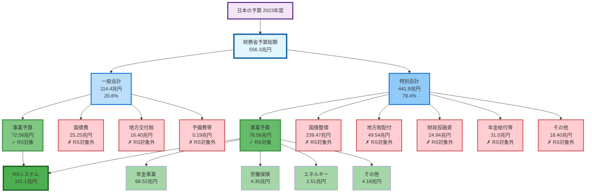

---

## 5. 一般会計と特別会計の比較（バー風）

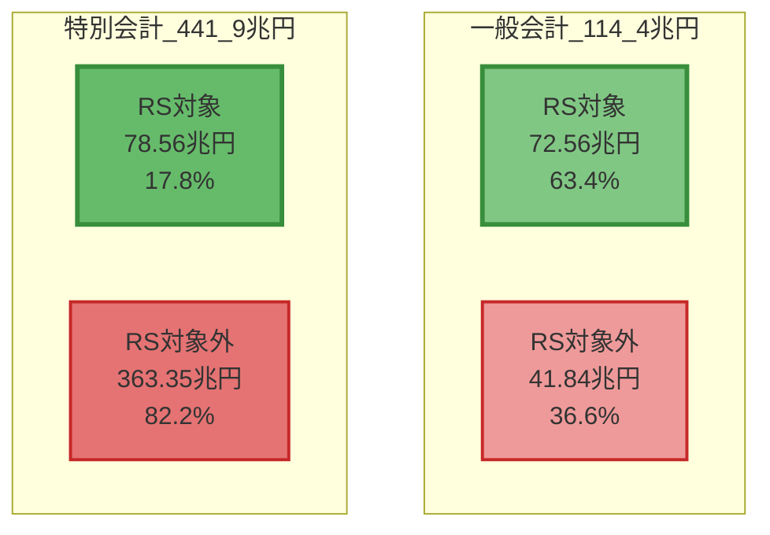

---

## 6. RS対象外の主要項目内訳

### 6.1 RS対象外総額（405.2兆円）の構成

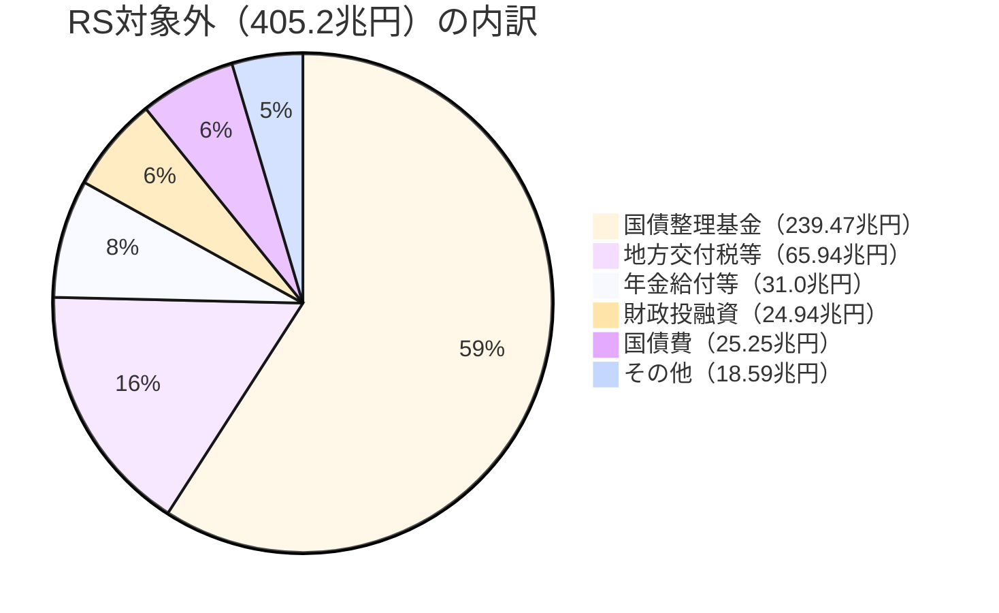

---

### 6.2 RS対象外の詳細表

| カテゴリ | 一般会計 | 特別会計 | 合計 | 構成比 |
|---------|---------|---------|------|--------|
| **国債関連** | 25.25兆円 | 239.47兆円 | **264.72兆円** | **65.3%** |
| **地方財源** | 16.40兆円 | 49.54兆円 | **65.94兆円** | **16.3%** |
| **年金給付等** | - | 31.0兆円 | **31.0兆円** | **7.6%** |
| **財政投融資** | - | 24.94兆円 | **24.94兆円** | **6.2%** |
| **その他** | 0.19兆円 | 18.40兆円 | **18.59兆円** | **4.6%** |
| **合計** | **41.84兆円** | **363.35兆円** | **405.19兆円** | **100%** |

---

## 7. RS対象範囲の詳細表

### 7.1 RSシステム（151.1兆円）の内訳

| カテゴリ | 一般会計 | 特別会計 | 合計 | 構成比 |
|---------|---------|---------|------|--------|
| **一般会計事業** | 72.56兆円 | - | **72.56兆円** | **48.0%** |
| **年金事業** | - | 68.52兆円 | **68.52兆円** | **45.3%** |
| **労働保険** | - | 4.35兆円 | **4.35兆円** | **2.9%** |
| **エネルギー対策** | - | 1.51兆円 | **1.51兆円** | **1.0%** |
| **食料安定供給** | - | 1.05兆円 | **1.05兆円** | **0.7%** |
| **その他特別会計** | - | 3.13兆円 | **3.13兆円** | **2.1%** |
| **合計** | **72.56兆円** | **78.56兆円** | **151.12兆円** | **100%** |

---

### 7.2 一般会計RS対象（72.56兆円）の主要項目

| 順位 | 項目 | 金額（兆円） | 備考 |
|------|------|-------------|------|
| 1 | 医療保険給付諸費 | 10.30 | 国民健康保険等 |
| 2 | 介護保険制度運営推進費 | 3.43 | 介護保険給付 |
| 3 | 防衛力強化のための資金へ繰入 | 3.38 | 防衛費 |
| 4 | 生活保護等対策費 | 2.91 | 生活保護 |
| 5 | 障害保健福祉費 | 2.00 | 障害福祉サービス |
| 6 | 義務教育費国庫負担金 | 1.52 | 教員人件費 |
| 7 | 自衛官給与費 | 1.47 | 人件費 |
| 8 | 社会資本総合整備事業費 | 1.29 | インフラ整備 |
| 9 | 航空機整備費 | 1.19 | 防衛装備 |
| 10 | 武器車両等整備費 | 1.12 | 防衛装備 |
| - | その他 | 43.95 | - |
| **合計** | - | **72.56** | - |

---

### 7.3 特別会計RS対象（78.56兆円）の主要項目

| 順位 | 特別会計 | 金額（兆円） | 構成比 | 主要事業 |
|------|---------|-------------|--------|---------|
| 1 | 年金 | 68.52 | 87.2% | 年金制度運営、健康勘定、子育て支援 |
| 2 | 労働保険 | 4.35 | 5.5% | 雇用対策、職業訓練、労災保険 |
| 3 | エネルギー対策 | 1.51 | 1.9% | 再生エネルギー、電源開発 |
| 4 | 食料安定供給 | 1.05 | 1.3% | 農業政策、食糧管理 |
| 5 | 東日本大震災復興 | 0.54 | 0.7% | 復興事業 |
| 6 | 自動車安全 | 0.33 | 0.4% | 空港整備、自動車検査 |
| 7 | その他 | 2.26 | 2.9% | 特許、地震再保険等 |
| **合計** | - | **78.56** | **100%** | - |

---

## 8. 数値サマリー

### 8.1 MOF予算総額（556.3兆円）の構成

```
MOF予算総額: 556.3兆円
├─ 一般会計: 114.4兆円（20.6%）
│  ├─ RS対象: 72.56兆円（63.4%）
│  └─ RS対象外: 41.84兆円（36.6%）
│     ├─ 国債費: 25.25兆円
│     ├─ 地方交付税: 16.40兆円
│     └─ 予備費等: 0.19兆円
│
└─ 特別会計: 441.9兆円（79.4%）
   ├─ RS対象: 78.56兆円（17.8%）
   │  ├─ 年金: 68.52兆円
   │  ├─ 労働保険: 4.35兆円
   │  └─ その他: 5.69兆円
   │
   └─ RS対象外: 363.35兆円（82.2%）
      ├─ 国債整理基金: 239.47兆円
      ├─ 地方交付税配付金: 49.54兆円
      ├─ 財政投融資: 24.94兆円
      ├─ 年金給付等: 31.0兆円
      └─ その他: 18.40兆円
```

---

### 8.2 RS対象率の比較

| 会計区分 | MOF総額 | RS対象額 | RS対象外 | RS対象率 |
|---------|---------|----------|----------|----------|
| **一般会計** | 114.4兆円 | 72.56兆円 | 41.84兆円 | **63.4%** |
| **特別会計** | 441.9兆円 | 78.56兆円 | 363.35兆円 | **17.8%** |
| **合計** | **556.3兆円** | **151.12兆円** | **405.19兆円** | **27.2%** |

**重要な発見**:
- 一般会計は約6割がRS対象（事業予算が中心）
- 特別会計は約2割のみがRS対象（国債・地方財源が大半）
- 全体では約3割がRS対象（事業レビューの範囲）

---

### 8.3 RS対象外の主要カテゴリ

| カテゴリ | 金額 | 全体に占める割合 | 説明 |
|---------|------|-----------------|------|
| **国債関連** | 264.72兆円 | 47.6% | 国債の償還・利払い（制度的支出） |
| **地方財源** | 65.94兆円 | 11.9% | 地方自治体への財源移転（制度的支出） |
| **年金給付等** | 31.0兆円 | 5.6% | 年金・保険給付金（給付型支出） |
| **財政投融資** | 24.94兆円 | 4.5% | 融資・投資活動（金融的支出） |
| **その他** | 18.59兆円 | 3.3% | 外為、予備費等 |
| **RS対象事業** | 151.12兆円 | 27.2% | 事業レビュー対象（政策的支出） |

---

## 9. 図の解説

### 9.1 なぜ特別会計のRS対象率が低いのか（17.8%）

**特別会計（441.9兆円）の大部分は「制度的支出」**:
1. **国債整理基金（239.47兆円）**: 国債の償還・利払い専用
   - 事業ではなく制度的義務
   - RS対象外

2. **地方交付税配付金（49.54兆円）**: 地方自治体への財源移転
   - 事業ではなく財源配分
   - RS対象外

3. **財政投融資（24.94兆円）**: 融資・投資活動
   - 事業ではなく金融活動
   - RS対象外（0.1%のみRS対象）

4. **年金給付等（31.0兆円）**: 年金・保険給付金の支払い
   - 給付型支出（制度運営費のみRS対象）
   - 大部分がRS対象外

---

### 9.2 なぜ一般会計のRS対象率が高いのか（63.4%）

**一般会計（114.4兆円）の約6割は「事業予算」**:
1. **国債費（25.25兆円）**: RS対象外
2. **地方交付税（16.40兆円）**: RS対象外
3. **その他（72.75兆円）**: ほぼすべてRS対象事業
   - 医療保険、介護保険
   - 防衛費（装備・人件費）
   - 教育費
   - 社会資本整備
   - 生活保護等

**結果**: 一般会計の大部分は政策的な事業予算であり、RS対象となる。

---

### 9.3 RSシステムの対象範囲（151.1兆円）の特徴

**RSシステムは「事業レビュー」対象のみをカバー**:
- **政策的支出**: 政府の施策を実行するための事業
- **事業評価可能**: PDCAサイクルで効果測定可能
- **支出先明確**: 契約先・交付先が具体的に特定可能

**RS対象外は「制度的支出」**:
- **制度的義務**: 国債償還、地方財源配分
- **給付型支出**: 年金・保険給付（受給権に基づく支払い）
- **金融的支出**: 融資・投資（返済前提）

---

## 10. サンキー図アプリへの応用

### 10.1 現在のサンキー図との対応

現在のサンキー図システムでは:
- **予算総額**: 146.63兆円（RS 2024年度データ）
- **内訳**: 一般会計 + 特別会計の事業のみ

**MOF全体を含めた拡張版サンキー図の可能性**:
1. **Level 0**: MOF予算総額（556.3兆円）
2. **Level 1**: 一般会計 vs 特別会計
3. **Level 2**: RS対象 vs RS対象外
4. **Level 3**: RS対象の場合、府省庁別に分解（現在のシステム）
5. **Level 3'**: RS対象外の場合、主要カテゴリ別に分解

---

### 10.2 拡張サンキー図のノード構成案

```
予算総額ノード（556.3兆円）
├─ 一般会計ノード（114.4兆円）
│  ├─ RS対象ノード（72.56兆円）
│  │  └─ [現在のサンキー図に接続]
│  │     ├─ 厚生労働省
│  │     ├─ 防衛省
│  │     └─ ...
│  │
│  └─ RS対象外ノード（41.84兆円）
│     ├─ 国債費（25.25兆円）
│     ├─ 地方交付税（16.40兆円）
│     └─ 予備費等（0.19兆円）
│
└─ 特別会計ノード（441.9兆円）
   ├─ RS対象ノード（78.56兆円）
   │  ├─ 年金（68.52兆円）
   │  ├─ 労働保険（4.35兆円）
   │  └─ その他（5.69兆円）
   │
   └─ RS対象外ノード（363.35兆円）
      ├─ 国債整理基金（239.47兆円）
      ├─ 地方交付税配付金（49.54兆円）
      ├─ 財政投融資（24.94兆円）
      ├─ 年金給付等（31.0兆円）
      └─ その他（18.40兆円）
```

---

### 10.3 拡張機能の実装イメージ

**新しいビューモード**: "MOF全体ビュー"
- 現在の "global" ビューの上位レイヤー
- URLパラメータ: `?view=mof-overview`

**ノードクリックアクション**:
- 「予算総額」クリック → 一般会計・特別会計に展開
- 「一般会計RS対象」クリック → 現在の global ビューに遷移
- 「RS対象外」ノードクリック → 詳細内訳表示（モーダル or 新ページ）

---

## 11. データソース

### 11.1 MOFデータ
- **ファイル**: `data/download/mof_2023/DL202311001b.csv`, `DL202312001b.csv`
- **内容**: 2023年度（令和5年度）一般会計・特別会計歳出（当初予算）
- **分析スクリプト**:
  - `scripts/analyze-mof-exclusions.ts` (一般会計分析)
  - `scripts/analyze-mof-special-accounts.ts` (特別会計分析)

### 11.2 RSシステムデータ
- **ファイル**: `data/year_2024/2-2_RS_2024_予算・執行_予算種別・歳出予算項目.csv`
- **内容**: 2024年度レビューシート（2023年度予算）の歳出項目
- **分析スクリプト**:
  - `scripts/analyze-rs-special-accounts.ts` (RS特別会計内訳)
  - `scripts/analyze-rs-mof-comparison.ts` (RS-MOF比較)

---

## 12. 参考ドキュメント

- [20260201_1423_RSシステムとMOF歳入歳出データの対応関係分析.md](20260201_1423_RSシステムとMOF歳入歳出データの対応関係分析.md)
  - RS対象範囲とMOFデータの詳細比較

- [20260201_2111_厚生年金勘定と基礎年金勘定の詳細分析.md](20260201_2111_厚生年金勘定と基礎年金勘定の詳細分析.md)
  - 年金特別会計の詳細分析

- [20260201_2200_年金特別会計資金フロー可視化.md](20260201_2200_年金特別会計資金フロー可視化.md)
  - 年金特別会計の資金フロー図

---

## 13. まとめ

### 13.1 重要な発見

1. **MOF予算総額の27.2%がRS対象**
   - RS対象: 151.1兆円（事業レビュー対象）
   - RS対象外: 405.2兆円（制度的支出）

2. **一般会計は63.4%、特別会計は17.8%がRS対象**
   - 一般会計: 事業予算が中心 → RS対象率高い
   - 特別会計: 制度的支出が中心 → RS対象率低い

3. **RS対象外の73%は国債・地方財源**
   - 国債関連: 264.72兆円（65.3%）
   - 地方財源: 65.94兆円（16.3%）
   - これらは事業ではなく制度的義務

### 13.2 Mermaid図の効果

このドキュメントのMermaid図により以下が明確化された:
- MOF予算全体（556.3兆円）とRS対象範囲（151.1兆円）の関係
- 一般会計と特別会計の構成比の違い
- RS対象外の主要カテゴリ（国債、地方財源、給付金等）
- サンキー図アプリへの拡張可能性

### 13.3 今後の活用方針

1. **サンキー図アプリの拡張**
   - MOF全体ビューの追加
   - RS対象外データの可視化
   - 一般会計・特別会計の切り替え表示

2. **データ分析の深化**
   - 年度間比較（2021-2024）
   - RS対象率の推移分析
   - 府省庁別のRS対象率分析

3. **ドキュメント連携**
   - 年金特別会計フロー図との統合
   - MOF-RS対応関係分析との連携
   - 総合的な予算可視化システムの構築

---

**作成日**: 2026年2月2日 00:00
**データ年度**: 2023年度（令和5年度）当初予算
**分析スクリプト**: `scripts/analyze-rs-mof-comparison.ts`, `scripts/analyze-mof-special-accounts.ts`
