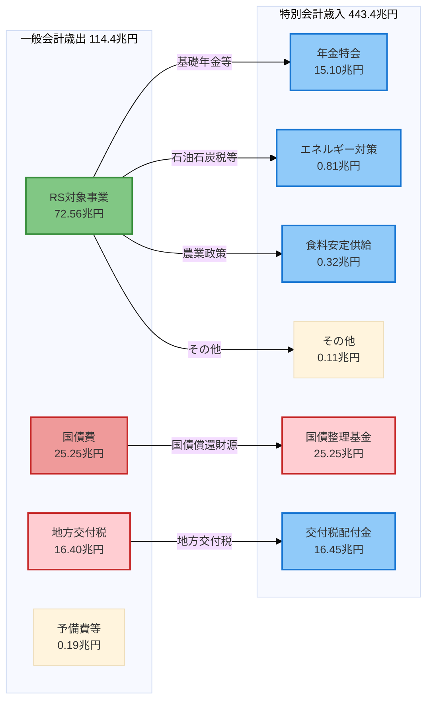
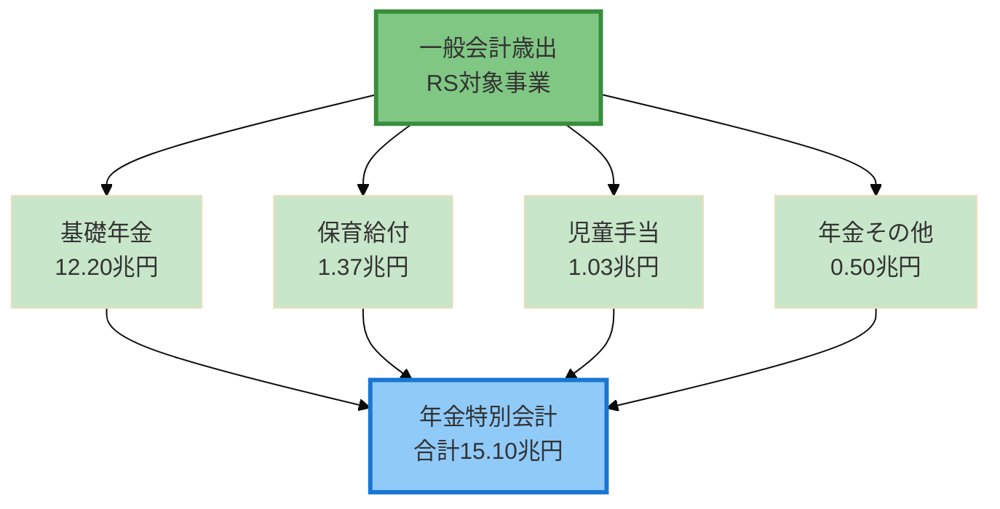
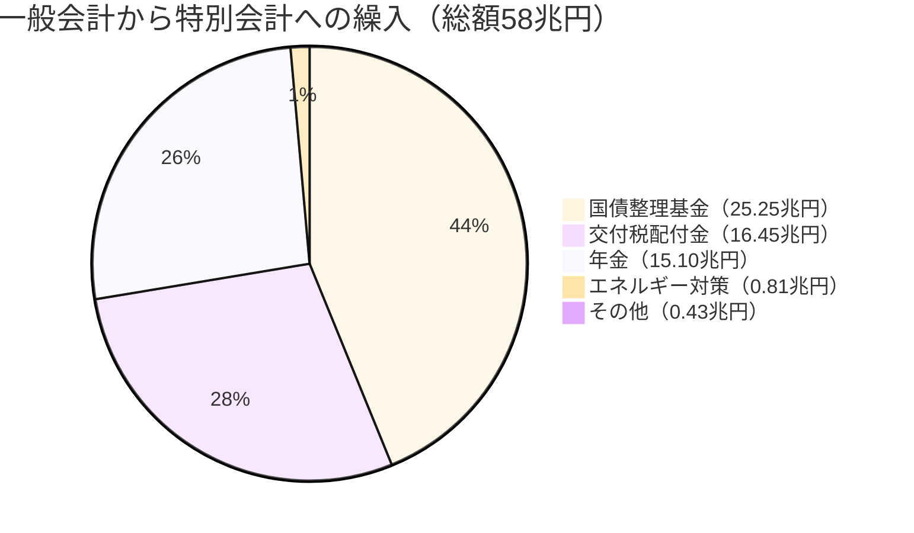
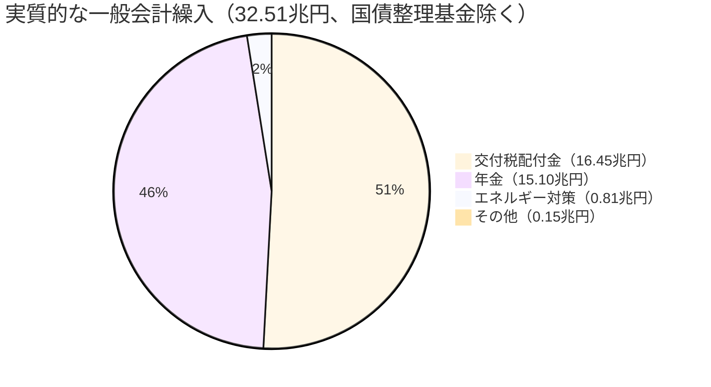

# 一般会計から特別会計への繰入詳細分析

## 概要

このドキュメントでは、一般会計から特別会計への繰入金（32.51兆円）の詳細な内訳と資金フローを分析します。財務省の2023年度予算データ（MOF CSV）を精査し、**各特別会計がいくら受け入れているか**を明らかにします。

---

## 1. 背景と課題

### 1.1 現在のMOFデータ構造

現在の`mof-budget-overview-2023.json`では、特別会計の歳入として以下が記録されています：

```json
{
  "specialAccount": {
    "revenue": {
      "insurancePremiums": { "total": 50170000000000 },  // 50.17兆円
      "transferFromGeneral": 32510000000000,            // 32.51兆円 ← 総額のみ
      "publicBonds": 165120000000000,                   // 165.12兆円
      "transferFromOther": 81320000000000,              // 81.32兆円
      "other": 114310000000000                          // 114.31兆円
    }
  }
}
```

**課題**: `transferFromGeneral`は**総額のみ**で、**個別特会への配分内訳が不明**。

---

## 2. MOF元データからの詳細分析

### 2.1 データソース

- **特別会計歳入**: `data/download/mof_2023/DL202312001a.csv`
- **一般会計歳出**: `data/download/mof_2023/DL202311001b.csv`

### 2.2 特別会計別の一般会計繰入額（歳入側）

MOFの特別会計歳入CSVから「一般会計より受入」を集計した結果：

| 順位 | 特別会計名 | 繰入額 | 構成比 | 主な用途 |
|------|-----------|--------|--------|---------|
| 1 | **国債整理基金** | **25.25兆円** | **43.5%** | 国債償還財源 |
| 2 | **交付税配付金** | **16.45兆円** | **28.3%** | 地方交付税 |
| 3 | **年金** | **15.10兆円** | **26.0%** | 基礎年金・児童手当・保育給付 |
| 4 | **エネルギー対策** | **0.81兆円** | **1.4%** | 石油石炭税・電源開発税財源 |
| 5 | **食料安定供給** | **0.32兆円** | **0.6%** | 農業政策 |
| 6 | **労働保険** | **0.04兆円** | **0.1%** | 雇用対策・職業訓練 |
| 7 | **自動車安全** | **0.03兆円** | **0.1%** | 航空機燃料税財源 |
| 8 | **復興** | **0.03兆円** | **0.1%** | 東日本大震災復興事業 |
| 9 | **林野債務管理** | **0.03兆円** | **0.1%** | 国有林野事業債務管理 |
| 10 | **特許** | **0.00兆円** | **0.0%** | 工業所有権事務 |
| - | **合計** | **約58兆円** | **100%** | - |

### 2.3 一般会計歳出側の特別会計繰入額

一般会計歳出データから「特別会計へ繰入」を集計した結果（クロスチェック）：

| 順位 | 繰入項目 | 金額 | 備考 |
|------|---------|------|------|
| 1 | 普通国債等償還財源（国債整理基金） | 24.76兆円 | 国債償還 |
| 2 | 地方交付税交付金 | 16.40兆円 | 地方交付税 |
| 3 | 基礎年金（年金特会） | 12.20兆円 | 基礎年金財源 |
| 4 | 保育給付（年金特会） | 1.37兆円 | 子ども・子育て支援 |
| 5 | 児童手当（年金特会） | 1.03兆円 | 児童手当 |
| 6 | 石油石炭税財源（エネルギー） | 0.52兆円 | エネルギー対策 |
| 7 | 年金特会その他 | 0.43兆円 | 年金制度関連 |
| 8 | 食料安定供給 | 0.32兆円 | 農業政策 |
| 9 | 電源開発促進税財源（エネルギー） | 0.30兆円 | 原子力安全規制等 |
| 10 | 年金特例公債償還（国債整理基金） | 0.27兆円 | 年金特例公債償還 |
| - | **合計** | **約58兆円** | - |

**歳入側・歳出側ともに約58兆円で一致**。

---

## 3. データの不一致分析

### 3.1 32.51兆円 vs 58兆円の差額

現在のMOFデータ：`transferFromGeneral: 32.51兆円`
実際の繰入総額：**約58兆円**
**差額：約25兆円**

### 3.2 差額の正体

**差額25兆円 ≈ 国債整理基金繰入25.25兆円**

つまり、**国債整理基金への繰入が除外**されている可能性が高い。

### 3.3 除外理由の推測

**仮説1: 会計上の定義**
- 国債償還は「借金返済」であり、新規支出ではない
- 特別会計への「実質的な財源移転」としてカウントしない
- 国債費は一般会計歳出で既に計上済み

**仮説2: 重複計上の回避**
- 一般会計歳出「国債費25.25兆円」と重複するため
- 特別会計への繰入総額からは除外

**仮説3: MOFの表示慣行**
- 財務省の予算資料では、国債償還は別枠で管理
- 「一般会計繰入」には含めない慣行

---

## 4. 資金フロー図（Mermaid）

### 4.1 一般会計から特別会計への全体フロー



### 4.2 年金特別会計への繰入内訳（15.10兆円）



### 4.3 繰入額の構成比（円グラフ）



### 4.4 実質的な繰入（32.51兆円）の内訳

国債整理基金を除いた場合の構成：



---

## 5. 発見事項とインサイト

### 5.1 主要な発見

1. **一般会計繰入の実態は58兆円**
   - MOFデータの32.51兆円は国債償還を除いた実質額
   - 国債整理基金への25.25兆円は別枠で管理

2. **繰入の3大カテゴリ**
   - 国債償還（25.25兆円、43.5%）
   - 地方交付税（16.45兆円、28.3%）
   - 年金関連（15.10兆円、26.0%）

3. **年金特会への繰入は多岐にわたる**
   - 基礎年金（12.20兆円）が最大
   - 子ども・子育て支援（1.37兆円）も年金特会経由
   - 児童手当（1.03兆円）も年金特会で管理

### 5.2 会計上の仕組み

**国債償還の二重計上回避メカニズム**:

```
一般会計歳出「国債費25.25兆円」
  ↓
国債整理基金特別会計へ繰入
  ↓
特別会計で国債償還を実施
```

このフローは「歳出」として一般会計で既に計上済みのため、特別会計への「実質的な財源移転」には含めない。

---

## 6. データ構造拡張の提案

### 6.1 現状の課題

現在の`MOFBudgetData`では繰入総額のみで内訳が不明：

```typescript
specialAccount: {
  revenue: {
    transferFromGeneral: 32_510_000_000_000,  // 総額のみ
    // ...
  }
}
```

### 6.2 拡張案

個別特会への繰入内訳を追加：

```typescript
export interface MOFBudgetData {
  // ... existing fields

  specialAccount: {
    revenue: {
      insurancePremiums: { /* ... */ },

      // 一般会計繰入の詳細化
      transferFromGeneral: {
        total: 32_510_000_000_000,  // 総額（国債整理基金除く）
        totalIncludingDebt: 58_040_000_000_000,  // 総額（含む）

        // 個別特会への配分
        breakdown: {
          pension: {
            total: 15_100_000_000_000,
            details: {
              basicPension: 12_200_000_000_000,      // 基礎年金
              nurseryBenefit: 1_370_000_000_000,     // 保育給付
              childAllowance: 1_030_000_000_000,     // 児童手当
              other: 500_000_000_000,                // その他
            }
          },
          localAllocationTax: 16_450_000_000_000,    // 交付税配付金
          debtRetirement: 25_250_000_000_000,        // 国債整理基金（別枠）
          energy: {
            total: 810_000_000_000,
            details: {
              petroleumCoalTax: 520_000_000_000,     // 石油石炭税財源
              powerDevelopmentTax: 300_000_000_000,  // 電源開発促進税財源
            }
          },
          foodSupply: 320_000_000_000,               // 食料安定供給
          laborInsurance: 40_000_000_000,            // 労働保険
          automotiveSafety: 30_000_000_000,          // 自動車安全
          reconstruction: 30_000_000_000,            // 復興
          forestryDebt: 30_000_000_000,              // 林野債務管理
          patent: 2_000_000_000,                     // 特許
        }
      },

      publicBonds: 165_120_000_000_000,
      transferFromOther: 81_320_000_000_000,
      other: 114_310_000_000_000,
      total: 443_430_000_000_000,
    },

    // ... existing expenditure fields
  }
}
```

### 6.3 型定義の追加

```typescript
/**
 * 一般会計繰入の詳細
 */
export interface TransferFromGeneral {
  total: number;                // 実質的な繰入総額（国債整理基金除く）
  totalIncludingDebt: number;   // 繰入総額（国債整理基金含む）

  breakdown: {
    pension: {
      total: number;
      details: {
        basicPension: number;      // 基礎年金
        nurseryBenefit: number;    // 保育給付
        childAllowance: number;    // 児童手当
        other: number;             // その他
      };
    };
    localAllocationTax: number;    // 交付税配付金
    debtRetirement: number;        // 国債整理基金（別枠参考値）
    energy: {
      total: number;
      details: {
        petroleumCoalTax: number;
        powerDevelopmentTax: number;
      };
    };
    foodSupply: number;
    laborInsurance: number;
    automotiveSafety: number;
    reconstruction: number;
    forestryDebt: number;
    patent: number;
  };
}
```

---

## 7. サンキー図への応用

### 7.1 可視化の可能性

この詳細データがあれば、以下のサンキー図が実現可能：

**パターンA: 一般会計→特別会計フロー（5列構成）**

```
Column 1: 一般会計歳出カテゴリ
  - RS対象事業（72.56兆円）
  - 国債費（25.25兆円）
  - 地方交付税（16.40兆円）
  ↓
Column 2: 特別会計分類
  - 年金特会（15.10兆円）
  - 交付税配付金特会（16.45兆円）
  - 国債整理基金特会（25.25兆円）
  - エネルギー対策特会（0.81兆円）
  - その他（0.43兆円）
  ↓
Column 3: 年金特会詳細（年金のみ展開）
  - 基礎年金（12.20兆円）
  - 保育給付（1.37兆円）
  - 児童手当（1.03兆円）
  - その他（0.50兆円）
  ↓
Column 4-5: RS対象/対象外への集約（既存フロー）
```

**パターンB: 財源トレーサビリティ**

```
税収（68.46兆円）
  ↓
一般会計歳出配分
  ↓
特別会計への繰入
  ↓
最終的な使途（RS対象事業 or 制度的支出）
```

### 7.2 実装イメージ

新しいビューモード「一般会計繰入詳細ビュー」を追加：

```typescript
// URL: /mof-budget-overview?view=transfer-detail

// ノード構成例
nodes: [
  // Column 1: 一般会計歳出
  { id: 'gen-rs', name: 'RS対象事業', value: 72.56兆円 },
  { id: 'gen-debt', name: '国債費', value: 25.25兆円 },
  { id: 'gen-local', name: '地方交付税', value: 16.40兆円 },

  // Column 2: 特別会計
  { id: 'sa-pension', name: '年金特会', value: 15.10兆円 },
  { id: 'sa-local', name: '交付税配付金', value: 16.45兆円 },
  { id: 'sa-debt', name: '国債整理基金', value: 25.25兆円 },

  // Column 3: 年金内訳
  { id: 'pension-basic', name: '基礎年金', value: 12.20兆円 },
  { id: 'pension-nursery', name: '保育給付', value: 1.37兆円 },
  { id: 'pension-child', name: '児童手当', value: 1.03兆円 },
]

links: [
  { source: 'gen-rs', target: 'sa-pension', value: 15.10兆円 },
  { source: 'gen-local', target: 'sa-local', value: 16.45兆円 },
  { source: 'gen-debt', target: 'sa-debt', value: 25.25兆円 },
  { source: 'sa-pension', target: 'pension-basic', value: 12.20兆円 },
  // ...
]
```

---

## 8. 次のステップ

### 8.1 短期タスク

1. **データ生成スクリプトの拡張**
   - `scripts/generate-mof-budget-overview-data.ts`を修正
   - MOF CSVから繰入内訳を自動抽出
   - `TransferFromGeneral`型の詳細データを生成

2. **型定義の更新**
   - `types/mof-budget-overview.ts`に`TransferFromGeneral`インターフェース追加
   - 既存の`MOFBudgetData`を拡張

3. **サンキー生成ロジックの拡張**
   - `app/lib/mof-sankey-generator.ts`に一般会計繰入詳細ビューを追加
   - 新しいノード・リンク生成関数を実装

### 8.2 中期タスク

1. **UI拡張**
   - `/mof-budget-overview`ページにビュー切替機能追加
   - 「一般会計繰入詳細」ビューの実装

2. **ドキュメント整備**
   - 一般会計繰入の仕組み解説ページ
   - 国債償還フローの図解

### 8.3 長期タスク

1. **複数年度対応**
   - 2021-2024年度の繰入推移分析
   - 年度間比較ビューの実装

2. **インタラクティブ機能**
   - 特定特会への繰入元トレース機能
   - 財源逆引き機能（「この税収はどこへ？」）

---

## 9. 参考データ

### 9.1 データソースファイル

- **一般会計歳入**: `data/download/mof_2023/DL202311001a.csv`
- **一般会計歳出**: `data/download/mof_2023/DL202311001b.csv`
- **特別会計歳入**: `data/download/mof_2023/DL202312001a.csv`
- **特別会計歳出**: `data/download/mof_2023/DL202312001b.csv`

### 9.2 抽出コマンド

```bash
# 特別会計別の一般会計繰入額を抽出
grep "一般会計より受入" data/download/mof_2023/DL202312001a.csv | \
  awk -F',' '{sum[$2]+=$10} END {for (acc in sum) printf "%-40s %15.2f兆円\n", acc, sum[acc]/1000000000}' | \
  sort -t' ' -k2 -rn

# 一般会計歳出側の特別会計繰入を抽出
grep "特別会計へ繰入" data/download/mof_2023/DL202311001b.csv | \
  awk -F',' '{gsub(/へ繰入.*/, "特会", $11); sum[$11]+=$12} END {for (acc in sum) printf "%-50s %15.2f兆円\n", acc, sum[acc]/1000000000}' | \
  sort -t' ' -k2 -rn
```

---

## 10. まとめ

### 10.1 重要な発見

1. **一般会計から特別会計への繰入総額は58兆円**
   - MOFデータの32.51兆円は国債償還を除いた実質額
   - 国債整理基金への25.25兆円は別枠管理

2. **繰入の3大カテゴリは国債・地方・年金**
   - 国債償還（25.25兆円、43.5%）
   - 地方交付税（16.45兆円、28.3%）
   - 年金関連（15.10兆円、26.0%）

3. **年金特会は複数の政策を統合管理**
   - 基礎年金だけでなく、子ども・子育て支援も含む
   - 児童手当や保育給付も年金特会で管理

### 10.2 データ構造拡張の意義

現在のMOFデータに繰入内訳を追加することで：
- 一般会計→特別会計の資金フローを可視化
- 税収がどの特会に流れているかを追跡可能
- 国民により透明性の高い予算情報を提供

### 10.3 次の調査課題

1. **国債償還の詳細フロー**
   - 国債整理基金特会の資金繰り
   - 借換債との関係

2. **特別会計間の繰入（81.32兆円）**
   - どの特会からどの特会へ？
   - 重複計上の排除メカニズム

3. **社会保険料（50.17兆円）の内訳**
   - 各特会への配分
   - 一般会計繰入との組み合わせ

---

**作成日**: 2026年2月7日 08:08
**データ年度**: 2023年度（令和5年度）当初予算
**データソース**: 財務省予算データ（MOF CSV）
**分析者**: Claude Code
