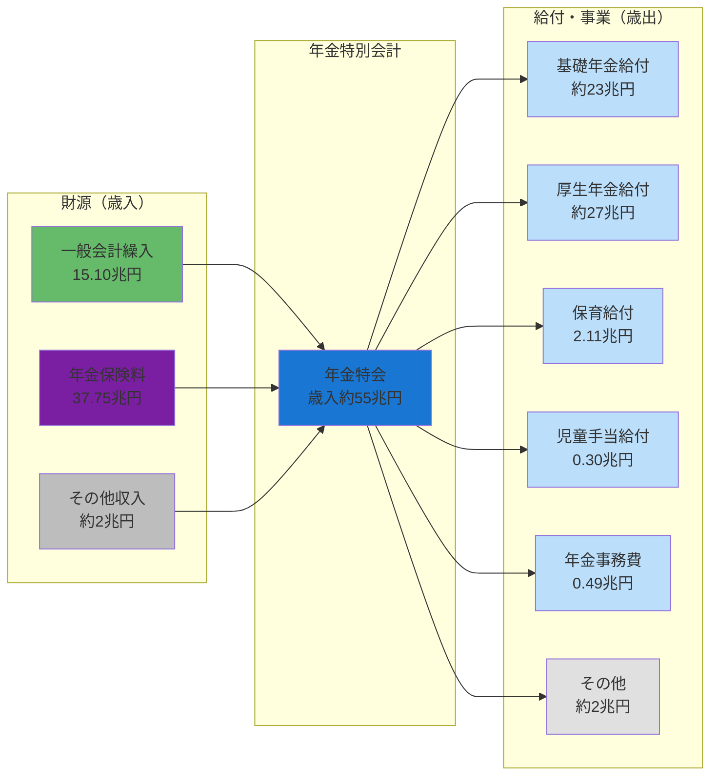
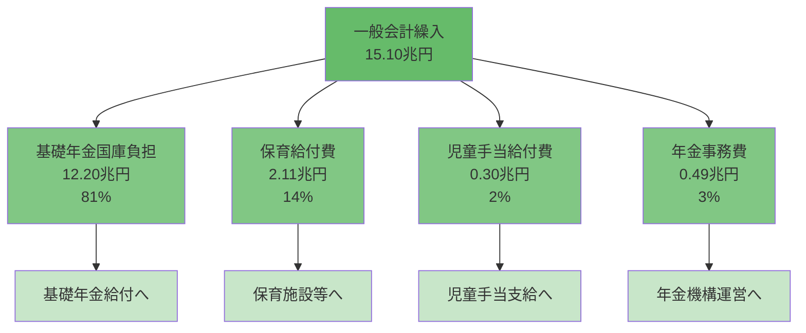
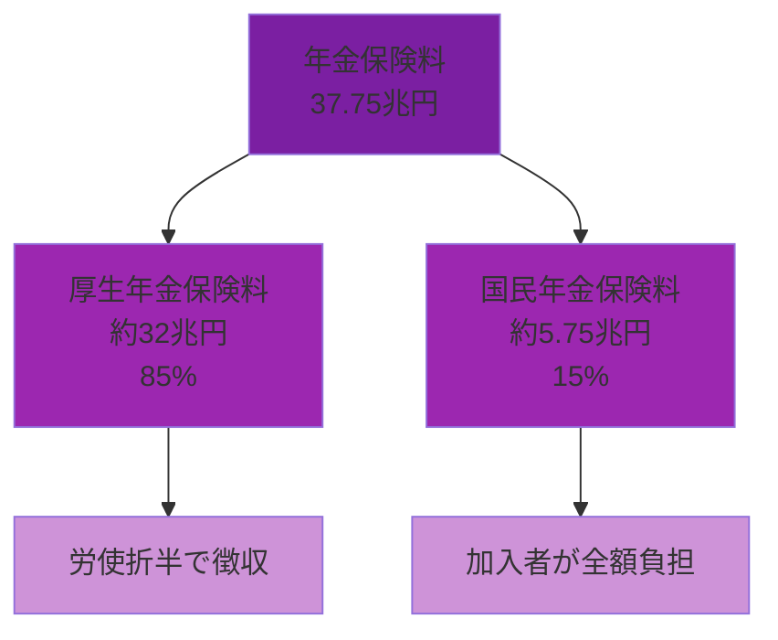
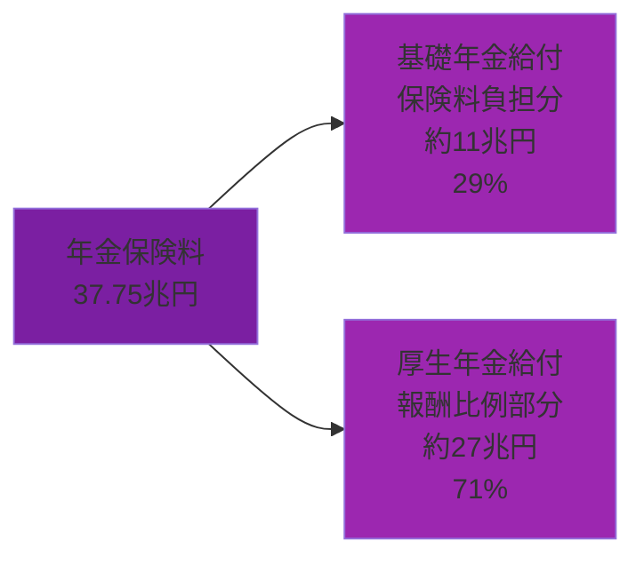
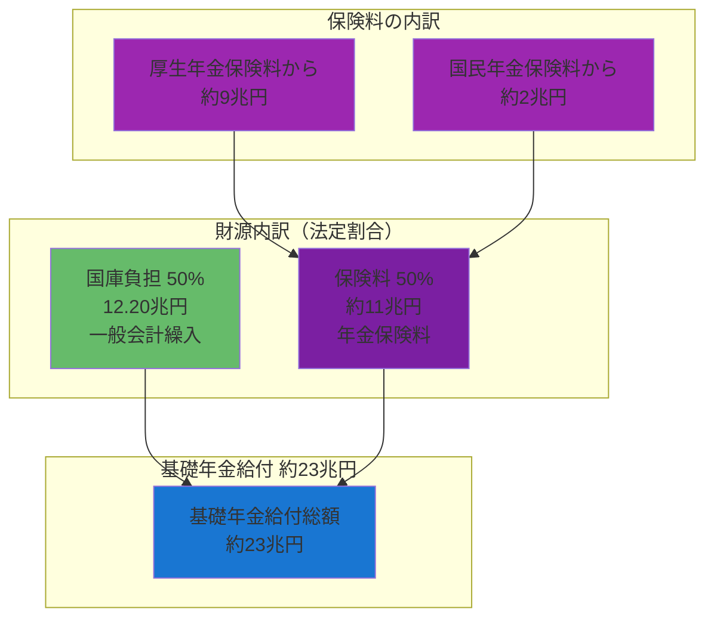
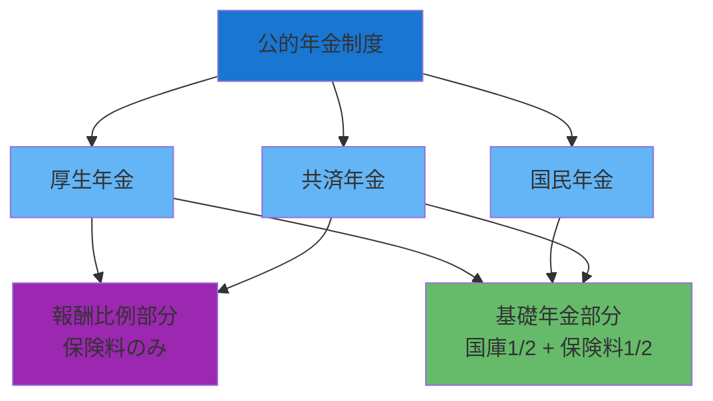
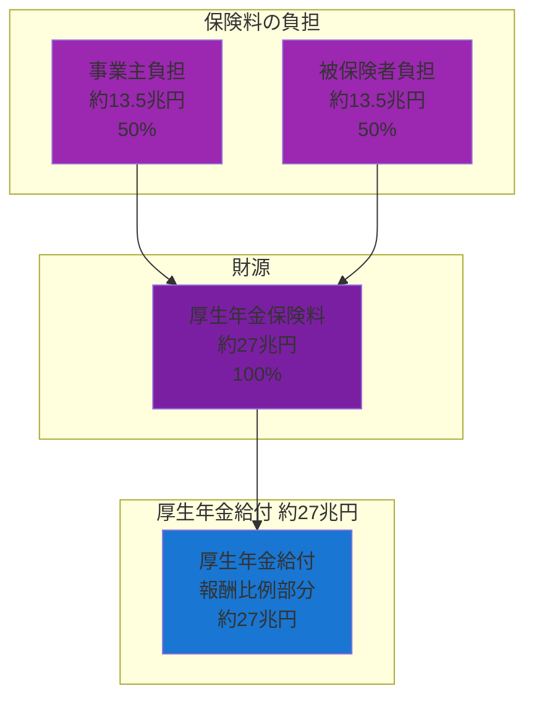
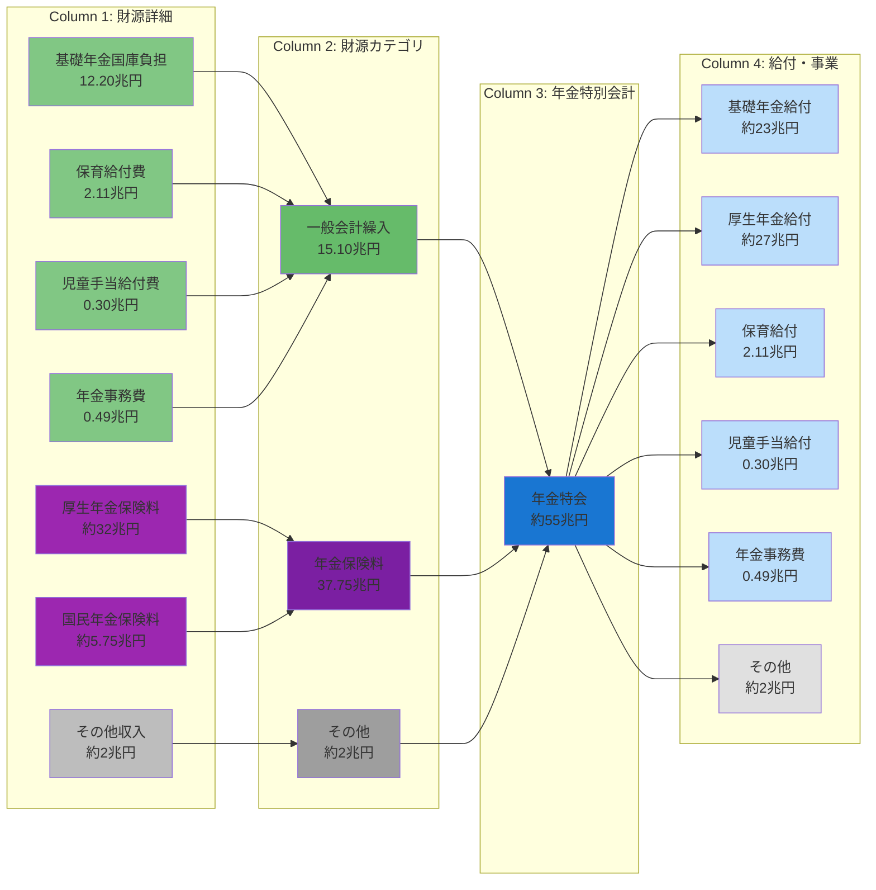
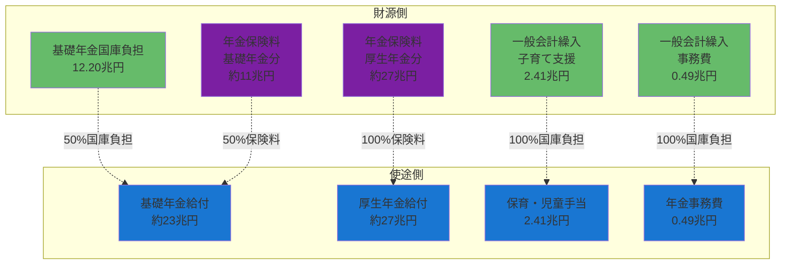
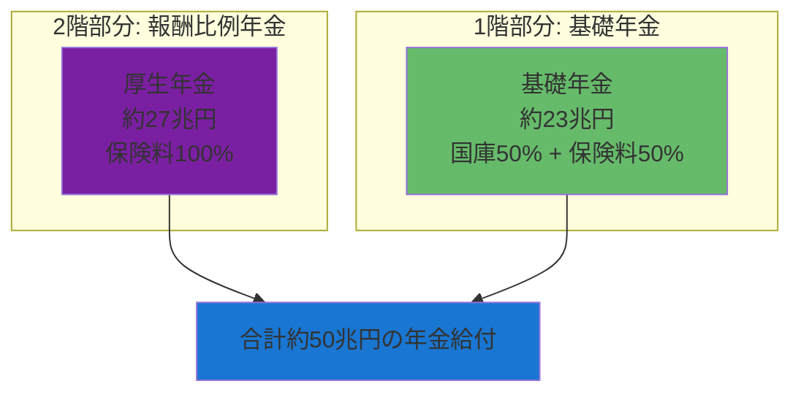

# 年金特別会計の資金フロー詳細

**作成日**: 2026-02-07
**目的**: 年金特別会計における一般会計繰入と社会保険料の使途を可視化し、年金給付の仕組みを明確化する

---

## 1. 年金特別会計の全体像

### 1.1 基本構造

年金特別会計は、**一般会計繰入（15.10兆円）**と**年金保険料（37.75兆円）**を主な財源として、年金給付や子育て支援を実施する特別会計です。

**規模**: 約55兆円規模
**主な事業**:
- 基礎年金給付（約23兆円）
- 厚生年金給付（約27兆円）
- 保育給付（2.11兆円）
- 児童手当給付（0.30兆円）
- 年金事務費（0.49兆円）

### 1.2 全体の資金フロー

---

## 2. 一般会計繰入の詳細（15.10兆円）

### 2.1 繰入の内訳

### 2.2 一般会計繰入の使途詳細

| 使途 | 金額 | 構成比 | 説明 |
|------|------|--------|------|
| **基礎年金国庫負担** | 12.20兆円 | 81% | 基礎年金給付の1/2を国が負担（法定） |
| **保育給付費** | 2.11兆円 | 14% | 子ども・子育て支援新制度による保育施設への給付 |
| **児童手当給付費** | 0.30兆円 | 2% | 児童手当の支給 |
| **年金事務費** | 0.49兆円 | 3% | 日本年金機構の運営費、システム費等 |
| **合計** | **15.10兆円** | **100%** | |

**ポイント**:
- 一般会計繰入の**81%**が基礎年金の国庫負担
- 残り19%は子育て支援（保育・児童手当）と事務費
- 基礎年金の国庫負担割合1/2は法律で定められている

---

## 3. 年金保険料の詳細（37.75兆円）

### 3.1 年金保険料の構成

### 3.2 年金保険料の使途

年金保険料37.75兆円は、以下のように使われます:

| 使途 | 金額（推定） | 構成比 | 説明 |
|------|-------------|--------|------|
| **基礎年金給付（保険料負担分）** | 約11兆円 | 29% | 基礎年金給付の1/2を保険料で賄う |
| **厚生年金給付（報酬比例部分）** | 約27兆円 | 71% | 現役時代の報酬に応じた年金 |
| **合計** | **約38兆円** | **100%** | |

**ポイント**:
- 年金保険料の約30%が基礎年金に充当
- 残り70%が厚生年金（報酬比例部分）に充当
- 一般会計繰入と保険料が混ざって基礎年金を支える構造

---

## 4. 基礎年金の仕組み（国庫負担1/2 + 保険料1/2）

### 4.1 基礎年金給付の財源構成

基礎年金は**国と国民の共同負担**で支えられています。

### 4.2 基礎年金の財源割合

| 財源 | 金額 | 割合 | 出所 |
|------|------|------|------|
| **国庫負担** | 12.20兆円 | 50% | 一般会計繰入 |
| **保険料負担** | 約11兆円 | 50% | 年金保険料 |
| └ 厚生年金保険料 | 約9兆円 | 39% | 厚生年金加入者 |
| └ 国民年金保険料 | 約2兆円 | 11% | 国民年金加入者 |
| **合計** | **約23兆円** | **100%** | |

**法律による規定**:
- 国民年金法第85条: 基礎年金給付に要する費用の1/2は国庫が負担
- 2009年度（平成21年度）から国庫負担割合を1/2に引き上げ（それ以前は1/3）

### 4.3 基礎年金の重要性

基礎年金は、**すべての年金制度の土台**となる給付です:

- **対象者**: 約6,700万人（厚生年金、国民年金、共済年金の全加入者）
- **給付額**: 満額で年間約78万円（令和5年度）
- **目的**: 老後の基礎的な生活を保障する最低限の年金

---

## 5. 厚生年金給付の仕組み（ほぼ全額保険料）

### 5.1 厚生年金の財源

厚生年金の報酬比例部分は、**保険料のみ**で賄われます。

### 5.2 厚生年金の特徴

| 項目 | 内容 |
|------|------|
| **財源** | 保険料のみ（国庫負担なし） |
| **保険料率** | 18.3%（労使折半、令和5年度固定） |
| **給付額** | 現役時代の報酬と加入期間に比例 |
| **加入者数** | 約4,500万人 |
| **平均給付月額** | 約14.6万円（老齢厚生年金） |

**ポイント**:
- 厚生年金の報酬比例部分は**国庫負担ゼロ**
- 完全に保険料のみで賄う「自助」の仕組み
- 基礎年金部分には国庫負担があるため、厚生年金受給者も間接的に国庫の恩恵を受ける

---

## 6. 年金特別会計の完全な資金循環図

### 6.1 詳細な資金フロー（財源→事業）

### 6.2 財源と使途の対応関係

---

## 7. 数値の整合性チェック

### 7.1 歳入側の合計

| 財源 | 金額 |
|------|------|
| 一般会計繰入 | 15.10兆円 |
| 年金保険料 | 37.75兆円 |
| その他収入（推定） | 約2兆円 |
| **歳入合計** | **約55兆円** |

### 7.2 歳出側の合計

| 事業 | 金額 |
|------|------|
| 基礎年金給付 | 約23兆円 |
| 厚生年金給付 | 約27兆円 |
| 保育給付 | 2.11兆円 |
| 児童手当給付 | 0.30兆円 |
| 年金事務費 | 0.49兆円 |
| その他（推定） | 約2兆円 |
| **歳出合計** | **約55兆円** |

### 7.3 基礎年金給付の財源内訳チェック

| 財源 | 金額 | 割合 |
|------|------|------|
| 国庫負担（一般会計繰入） | 12.20兆円 | 50% |
| 保険料負担（年金保険料） | 約11兆円 | 50% |
| **基礎年金給付合計** | **約23兆円** | **100%** |

✅ **整合性確認**:
- 歳入約55兆円 = 歳出約55兆円（バランス）
- 基礎年金国庫負担12.20兆円 ≈ 基礎年金給付23兆円 × 50%
- 一般会計繰入の内訳合計 = 12.20 + 2.11 + 0.30 + 0.49 = 15.10兆円 ✅

---

## 8. 重要なポイントまとめ

### 8.1 一般会計繰入15.10兆円の役割

1. **基礎年金の土台を支える（81%）**
   - 12.20兆円で基礎年金給付の半分を国が負担
   - すべての年金受給者の最低保障となる

2. **子育て支援を実施（16%）**
   - 保育給付2.11兆円 + 児童手当0.30兆円 = 2.41兆円
   - 少子化対策の重要施策

3. **年金制度の運営費（3%）**
   - 年金事務費0.49兆円
   - 日本年金機構の運営、システム維持等

### 8.2 年金保険料37.75兆円の役割

1. **基礎年金の半分を支える（約30%）**
   - 約11兆円で基礎年金給付の半分を保険料で賄う
   - 国庫負担と合わせて基礎年金23兆円を実現

2. **厚生年金の全額を賄う（約70%）**
   - 約27兆円で厚生年金給付（報酬比例部分）を100%賄う
   - 国庫負担なしの完全な保険料財源

### 8.3 年金制度の二層構造

**ポイント**:
- **1階（基礎年金）**: 国と国民の共同負担で最低保障
- **2階（厚生年金）**: 保険料のみで報酬に応じた上乗せ給付
- 合計で約50兆円の年金給付を実現

---

## 9. 今後の可視化案

### 9.1 実装可能なサンキー図

現在のデータ構造で実装可能な追加ビュー:

1. **年金特別会計詳細ビュー**
   - Column 1: 財源詳細（一般会計繰入詳細、保険料詳細）
   - Column 2: 年金特別会計
   - Column 3: 給付・事業詳細
   - Column 4: 具体的な使途（基礎年金、厚生年金等）

2. **基礎年金財源ビュー**
   - 国庫負担12.20兆円と保険料約11兆円がどう基礎年金23兆円を支えるか
   - 50/50の法定割合を可視化

3. **子育て支援財源ビュー**
   - 一般会計繰入2.41兆円（保育2.11兆円 + 児童手当0.30兆円）
   - 各施設・家庭への給付フロー

### 9.2 必要なデータ拡張

より詳細な可視化のために必要なデータ:

1. **年金保険料の内訳詳細**
   - 厚生年金保険料と国民年金保険料の分離
   - 基礎年金分と報酬比例分の配分

2. **年金給付の受給者数データ**
   - 基礎年金受給者数
   - 厚生年金受給者数
   - 平均給付月額

3. **時系列データ**
   - 国庫負担割合の推移（1/3 → 1/2への変更）
   - 保険料率の推移
   - 給付額の推移

---

## 10. 参考資料

### 10.1 データソース
- 財務省「令和5年度特別会計予算」
- 厚生労働省「年金制度の概要」
- 日本年金機構「年金財政の現況」

### 10.2 関連法令
- 国民年金法第85条（国庫負担）
- 厚生年金保険法第80条（保険料）

### 10.3 関連ドキュメント
- [docs/20260207_0808_一般会計から特別会計への繰入詳細分析.md](20260207_0808_一般会計から特別会計への繰入詳細分析.md)
- [docs/20260207_0915_一般会計と特別会計の会計関係と実装.md](20260207_0915_一般会計と特別会計の会計関係と実装.md)

### 10.4 実装ファイル
- [types/mof-transfer.ts](../types/mof-transfer.ts) - 繰入詳細型定義
- [app/lib/mof-transfer-sankey-generator.ts](../app/lib/mof-transfer-sankey-generator.ts) - サンキー生成ロジック
- [app/mof-budget-overview/transfer-detail/page.tsx](../app/mof-budget-overview/transfer-detail/page.tsx) - 財源内訳UI
