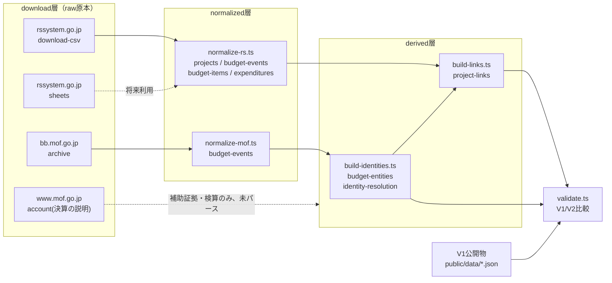

# Data Pipeline V2 Guide

Budget Flow・予算イベント可視化の基盤となる新パイプライン（`scripts/pipeline-v2/`）。
既存パイプライン（[data-pipeline-guide.md](data-pipeline-guide.md)、以下V1）とは独立に動作する。

設計の経緯・意思決定の詳細な検討過程はtask doc側に別途あるが、恒久的な仕様・制約はこのドキュメントに集約する。

---

## 1. なぜV1を残すか

V1（`generate-mof-*`・`generate-sankey-svg-*`・`app/lib/integrated-sankey.ts`等）は本番稼働中で、`/sankey-svg`・`/mof-budget-overview`・`/integrated-sankey`等が依存している。V2はこれらを一切変更しない。

V1は同時に「V2の正しさを検算する基準」としても機能する。V2は独自にraw原本を取得・パースするため、V1とV2が独立に同じ結論（同じ金額・同じ件数）に達すれば、双方のロジックが正しい可能性が高まる（4節・7節）。

## 2. V2の目的

- 公式原本（raw）→原典別正規化（normalized）→意味解決済み統合データ（derived）→アプリ向け成果物（products）の4層に責務を分離する
- MOF・RSそれぞれの「予算年度」の概念のズレ（sourceYear/fiscalYear、3節）を型レベルで区別する
- 金額を静的な1レコードに潰さず、当初・補正・決算・執行等を`BudgetEvent`として表現する（5節）
- Budget Flow機能実装の土台を作る（`/budget-flow`ページはこの正規化・突合結果を読む）

## 3. sourceYearとfiscalYearの区別

RSの1回の提出（例: 2024年度提出=sourceYear）には、複数の予算年度（fiscalYear）の行が同時に含まれる。

```text
sourceYear = 2024（RS 2024年度提出データ）
├─ fiscalYear = 2023 の執行実績（決算が締まった直近年度）
├─ fiscalYear = 2024 の当初予算・補正予算
└─ fiscalYear = 2025 の翌年度要求額
```

「RS 2024 = fiscalYear 2024」という前提は置かない。`normalize-rs.ts`の`RsBudgetEvent`は`sourceYear`と`fiscalYear`を必ず両方持つ。

## 4. ディレクトリ構成

ディレクトリ名はソースURLの表記にそのまま合わせる（統一の命名規則を新たに作らない）。

```text
data/
├── download/                          # raw原本（gitignore対象）
│   ├── rssystem.go.jp/
│   │   ├── download-csv/{year}/       # RS公開CSV（15グループ、ZIP）
│   │   └── sheets/{year}/{省庁slug}/  # 府省庁レビューシート（CSV。PDFは同一内容のため取得しない）
│   └── mof.go.jp/
│       ├── archive/{year}/{yearDir}/  # bb.mof.go.jp予算書・決算書DB。URLにfyが無いため年数のみ
│       │   └── csv|dlpdf/DL*.zip|pdf  # csvが無い帳票のみdlpdfを取得
│       └── account/fy{year}/          # 決算の説明（全体版PDFのみ。個別41章は取得しない）
├── normalized/                        # 原典ごとの正規化JSON
│   ├── mof/{year}/budget-events.json
│   └── rs/{year}/{projects,budget-events,budget-items,expenditures}.json
└── derived/                           # MOF内部の同一性解決・RS↔MOFリンク
    └── {year}/{budget-entities,budget-events,identity-resolution,project-links}.json
```

`data/download_old/`はV1が使っていたraw原本の退避先（一時的なローカル整理。`data/`はgitignore対象のためこの退避はローカル環境のみに影響する）。

## 5. Budget EntityとBudget Event

MOFの「項」「目」は年度をまたいで不変のIDとは仮定しない（項コード変更・補正での新設・所管変更等があるため）。そのため`BudgetEntity`（識別情報）と`BudgetEvent`（金額の出来事）を分離する。

```text
BudgetEntity: account + organization + subAccount(特別会計のみ) + sectionCode + sectionName + itemName
BudgetEvent:  fiscalYear + eventType + amount + provenance
```

**重要**: `項コード`単独は識別子にならない。同じ所管の中でも項コードは項名を持たずに再利用されることがあり（例: 東日本大震災復興特別会計で項コード`01`が「復興債費」と「復興庁共通費」の2つの項名で使われる）、また特別会計は「特別会計名」自体を欠くと`所管`+`勘定`だけで別の特別会計を取り違える（2026-09-19に実装中に発覚・修正）。

`eventType`（`scripts/pipeline-v2/types.ts`）: `initial` / `supplementary` / `execution` / `reserve` / `carryover_in` / `carryover_out` / `unused` / `transfer` / `request`。決算CSV1行から複数の`eventType`が生成される（支出済・予備費使用・繰越・不用・移替）。

**0円行を除外しない**: 金額が0円の行も「0円で計上されている」という意味のある情報であり、行の存在自体を消してはいけない。実装当初はここを誤り、項数・行数を過少カウントしていた（8節参照）。

## 6. provenance

normalized/derivedの全レコードは`provenance`（`domain`・`dataset`・`year`・`file`）を持ち、どのraw原本のどのファイルに由来するかを追跡できる。

## 7. 各スクリプトの入力/出力

| スクリプト | 入力 | 出力 | npm script |
|---|---|---|---|
| `download-rs-csv.ts` | rssystem.go.jp（公式サイト） | `data/download/rssystem.go.jp/download-csv/{year}/*.zip` | `pipeline:v2:download:rs` |
| `download-rs-sheets.ts` | rssystem.go.jp（公式サイト、Playwrightでボタン押下時の実URLを観測） | `data/download/rssystem.go.jp/sheets/{year}/{slug}/*.csv` | `pipeline:v2:download:rs-sheets` |
| `download-mof-archive.ts` | bb.mof.go.jp/archive（公式サイト） | `data/download/mof.go.jp/archive/{year}/**` | `pipeline:v2:download:mof` |
| `download-mof-account-explanation.ts` | www.mof.go.jp（公式サイト） | `data/download/mof.go.jp/account/fy{year}/*.pdf` | `pipeline:v2:download:mof-account-explanation` |
| `normalize-rs.ts` | 上記RS raw ZIP | `data/normalized/rs/{year}/*.json` | `pipeline:v2:normalize:rs` |
| `normalize-mof.ts` | 上記MOF raw ZIP（archive分のみ。決算の説明PDFは対象外） | `data/normalized/mof/{year}/budget-events.json` | `pipeline:v2:normalize:mof` |
| `build-identities.ts` | `normalized/mof/{year}/budget-events.json` | `derived/{year}/{budget-entities,budget-events,identity-resolution}.json` | `pipeline:v2:derive`（の前半） |
| `build-links.ts` | `derived/{year}/budget-entities.json` + `normalized/rs/{year}/budget-items.json` | `derived/{year}/project-links.json`（+ identity-resolution.jsonへの追記） | `pipeline:v2:derive`（の後半） |
| `validate.ts` | V1公開物（`public/data/*.json`）・`data/download_old/`の生CSV・上記derived出力 | 標準出力（MATCH/DIFF/V1_ONLY/V2_ONLYの表） | `pipeline:v2:validate` |

## 8. V1/V2比較方法

```bash
npm run pipeline:v2:validate -- 2024
```

V1側の比較対象は3種類ある。

1. **V1が実際に配信している値**（例: `public/data/mof-budget-overview-2024.json`の一般会計歳出合計）との比較。最も強い検証（実際に一致することを2024年度で確認済み）
2. **同じraw原本をvalidate.ts独自実装で再集計した値**（`normalize-*.ts`とは別コード）との比較。パースバグの検出が目的
3. **Python標準ライブラリのみで書かれた独立参照実装**（TypeScript版とコードを共有しないダブルチェック用）との突合。実装中にMOF/RS双方の0円行除外バグをこれで発見・修正した

差分は自動補正しない。「一致すべき差分」（バグ）と「V2の意図的差分」（算出範囲・年度の取り方の違い）を`validate.ts`のnoteで区別する。現状のDIFFはすべて後者（例: RS事業数はV1公開物とのスナップショット時期の違い、MOF↔RSリンク数は年度の組み合わせ方・粒度の違い）。

## 9. 意図的に実装しなかったもの

- **transfer-links（MOF移替関係）**: 予算現額移替調書等の対応表を未取り込みのため対象外
- **決算目への引き継ぎ**（V1にはある）: V2のBudgetEntityは当初/補正/決算を既に同一entityへ集約済みのため、この引き継ぎ自体が不要
- **MOF決算説明PDF（`kessan_06_zenntaibann.pdf`）の本文パース**: 構造化原本（CSV）を主データとし、PDFは移替・予備費・繰越等の補助証拠・検算用途に将来使う位置付け（本文は未パース）
- **RSレビューシートのPDF・MOF帳票のExcel/dlpdf（CSV/XMLが存在する場合）**: CSVと完全に同一内容と確認済みのため取得しない

## 10. 再生成手順

```bash
# 1. raw取得（政府サイトへの実アクセスが発生する。通常のbuildでは実行しない）
npm run pipeline:v2:download:rs
npm run pipeline:v2:download:rs-sheets
npm run pipeline:v2:download:mof
npm run pipeline:v2:download:mof-account-explanation

# 2. normalize
npm run pipeline:v2:normalize:rs
npm run pipeline:v2:normalize:mof

# 3. derive
npm run pipeline:v2:derive

# 4. V1との比較検証
npm run pipeline:v2:validate -- 2024
```

年度は各コマンドの引数で指定できる（省略時は2024・2025）。

## パイプライン図


