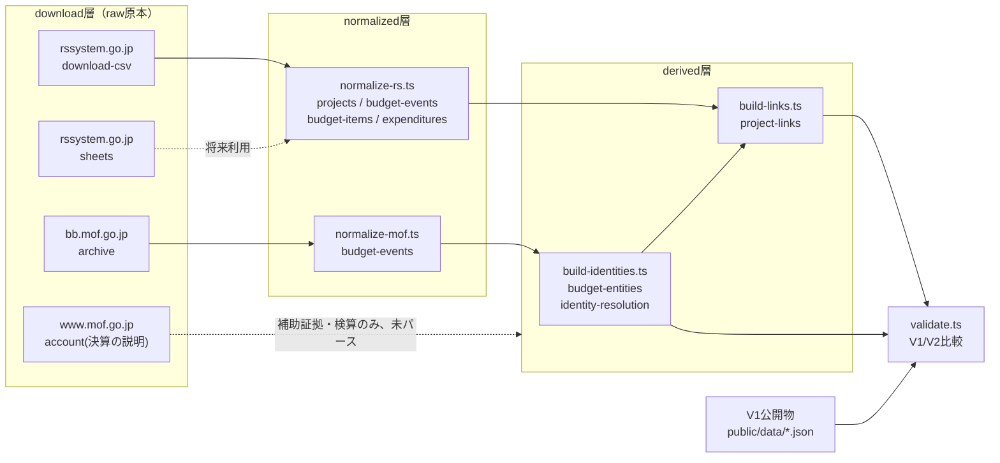

# Data Pipeline V2 Guide

Budget Flow・予算イベント可視化の基盤となる新パイプライン（`scripts/pipeline-v2/`）。
既存パイプライン（[data-pipeline-guide.md](data-pipeline-guide.md)、以下V1）とは独立に動作する。

設計の経緯・意思決定の詳細な検討過程はtask doc側に別途あるが、恒久的な仕様・制約はこのドキュメントに集約する。

---

## 1. なぜV1を残すか

V1（`generate-mof-*`・`generate-sankey-svg-*`・`app/lib/integrated-sankey.ts`等）は本番稼働中で、`/sankey-svg`・`/mof-budget-overview`・`/integrated-sankey`等が依存している。V2はこれらを一切変更しない。

V1は同時に「V2の正しさを検算する基準」としても機能する。V2は独自にraw原本を取得・パースするため、V1とV2が独立に同じ結論（同じ金額・同じ件数）に達すれば、双方のロジックが正しい可能性が高まる（4節・7節）。

## 2. V2の目的

- 公式原本（raw）→原典別正規化（normalized）→意味解決済み統合データ（derived）→アプリ向け成果物（products）の4層に責務を分離する
- MOF・RSそれぞれの「予算年度」の概念のズレ（sourceYear/fiscalYear、3節）を型レベルで区別する
- 金額を静的な1レコードに潰さず、当初・補正・決算・執行等を`BudgetEvent`として表現する（5節）
- Budget Flow機能実装の土台を作る（`/budget-flow`ページはこの正規化・突合結果を読む）

## 3. sourceYearとfiscalYearの区別

RSの1回の提出（例: 2024年度提出=sourceYear）には、複数の予算年度（fiscalYear）の行が同時に含まれる。

```text
sourceYear = 2024（RS 2024年度提出データ）
├─ fiscalYear = 2023 の執行実績（決算が締まった直近年度）
├─ fiscalYear = 2024 の当初予算・補正予算
└─ fiscalYear = 2025 の翌年度要求額
```

「RS 2024 = fiscalYear 2024」という前提は置かない。`normalize-rs.ts`の`RsBudgetEvent`は`sourceYear`と`fiscalYear`を必ず両方持つ。

## 4. ディレクトリ構成

ディレクトリ名はソースURLの表記にそのまま合わせる（統一の命名規則を新たに作らない）。

```text
data/
├── download/                          # raw原本（gitignore対象）
│   ├── rssystem.go.jp/
│   │   ├── download-csv/{year}/       # RS公開CSV（15グループ、ZIP）
│   │   └── sheets/{year}/{省庁slug}/  # 府省庁レビューシート（CSV。PDFは同一内容のため取得しない）
│   └── mof.go.jp/
│       ├── archive/{year}/{yearDir}/  # bb.mof.go.jp予算書・決算書DB。URLにfyが無いため年数のみ
│       │   └── csv|dlpdf/DL*.zip|pdf  # csvが無い帳票のみdlpdfを取得
│       └── account/fy{year}/          # 決算の説明（全体版PDFのみ。個別41章は取得しない）
│   # 概算要求書PDFは {publisherDomain}/{canonical URL path} に保存（7-2節）。mof.go.jpでは
│   # about_mof/・policy/ 配下になり、上のarchive/・account/ とは同domain内でもpathが衝突しない
├── normalized/                        # 原典ごとの正規化JSON
│   ├── mof/{year}/budget-events.json
│   └── rs/{year}/{projects,budget-events,budget-items,expenditures}.json
└── derived/                           # MOF内部の同一性解決・RS↔MOFリンク
    └── {year}/{budget-entities,budget-events,identity-resolution,project-links}.json
```

`data/download_old/`はV1が使っていたraw原本の退避先（一時的なローカル整理。`data/`はgitignore対象のためこの退避はローカル環境のみに影響する）。

## 5. Budget EntityとBudget Event

MOFの「項」「目」は年度をまたいで不変のIDとは仮定しない（項コード変更・補正での新設・所管変更等があるため）。そのため`BudgetEntity`（識別情報）と`BudgetEvent`（金額の出来事）を分離する。

```text
BudgetEntity: account + organization + subAccount(特別会計のみ) + sectionCode + sectionName + itemName
BudgetEvent:  fiscalYear + eventType + amount + provenance
```

**重要**: `項コード`単独は識別子にならない。同じ所管の中でも項コードは項名を持たずに再利用されることがあり（例: 東日本大震災復興特別会計で項コード`01`が「復興債費」と「復興庁共通費」の2つの項名で使われる）、また特別会計は「特別会計名」自体を欠くと`所管`+`勘定`だけで別の特別会計を取り違える（2026-09-19に実装中に発覚・修正）。

`eventType`（`scripts/pipeline-v2/types.ts`）: `initial` / `supplementary` / `execution` / `reserve` / `carryover_in` / `carryover_out` / `unused` / `transfer` / `request`。決算CSV1行から複数の`eventType`が生成される（支出済・予備費使用・繰越・不用・移替）。

**0円行を除外しない**: 金額が0円の行も「0円で計上されている」という意味のある情報であり、行の存在自体を消してはいけない。実装当初はここを誤り、項数・行数を過少カウントしていた（8節参照）。

## 6. provenance

normalized/derivedの全レコードは`provenance`（`domain`・`dataset`・`year`・`file`）を持ち、どのraw原本のどのファイルに由来するかを追跡できる。

## 7. 各スクリプトの入力/出力

| スクリプト | 入力 | 出力 | npm script |
|---|---|---|---|
| `download-rs-csv.ts` | rssystem.go.jp（公式サイト） | `data/download/rssystem.go.jp/download-csv/{year}/*.zip` | `pipeline:v2:download:rs` |
| `download-rs-sheets.ts` | rssystem.go.jp（公式サイト、Playwrightでボタン押下時の実URLを観測） | `data/download/rssystem.go.jp/sheets/{year}/{slug}/*.csv` | `pipeline:v2:download:rs-sheets` |
| `download-mof-archive.ts` | bb.mof.go.jp/archive（公式サイト） | `data/download/mof.go.jp/archive/{year}/**` | `pipeline:v2:download:mof` |
| `download-mof-account-explanation.ts` | www.mof.go.jp（公式サイト） | `data/download/mof.go.jp/account/fy{year}/*.pdf` | `pipeline:v2:download:mof-account-explanation` |
| `download-budget-requests.ts` | 各府省庁の公式サイト（FY2024歳出概算要求書PDF。manifest固定） | `data/download/{publisherDomain}/{canonical URL path}`（83 PDF） | `pipeline:v2:download:budget-requests` |
| `normalize-rs.ts` | 上記RS raw ZIP | `data/normalized/rs/{year}/*.json` | `pipeline:v2:normalize:rs` |
| `normalize-mof.ts` | 上記MOF raw ZIP（archive分のみ。決算の説明PDFは対象外） | `data/normalized/mof/{year}/budget-events.json` | `pipeline:v2:normalize:mof` |
| `build-identities.ts` | `normalized/mof/{year}/budget-events.json` | `derived/{year}/{budget-entities,budget-events,identity-resolution}.json` | `pipeline:v2:derive`（の前半） |
| `build-links.ts` | `derived/{year}/budget-entities.json` + `normalized/rs/{year}/budget-items.json` | `derived/{year}/project-links.json`（+ identity-resolution.jsonへの追記） | `pipeline:v2:derive`（の後半） |
| `validate.ts` | V1公開物（`public/data/*.json`）・`data/download_old/`の生CSV・上記derived出力 | 標準出力（MATCH/DIFF/V1_ONLY/V2_ONLYの表） | `pipeline:v2:validate` |

## 7-2. 概算要求書PDF（raw downloader）

**対象**: FY2024（令和6年度）歳出概算要求書の原本PDF。一般会計・特別会計（13会計）・復興特会と、検算用のvalidation reference（財務省 `sy050905.pdf`）。本文の解析・正規化はしない（raw原本を無加工で保存するだけ）。

**manifest**: `scripts/pipeline-v2/lib/fy2024-budget-request-manifest.ts`（型・validationは `budget-request-manifest.ts`）。人間確認済みURLを固定したもので、URLの推測・自動探索はしない。構造は publisher → logical document（1つの概算要求書）→ physical files（N本のPDF）。皇室費/宮内庁、国会所管等はpublisherと別に `logicalAuthority`/`budgetJurisdiction` で保持する。FY2024は 32 source / 62 logical document / 82 PDF + reference 1 = **83 target**。`verificationStatus` は調査時の確認度で、実取得の成否とは別。manifest未定義の年度はエラー。

```bash
npm run pipeline:v2:download:budget-requests -- 2024             # 取得
npm run pipeline:v2:download:budget-requests -- 2024 --dry-run   # network・書き込みなしでtargetと保存先を表示
npm run pipeline:v2:download:budget-requests -- 2024 --only=ndl.go.jp,mof.go.jp   # domainで絞る
```

**保存先**: `data/download/{publisherDomain}/{canonical URL path}`（`www.`除去、query/fragment除外。`$File` は `%24File`）。保存先は常にcanonical URLから決め、fallback/archiveのURLからは作らない。

**取得順**:

```text
valid cache（size>0 かつ先頭が %PDF-）→ cached
  ↓ なし
acquisitionPolicy=manual-required → networkへ出ず manual-required
  ↓ auto
canonical URLをdirect fetch（HTTP成功 + 先頭 %PDF-。timeout 120秒、request前に1秒throttle、逐次）
  ↓ 失敗
manifestに明示されたacquisitionFallbacks（warp / alternate-live-url）をmanifest順に1回ずつ
  ↓ 失敗
allowPlaywrightFallback付きtargetのみ browser acquisition（canonical URL。FY2024では該当なし）
  ↓ 失敗
failed
```

結果statusは `downloaded` / `cached` / `manual-required` / `failed` / `playwright-required`（browser未注入時）。`manual-required` は終了コード0、`failed`・`playwright-required` があれば1。

**FY2024の既知事項（2026-10-02時点）**:

- **NDL**: canonical（`www.ndl.go.jp/jp/aboutus/outline/r06_budgetrequest.pdf`）はlive 404。manifestの人手確認済みWARP URLが返すpywbのreplay HTMLの `iframe#pywb-frame` のsrc（同一WARP host・https）を1回だけ辿ると `application/pdf` が取れる。保存先は `data/download/ndl.go.jp/…`（WARP hostではない）。resultは `method=warp / transport=fetch`、`acquisitionUrl`=manifestのWARP URL、`finalUrl`=iframe URL。
- **経産省6 PDF**（`ippan_o` `eneju_o` `eneden_o` `enegen_o` `tokkyo_o` `fukko_o`）: direct fetchはHTTP 403、ブラウザのlandingは「Human Verification」（人間操作が必要）、PDF navigationはHTTP 405。CAPTCHA突破は実装しないため `manual-required`。2026-09-25にresearchで取得できた実績があり、恒久的な取得不能ではない（WAF状態が変われば再検証する）。
  人手で取得した場合は、次のpathへ**同名で**配置する。配置後は通常実行が `%PDF-` を確認して `cached` と認識する（未配置のままなら毎回WAFへアクセスせず `manual-required` と表示）。

  ```text
  data/download/meti.go.jp/main/yosangaisan/fy2024/pdf/
    ippan_o.pdf  eneju_o.pdf  eneden_o.pdf  enegen_o.pdf  tokkyo_o.pdf  fukko_o.pdf
  ```

  人手取得の準備は `--prepare-manual` で行う。manual-required targetの保存先directoryを作成し、人間向けのURL・保存先・現在状態（`MISSING` / `VALID PDF` / `INVALID FILE`）の一覧 `_MANUAL_DOWNLOAD.md` をdirectoryごとに生成する（manifestから生成。network accessなし・PDFは作らない・既存ファイルは変更しない・`--dry-run` とは併用不可）。`_MANUAL_DOWNLOAD.md` はcache判定に影響しない。

  ```bash
  npm run pipeline:v2:download:budget-requests -- 2024 --prepare-manual   # 1. 準備（再実行すると状態列が更新される）
  # 2. ブラウザで取得 → 3. 指定folderへ同名でcopy
  npm run pipeline:v2:download:budget-requests -- 2024 --only=meti.go.jp  # 4. 検証（6件とも cached になる）
  ```

- 内閣府の一般会計は確認済みの2本（`0.pdf`/`1.pdf`）のみで、実際は約50本に分割されている（`coverage: known-confirmed-files-only`）。内閣官房 `r6_01〜r6_17`（01〜15=一般会計、16〜17=復興特会）は確認済みhrefのみ。
- 厚労省 `05-1b-01.pdf` は3.3MBだが1,723頁（`pdfinfo`確認済み）。法務省 `001402818.pdf` は約141MB（120秒timeout内に取得できる）。

## 7-3. 概算要求PDFのExtraction基盤（入力検査のみ）

取得済みの概算要求PDFを構造化データへ変換する工程の土台。**PDF本文の解析はまだしない**（明細行・数値・表構造の抽出は次のPoC）。Downloaderと同じmanifest（`getBudgetRequestManifest`）・同じpath解決（`localPathFor`）を使い、PDF一覧を二重に持たない。

```bash
npm run pipeline:v2:extract:budget-requests -- 2024                    # manifest→localPath→原本の存在・PDF妥当性を検査し Found/Missing/Invalid を集計
npm run pipeline:v2:extract:budget-requests -- 2024 --only=meti.go.jp  # domainで絞る
npm run pipeline:v2:extract:budget-requests -- 2024 --write-inventory  # 検査結果を data/work/.../2024/inventory.json へ書く
```

- 対象は概算要求書のdocument PDF（FY2024は82本）。検算用のreference（`sy050905.pdf`）は含めない。MISSING/INVALIDがあれば終了コード1。
- 原本（`data/download/`）は読み取りのみ。解析途中の再生成可能な生成物は `data/work/budget-request-extraction/{year}/` に置く（`data/download`=原本 / `data/work`=解析途中 / `data/derived`=意味確定データ / `public/data`=アプリ配信用）。
- Golden Sampleのlocator: `tests/fixtures/budget-request-extraction/{year}/golden-samples.json`。PDFはコピーせず、manifestのcanonical URL + PDF物理ページ番号（1始まり）で原本を参照する。正解データ（groundTruth）は人間がPDF原本を確認して作成するまで `pending-human-review`。FY2024の候補はNormal（METI `ippan_o.pdf` p9）/ Moderate（MHLW `05-1b-01.pdf` p1268）/ Extreme（同 p1555）。

### SourceToken PoC（指定ページのtext layerと位置の取得）

次段（TableGeometry等）に進めるだけのSource Fidelityが得られるかの検証。指定した1ページだけをpdf.jsで読み、文字列と位置を持つ `SourceToken` を `data/work/budget-request-extraction/{year}/source-token-poc/{id}.json` へ書く（`data/download` へは書かない）。全82 documentは走査しない。

```bash
npm run pipeline:v2:extract:budget-request-page -- 2024 --golden                       # Golden Sample全件
npm run pipeline:v2:extract:budget-request-page -- 2024 --sample=mext-detail-p876      # idで指定
npm run pipeline:v2:extract:budget-request-page -- 2024 --document=<canonicalUrl> --page=<N>
```

- **SourceTokenは意味的な「単語」ではない**: pdf.jsのtext item 1個 = 1 token。`rawText` は補正・正規化・trimなし（空文字・空白のみ・桁区切りの順序反転したchunkもそのまま）。単語化・行化・読み順・列/領域の分類・Core/Auxiliaryの関連付けは後段の責務で、PoCでは行わない。
- **座標系**: 原点=ページ左上、x右が正、y下が正、単位pt（1/72 inch）。`bbox.yMin/yMax` は pdf.js のフォントmetrics（ascent/descent）から導いた文字のem上端/下端（glyphのインク範囲ではない近似）、`xMin/xMax` は `item.width` による。元のPDF user space（左下原点）の値は `transform` にそのまま保持。人間が過去に確認した座標（左端x・上端y）は `bbox.xMin/yMin` と同じ座標系。詳細は `lib/budget-request-source-token.ts` の冒頭コメント。
- **PDFライブラリ**: `pdf-parse` 2.4.5 の公開API（getText/getTable等）はページ文字列のみでbboxを返さないため、`pdfjs-dist`（5.4.296、pdf-parseが使う版と同じ）を直接dependencyに追加して `legacy/build/pdf.mjs` を使う。
- **評価専用の人間確認値**: `tests/fixtures/budget-request-extraction/{year}/human-observations.json`。抽出結果との比較にだけ使い、Extractorの入力・補正には使わない。実PDFを使うテスト（`*.golden.test.ts`）はローカルの `data/download/` が無い環境では自動skip。
- Golden Sampleの4系統: Normal（METI `ippan_o.pdf` p9）/ Moderate（MHLW `05-1b-01.pdf` p1268）/ Extreme（同 p1555）/ Structured Remark（MEXT 第2表 `…000031817_03.pdf` p876。備考列に階層的な積算内訳が並ぶ）。

### TableGeometry PoC（PhysicalRowCandidate / ColumnBandObservation）

SourceTokenの次の中間層。**意味を決めない物理配置の観測のみ**（LogicalRowResolver・CoreFields・数値parse・△の判定・SourceRegion・Core/Auxiliary関連付けは次段）。`PhysicalRowCandidate` は「ページ上でほぼ同じ高さに配置されたSourceTokenの集合」で明細行ではない。`ColumnBandObservation` は「x座標の端の揃いとして観測した、縦方向に繰り返し現れる配置帯」で、事項・金額・備考等の意味ラベル（`columnName` / `regionType`）を持たない。

```bash
npm run pipeline:v2:extract:budget-request-geometry -- 2024 --golden
npm run pipeline:v2:extract:budget-request-geometry -- 2024 --sample=meti-ippan-p9
npm run pipeline:v2:extract:budget-request-geometry -- 2024 --document=<canonicalUrl> --page=<N>
```

出力: `data/work/budget-request-extraction/{year}/table-geometry-poc/{id}.json`（`schema: budget-request-table-geometry-poc/v1`。source / page / parameters / sourceTokenCount / physicalRows / columnBands / diagnostics）。実装は `lib/budget-request-table-geometry.ts`（SourceToken実装とは分離。入力は `SourceToken[]` + `PageMeta` で、SourceTokenは読み取るだけ）。

- **不変条件**: ①SourceTokenを書き換えない ②raw order（`SourceToken.index`=pdf.js text item順）を捨てない: `rawTokenIndexes`（index昇順）と `visualTokenIndexes`（bbox.xMin昇順。「正しい文字列順」ではない観測上の順序）を別に持ち、`rawOrderMatchesVisualOrder` で並びの違いを観測できる。金額chunk（`916`/`599,`/`234,` が右から左のitemで並ぶ）を結合して金額文字列を作ることはしない ③空白のみ・空文字のtokenは行クラスタリングの入力から除外するがSourceTokenからは消さず、近い行から `whitespaceTokenIndexes` で参照する ④罫線文字（`│`等のみのtoken）は行には残し、帯の観測からだけ除外する ⑤rowは `text` を持たずtoken参照のみ。
- **行クラスタリング**: 1次元gap法。非空白tokenをy代表値で昇順に並べ、隣り合う差が `tolerance` を超えたら新しい行。`tolerance = 0.25 × ページの非空白tokenのfontSize中央値`（FY2024の4ページでは1.736pt）。xは行判定に使わない。PDF別・Golden Sample別のルールは持たない。しきい値・algorithm・除外ルールはすべて出力JSONの `parameters` に記録。
- **y代表値の比較（baseline / bbox.yMin / centerY）**: `diagnostics.yReferenceSweep` に toleranceFactor を振ったときの行数を出す。4ページの結果: baseline は factor 0.05〜0.4 で行数が一定（METI p9=42行, MHLW p1268=55, p1555=40, MEXT p876=37）。yMin/centerY は混在するfontSize（METI p9の見出し13.89ptと本文6.94pt）で factor が小さいと行が分かれ（METI p9: 0.05/0.1で43行）、安定する範囲が狭い。bbox.yMin/yMaxはフォントmetrics由来の近似なので、PDF user spaceの `transform[5]` から揃えた baseline を採用。factor 0.5 以上では半行（3.472pt）離れた行が併合され始めるため 0.25 とした。
- **ColumnBand観測**: 空白・罫線文字を除くtokenについて、左端（xMin）と右端（xMax）の揃いを別々に、最小値を起点に幅 `edgeTolerance`（= 0.25×fontSize中央値）以内のtokenを1つの帯とし、物理行が `minRows`（3）以上に繰り返すものだけを残す。帯は重なり得る（同じtokenが左端帯と右端帯に入る）。
- **既知の限界**: ①帯が多い（FY2024の4ページで43〜78本）。金額が数値chunkごとに別tokenのため、chunkごとの端が別々の帯になる。帯の統合・意味付けは次段 ②縦方向のbbox（フォントmetrics由来）は近似 ③複数ページにまたがる行、複数rowにまたがる事項名、表の罫線（行・列の区切り）の利用は未対応 ④右側の独立した表（MHLW p1268）や備考列の積算（MEXT p876）は、同じy付近のrowに物理的に同居するだけで、左側Coreとの関連付けも意味分類もしない。

## 8. V1/V2比較方法

```bash
npm run pipeline:v2:validate -- 2024
```

V1側の比較対象は3種類ある。

1. **V1が実際に配信している値**（例: `public/data/mof-budget-overview-2024.json`の一般会計歳出合計）との比較。最も強い検証（実際に一致することを2024年度で確認済み）
2. **同じraw原本をvalidate.ts独自実装で再集計した値**（`normalize-*.ts`とは別コード）との比較。パースバグの検出が目的
3. **Python標準ライブラリのみで書かれた独立参照実装**（TypeScript版とコードを共有しないダブルチェック用）との突合。実装中にMOF/RS双方の0円行除外バグをこれで発見・修正した

差分は自動補正しない。「一致すべき差分」（バグ）と「V2の意図的差分」（算出範囲・年度の取り方の違い）を`validate.ts`のnoteで区別する。現状のDIFFはすべて後者（例: RS事業数はV1公開物とのスナップショット時期の違い、MOF↔RSリンク数は年度の組み合わせ方・粒度の違い）。

## 9. 意図的に実装しなかったもの

- **transfer-links（MOF移替関係）**: 予算現額移替調書等の対応表を未取り込みのため対象外
- **決算目への引き継ぎ**（V1にはある）: V2のBudgetEntityは当初/補正/決算を既に同一entityへ集約済みのため、この引き継ぎ自体が不要
- **MOF決算説明PDF（`kessan_06_zenntaibann.pdf`）の本文パース**: 構造化原本（CSV）を主データとし、PDFは移替・予備費・繰越等の補助証拠・検算用途に将来使う位置付け（本文は未パース）
- **RSレビューシートのPDF・MOF帳票のExcel/dlpdf（CSV/XMLが存在する場合）**: CSVと完全に同一内容と確認済みのため取得しない

## 10. 再生成手順

```bash
# 1. raw取得（政府サイトへの実アクセスが発生する。通常のbuildでは実行しない）
npm run pipeline:v2:download:rs
npm run pipeline:v2:download:rs-sheets
npm run pipeline:v2:download:mof
npm run pipeline:v2:download:mof-account-explanation
npm run pipeline:v2:download:budget-requests -- 2024

# 2. normalize
npm run pipeline:v2:normalize:rs
npm run pipeline:v2:normalize:mof

# 3. derive
npm run pipeline:v2:derive

# 4. V1との比較検証
npm run pipeline:v2:validate -- 2024
```

年度は各コマンドの引数で指定できる（省略時は2024・2025）。

## パイプライン図


```mermaid
flowchart LR
    subgraph download["download層（raw原本）"]
        RSCSV["rssystem.go.jp\ndownload-csv"]
        RSSheets["rssystem.go.jp\nsheets"]
        MOFArchive["bb.mof.go.jp\narchive"]
        MOFAccount["www.mof.go.jp\naccount(決算の説明)"]
    end

    subgraph normalized["normalized層"]
        RSNorm["normalize-rs.ts\nprojects / budget-events\nbudget-items / expenditures"]
        MOFNorm["normalize-mof.ts\nbudget-events"]
    end

    subgraph derived["derived層"]
        Identities["build-identities.ts\nbudget-entities\nidentity-resolution"]
        Links["build-links.ts\nproject-links"]
    end

    Validate["validate.ts\nV1/V2比較"]

    RSCSV --> RSNorm
    RSSheets -.->|将来利用| RSNorm
    MOFArchive --> MOFNorm
    MOFAccount -.->|補助証拠・検算のみ、未パース| derived

    MOFNorm --> Identities
    Identities --> Links
    RSNorm --> Links

    Identities --> Validate
    Links --> Validate
    V1["V1公開物\npublic/data/*.json"] --> Validate
```
