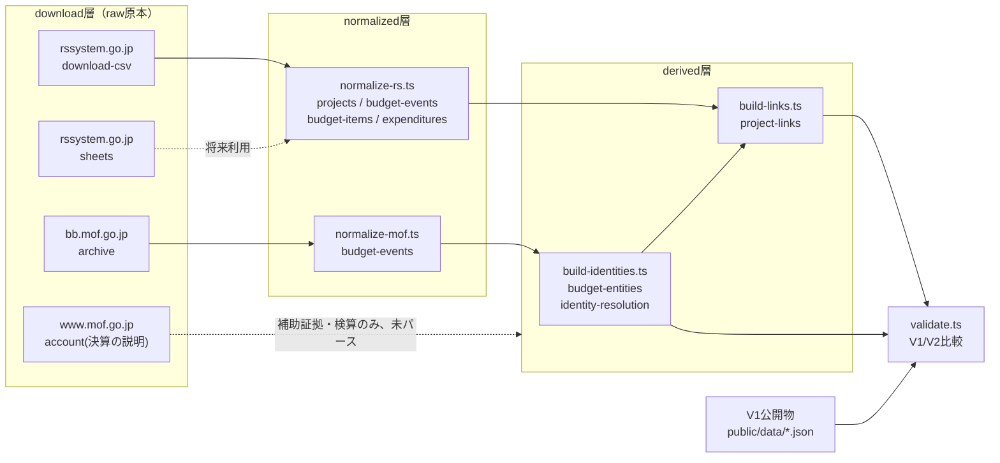

# Data Pipeline V2 Guide

Budget Flow・予算イベント可視化の基盤となる新パイプライン（`scripts/pipeline-v2/`）。
既存パイプライン（[data-pipeline-guide.md](data-pipeline-guide.md)、以下V1）とは独立に動作する。

設計の経緯・意思決定の詳細な検討過程はtask doc側に別途あるが、恒久的な仕様・制約はこのドキュメントに集約する。

---

## 1. なぜV1を残すか

V1（`generate-mof-*`・`generate-sankey-svg-*`・`app/lib/integrated-sankey.ts`等）は本番稼働中で、`/sankey-svg`・`/mof-budget-overview`・`/integrated-sankey`等が依存している。V2はこれらを一切変更しない。

V1は同時に「V2の正しさを検算する基準」としても機能する。V2は独自にraw原本を取得・パースするため、V1とV2が独立に同じ結論（同じ金額・同じ件数）に達すれば、双方のロジックが正しい可能性が高まる（4節・7節）。

## 2. V2の目的

- 公式原本（raw）→原典別正規化（normalized）→意味解決済み統合データ（derived）→アプリ向け成果物（products）の4層に責務を分離する
- MOF・RSそれぞれの「予算年度」の概念のズレ（sourceYear/fiscalYear、3節）を型レベルで区別する
- 金額を静的な1レコードに潰さず、当初・補正・決算・執行等を`BudgetEvent`として表現する（5節）
- Budget Flow機能実装の土台を作る（`/budget-flow`ページはこの正規化・突合結果を読む）

## 3. sourceYearとfiscalYearの区別

RSの1回の提出（例: 2024年度提出=sourceYear）には、複数の予算年度（fiscalYear）の行が同時に含まれる。

```text
sourceYear = 2024（RS 2024年度提出データ）
├─ fiscalYear = 2023 の執行実績（決算が締まった直近年度）
├─ fiscalYear = 2024 の当初予算・補正予算
└─ fiscalYear = 2025 の翌年度要求額
```

「RS 2024 = fiscalYear 2024」という前提は置かない。`normalize-rs.ts`の`RsBudgetEvent`は`sourceYear`と`fiscalYear`を必ず両方持つ。

## 4. ディレクトリ構成

ディレクトリ名はソースURLの表記にそのまま合わせる（統一の命名規則を新たに作らない）。

```text
data/
├── download/                          # raw原本（gitignore対象）
│   ├── rssystem.go.jp/
│   │   ├── download-csv/{year}/       # RS公開CSV（15グループ、ZIP）
│   │   └── sheets/{year}/{省庁slug}/  # 府省庁レビューシート（CSV。PDFは同一内容のため取得しない）
│   └── mof.go.jp/
│       ├── archive/{year}/{yearDir}/  # bb.mof.go.jp予算書・決算書DB。URLにfyが無いため年数のみ
│       │   └── csv|dlpdf/DL*.zip|pdf  # csvが無い帳票のみdlpdfを取得
│       └── account/fy{year}/          # 決算の説明（全体版PDFのみ。個別41章は取得しない）
│   # 概算要求書PDFは {publisherDomain}/{canonical URL path} に保存（7-2節）。mof.go.jpでは
│   # about_mof/・policy/ 配下になり、上のarchive/・account/ とは同domain内でもpathが衝突しない
├── normalized/                        # 原典ごとの正規化JSON
│   ├── mof/{year}/budget-events.json
│   └── rs/{year}/{projects,budget-events,budget-items,expenditures}.json
└── derived/                           # MOF内部の同一性解決・RS↔MOFリンク
    └── {year}/{budget-entities,budget-events,identity-resolution,project-links}.json
```

`data/download_old/`はV1が使っていたraw原本の退避先（一時的なローカル整理。`data/`はgitignore対象のためこの退避はローカル環境のみに影響する）。

## 5. Budget EntityとBudget Event

MOFの「項」「目」は年度をまたいで不変のIDとは仮定しない（項コード変更・補正での新設・所管変更等があるため）。そのため`BudgetEntity`（識別情報）と`BudgetEvent`（金額の出来事）を分離する。

```text
BudgetEntity: account + organization + subAccount(特別会計のみ) + sectionCode + sectionName + itemName
BudgetEvent:  fiscalYear + eventType + amount + provenance
```

**重要**: `項コード`単独は識別子にならない。同じ所管の中でも項コードは項名を持たずに再利用されることがあり（例: 東日本大震災復興特別会計で項コード`01`が「復興債費」と「復興庁共通費」の2つの項名で使われる）、また特別会計は「特別会計名」自体を欠くと`所管`+`勘定`だけで別の特別会計を取り違える（2026-09-19に実装中に発覚・修正）。

`eventType`（`scripts/pipeline-v2/types.ts`）: `initial` / `supplementary` / `execution` / `reserve` / `carryover_in` / `carryover_out` / `unused` / `transfer` / `request`。決算CSV1行から複数の`eventType`が生成される（支出済・予備費使用・繰越・不用・移替）。

**0円行を除外しない**: 金額が0円の行も「0円で計上されている」という意味のある情報であり、行の存在自体を消してはいけない。実装当初はここを誤り、項数・行数を過少カウントしていた（8節参照）。

## 6. provenance

normalized/derivedの全レコードは`provenance`（`domain`・`dataset`・`year`・`file`）を持ち、どのraw原本のどのファイルに由来するかを追跡できる。

## 7. 各スクリプトの入力/出力

| スクリプト | 入力 | 出力 | npm script |
|---|---|---|---|
| `download-rs-csv.ts` | rssystem.go.jp（公式サイト） | `data/download/rssystem.go.jp/download-csv/{year}/*.zip` | `pipeline:v2:download:rs` |
| `download-rs-sheets.ts` | rssystem.go.jp（公式サイト、Playwrightでボタン押下時の実URLを観測） | `data/download/rssystem.go.jp/sheets/{year}/{slug}/*.csv` | `pipeline:v2:download:rs-sheets` |
| `download-mof-archive.ts` | bb.mof.go.jp/archive（公式サイト） | `data/download/mof.go.jp/archive/{year}/**` | `pipeline:v2:download:mof` |
| `download-mof-account-explanation.ts` | www.mof.go.jp（公式サイト） | `data/download/mof.go.jp/account/fy{year}/*.pdf` | `pipeline:v2:download:mof-account-explanation` |
| `download-budget-requests.ts` | 各府省庁の公式サイト（FY2024歳出概算要求書PDF。manifest固定） | `data/download/{publisherDomain}/{canonical URL path}`（83 PDF） | `pipeline:v2:download:budget-requests` |
| `normalize-rs.ts` | 上記RS raw ZIP | `data/normalized/rs/{year}/*.json` | `pipeline:v2:normalize:rs` |
| `normalize-mof.ts` | 上記MOF raw ZIP（archive分のみ。決算の説明PDFは対象外） | `data/normalized/mof/{year}/budget-events.json` | `pipeline:v2:normalize:mof` |
| `build-identities.ts` | `normalized/mof/{year}/budget-events.json` | `derived/{year}/{budget-entities,budget-events,identity-resolution}.json` | `pipeline:v2:derive`（の前半） |
| `build-links.ts` | `derived/{year}/budget-entities.json` + `normalized/rs/{year}/budget-items.json` | `derived/{year}/project-links.json`（+ identity-resolution.jsonへの追記） | `pipeline:v2:derive`（の後半） |
| `validate.ts` | V1公開物（`public/data/*.json`）・`data/download_old/`の生CSV・上記derived出力 | 標準出力（MATCH/DIFF/V1_ONLY/V2_ONLYの表） | `pipeline:v2:validate` |

## 7-2. 概算要求書PDF（raw downloader）

**対象**: FY2024（令和6年度）歳出概算要求書の原本PDF。一般会計・特別会計（13会計）・復興特会と、検算用のvalidation reference（財務省 `sy050905.pdf`）。本文の解析・正規化はしない（raw原本を無加工で保存するだけ）。

**manifest**: `scripts/pipeline-v2/lib/fy2024-budget-request-manifest.ts`（型・validationは `budget-request-manifest.ts`）。人間確認済みURLを固定したもので、URLの推測・自動探索はしない。構造は publisher → logical document（1つの概算要求書）→ physical files（N本のPDF）。皇室費/宮内庁、国会所管等はpublisherと別に `logicalAuthority`/`budgetJurisdiction` で保持する。FY2024は 32 source / 62 logical document / 82 PDF + reference 1 = **83 target**。`verificationStatus` は調査時の確認度で、実取得の成否とは別。manifest未定義の年度はエラー。

```bash
npm run pipeline:v2:download:budget-requests -- 2024             # 取得
npm run pipeline:v2:download:budget-requests -- 2024 --dry-run   # network・書き込みなしでtargetと保存先を表示
npm run pipeline:v2:download:budget-requests -- 2024 --only=ndl.go.jp,mof.go.jp   # domainで絞る
```

**保存先**: `data/download/{publisherDomain}/{canonical URL path}`（`www.`除去、query/fragment除外。`$File` は `%24File`）。保存先は常にcanonical URLから決め、fallback/archiveのURLからは作らない。

**取得順**:

```text
valid cache（size>0 かつ先頭が %PDF-）→ cached
  ↓ なし
acquisitionPolicy=manual-required → networkへ出ず manual-required
  ↓ auto
canonical URLをdirect fetch（HTTP成功 + 先頭 %PDF-。timeout 120秒、request前に1秒throttle、逐次）
  ↓ 失敗
manifestに明示されたacquisitionFallbacks（warp / alternate-live-url）をmanifest順に1回ずつ
  ↓ 失敗
allowPlaywrightFallback付きtargetのみ browser acquisition（canonical URL。FY2024では該当なし）
  ↓ 失敗
failed
```

結果statusは `downloaded` / `cached` / `manual-required` / `failed` / `playwright-required`（browser未注入時）。`manual-required` は終了コード0、`failed`・`playwright-required` があれば1。

**FY2024の既知事項（2026-10-02時点）**:

- **NDL**: canonical（`www.ndl.go.jp/jp/aboutus/outline/r06_budgetrequest.pdf`）はlive 404。manifestの人手確認済みWARP URLが返すpywbのreplay HTMLの `iframe#pywb-frame` のsrc（同一WARP host・https）を1回だけ辿ると `application/pdf` が取れる。保存先は `data/download/ndl.go.jp/…`（WARP hostではない）。resultは `method=warp / transport=fetch`、`acquisitionUrl`=manifestのWARP URL、`finalUrl`=iframe URL。
- **経産省6 PDF**（`ippan_o` `eneju_o` `eneden_o` `enegen_o` `tokkyo_o` `fukko_o`）: direct fetchはHTTP 403、ブラウザのlandingは「Human Verification」（人間操作が必要）、PDF navigationはHTTP 405。CAPTCHA突破は実装しないため `manual-required`。2026-09-25にresearchで取得できた実績があり、恒久的な取得不能ではない（WAF状態が変われば再検証する）。
  人手で取得した場合は、次のpathへ**同名で**配置する。配置後は通常実行が `%PDF-` を確認して `cached` と認識する（未配置のままなら毎回WAFへアクセスせず `manual-required` と表示）。

  ```text
  data/download/meti.go.jp/main/yosangaisan/fy2024/pdf/
    ippan_o.pdf  eneju_o.pdf  eneden_o.pdf  enegen_o.pdf  tokkyo_o.pdf  fukko_o.pdf
  ```

  人手取得の準備は `--prepare-manual` で行う。manual-required targetの保存先directoryを作成し、人間向けのURL・保存先・現在状態（`MISSING` / `VALID PDF` / `INVALID FILE`）の一覧 `_MANUAL_DOWNLOAD.md` をdirectoryごとに生成する（manifestから生成。network accessなし・PDFは作らない・既存ファイルは変更しない・`--dry-run` とは併用不可）。`_MANUAL_DOWNLOAD.md` はcache判定に影響しない。

  ```bash
  npm run pipeline:v2:download:budget-requests -- 2024 --prepare-manual   # 1. 準備（再実行すると状態列が更新される）
  # 2. ブラウザで取得 → 3. 指定folderへ同名でcopy
  npm run pipeline:v2:download:budget-requests -- 2024 --only=meti.go.jp  # 4. 検証（6件とも cached になる）
  ```

- 内閣府の一般会計は確認済みの2本（`0.pdf`/`1.pdf`）のみで、実際は約50本に分割されている（`coverage: known-confirmed-files-only`）。内閣官房 `r6_01〜r6_17`（01〜15=一般会計、16〜17=復興特会）は確認済みhrefのみ。
- 厚労省 `05-1b-01.pdf` は3.3MBだが1,723頁（`pdfinfo`確認済み）。法務省 `001402818.pdf` は約141MB（120秒timeout内に取得できる）。

## 7-3. 概算要求PDFのExtraction基盤（入力検査のみ）

取得済みの概算要求PDFを構造化データへ変換する工程の土台。**PDF本文の解析はまだしない**（明細行・数値・表構造の抽出は次のPoC）。Downloaderと同じmanifest（`getBudgetRequestManifest`）・同じpath解決（`localPathFor`）を使い、PDF一覧を二重に持たない。

```bash
npm run pipeline:v2:extract:budget-requests -- 2024                    # manifest→localPath→原本の存在・PDF妥当性を検査し Found/Missing/Invalid を集計
npm run pipeline:v2:extract:budget-requests -- 2024 --only=meti.go.jp  # domainで絞る
npm run pipeline:v2:extract:budget-requests -- 2024 --write-inventory  # 検査結果を data/work/.../2024/inventory.json へ書く
```

- 対象は概算要求書のdocument PDF（FY2024は82本）。検算用のreference（`sy050905.pdf`）は含めない。MISSING/INVALIDがあれば終了コード1。
- 原本（`data/download/`）は読み取りのみ。解析途中の再生成可能な生成物は `data/work/budget-request-extraction/{year}/` に置く（`data/download`=原本 / `data/work`=解析途中 / `data/derived`=意味確定データ / `public/data`=アプリ配信用）。
- Golden Sampleのlocator: `tests/fixtures/budget-request-extraction/{year}/golden-samples.json`。PDFはコピーせず、manifestのcanonical URL + PDF物理ページ番号（1始まり）で原本を参照する。正解データ（groundTruth）は人間がPDF原本を確認して作成するまで `pending-human-review`。FY2024の候補はNormal（METI `ippan_o.pdf` p9）/ Moderate（MHLW `05-1b-01.pdf` p1268）/ Extreme（同 p1555）。

### SourceToken PoC（指定ページのtext layerと位置の取得）

次段（TableGeometry等）に進めるだけのSource Fidelityが得られるかの検証。指定した1ページだけをpdf.jsで読み、文字列と位置を持つ `SourceToken` を `data/work/budget-request-extraction/{year}/source-token-poc/{id}.json` へ書く（`data/download` へは書かない）。全82 documentは走査しない。

```bash
npm run pipeline:v2:extract:budget-request-page -- 2024 --golden                       # Golden Sample全件
npm run pipeline:v2:extract:budget-request-page -- 2024 --sample=mext-detail-p876      # idで指定
npm run pipeline:v2:extract:budget-request-page -- 2024 --document=<canonicalUrl> --page=<N>
```

- **SourceTokenは意味的な「単語」ではない**: pdf.jsのtext item 1個 = 1 token。`rawText` は補正・正規化・trimなし（空文字・空白のみ・桁区切りの順序反転したchunkもそのまま）。単語化・行化・読み順・列/領域の分類・Core/Auxiliaryの関連付けは後段の責務で、PoCでは行わない。
- **座標系**: 原点=ページ左上、x右が正、y下が正、単位pt（1/72 inch）。`bbox.yMin/yMax` は pdf.js のフォントmetrics（ascent/descent）から導いた文字のem上端/下端（glyphのインク範囲ではない近似）、`xMin/xMax` は `item.width` による。元のPDF user space（左下原点）の値は `transform` にそのまま保持。人間が過去に確認した座標（左端x・上端y）は `bbox.xMin/yMin` と同じ座標系。詳細は `lib/budget-request-source-token.ts` の冒頭コメント。
- **PDFライブラリ**: `pdf-parse` 2.4.5 の公開API（getText/getTable等）はページ文字列のみでbboxを返さないため、`pdfjs-dist`（5.4.296、pdf-parseが使う版と同じ）を直接dependencyに追加して `legacy/build/pdf.mjs` を使う。
- **評価専用の人間確認値**: `tests/fixtures/budget-request-extraction/{year}/human-observations.json`。抽出結果との比較にだけ使い、Extractorの入力・補正には使わない。実PDFを使うテスト（`*.golden.test.ts`）はローカルの `data/download/` が無い環境では自動skip。
- Golden Sampleの4系統: Normal（METI `ippan_o.pdf` p9）/ Moderate（MHLW `05-1b-01.pdf` p1268）/ Extreme（同 p1555）/ Structured Remark（MEXT 第2表 `…000031817_03.pdf` p876。備考列に階層的な積算内訳が並ぶ）。

### TableGeometry PoC（PhysicalRowCandidate / ColumnBandObservation）

SourceTokenの次の中間層。**意味を決めない物理配置の観測のみ**（LogicalRowResolver・CoreFields・数値parse・△の判定・SourceRegion・Core/Auxiliary関連付けは次段）。`PhysicalRowCandidate` は「ページ上でほぼ同じ高さに配置されたSourceTokenの集合」で明細行ではない。`ColumnBandObservation` は「x座標の端の揃いとして観測した、縦方向に繰り返し現れる配置帯」で、事項・金額・備考等の意味ラベル（`columnName` / `regionType`）を持たない。

```bash
npm run pipeline:v2:extract:budget-request-geometry -- 2024 --golden
npm run pipeline:v2:extract:budget-request-geometry -- 2024 --sample=meti-ippan-p9
npm run pipeline:v2:extract:budget-request-geometry -- 2024 --document=<canonicalUrl> --page=<N>
```

出力: `data/work/budget-request-extraction/{year}/table-geometry-poc/{id}.json`（`schema: budget-request-table-geometry-poc/v1`。source / page / parameters / sourceTokenCount / physicalRows / columnBands / diagnostics）。実装は `lib/budget-request-table-geometry.ts`（SourceToken実装とは分離。入力は `SourceToken[]` + `PageMeta` で、SourceTokenは読み取るだけ）。

- **不変条件**: ①SourceTokenを書き換えない ②raw order（`SourceToken.index`=pdf.js text item順）を捨てない: `rawTokenIndexes`（index昇順）と `visualTokenIndexes`（bbox.xMin昇順。「正しい文字列順」ではない観測上の順序）を別に持ち、`rawOrderMatchesVisualOrder` で並びの違いを観測できる。金額chunk（`916`/`599,`/`234,` が右から左のitemで並ぶ）を結合して金額文字列を作ることはしない ③空白のみ・空文字のtokenは行クラスタリングの入力から除外するがSourceTokenからは消さず、近い行から `whitespaceTokenIndexes` で参照する ④罫線文字（`│`等のみのtoken）は行には残し、帯の観測からだけ除外する ⑤rowは `text` を持たずtoken参照のみ。
- **行クラスタリング**: 1次元gap法。非空白tokenをy代表値で昇順に並べ、隣り合う差が `tolerance` を超えたら新しい行。`tolerance = 0.25 × ページの非空白tokenのfontSize中央値`（FY2024の4ページでは1.736pt）。xは行判定に使わない。PDF別・Golden Sample別のルールは持たない。しきい値・algorithm・除外ルールはすべて出力JSONの `parameters` に記録。
- **y代表値の比較（baseline / bbox.yMin / centerY）**: `diagnostics.yReferenceSweep` に toleranceFactor を振ったときの行数を出す。4ページの結果: baseline は factor 0.05〜0.4 で行数が一定（METI p9=42行, MHLW p1268=55, p1555=40, MEXT p876=37）。yMin/centerY は混在するfontSize（METI p9の見出し13.89ptと本文6.94pt）で factor が小さいと行が分かれ（METI p9: 0.05/0.1で43行）、安定する範囲が狭い。bbox.yMin/yMaxはフォントmetrics由来の近似なので、PDF user spaceの `transform[5]` から揃えた baseline を採用。factor 0.5 以上では半行（3.472pt）離れた行が併合され始めるため 0.25 とした。
- **ColumnBand観測**: 空白・罫線文字を除くtokenについて、左端（xMin）と右端（xMax）の揃いを別々に、最小値を起点に幅 `edgeTolerance`（= 0.25×fontSize中央値）以内のtokenを1つの帯とし、物理行が `minRows`（3）以上に繰り返すものだけを残す。帯は重なり得る（同じtokenが左端帯と右端帯に入る）。
- **既知の限界**: ①帯が多い（FY2024の4ページで43〜78本）。金額が数値chunkごとに別tokenのため、chunkごとの端が別々の帯になる。帯の統合・意味付けは次段 ②縦方向のbbox（フォントmetrics由来）は近似 ③複数ページにまたがる行、複数rowにまたがる事項名、表の罫線（行・列の区切り）の利用は未対応 ④右側の独立した表（MHLW p1268）や備考列の積算（MEXT p876）は、同じy付近のrowに物理的に同居するだけで、左側Coreとの関連付けも意味分類もしない。

### LogicalRowResolver PoC（LogicalRowCandidate）

```text
SourceToken  →  TableGeometry（PhysicalRowCandidate / ColumnBandObservation）  →  LogicalRowResolver（LogicalRowCandidate）
```

```bash
npm run pipeline:v2:extract:budget-request-logical-row -- 2024 --golden
npm run pipeline:v2:extract:budget-request-logical-row -- 2024 --sample=meti-ippan-p9
npm run pipeline:v2:extract:budget-request-logical-row -- 2024 --document=<canonicalUrl> --page=<N>
```

出力: `data/work/budget-request-extraction/{year}/logical-row-poc/{id}.json`（`schema: budget-request-logical-row-poc/v1`。parameters / physicalRowCount / logicalRowCandidates / diagnostics。SourceTokenは複製せず `SourceToken.index` / `PhysicalRowCandidate.rowIndex` で参照）。実装は `lib/budget-request-logical-row.ts`。

**LogicalRowCandidate はまだ予算明細のsemantic record（LogicalDetailRecord）ではない。** 「複数のPhysicalRowCandidateが同一の論理行候補を構成している可能性」を表す可逆な観測結果で、要求番号・事項・金額・備考の意味、数値parse、符号（△▲-）、blankの扱い、Core/Auxiliary関連付けは行わない。

- **可逆性**: candidateは必ず `physicalRowIndexes` を持ち、SourceToken・PhysicalRowCandidateは書き換えない。`rawTokenIndexes`（index昇順）と `visualTokenIndexes`（physical row順に各rowのvisual-x orderを連結）を区別し、文字列は結合しない（`234,599,916` を作らない）。
- **水平分割（HorizontalSegment）**: 同じphysical row内を、visual-x順のx-gap（次のxMin − ここまでのxMax最大値）が `gapFactor(2.5) × fontSize中央値` を超えたところで区切る純粋なgeometry。左右の独立構造が同じbaselineに同居しても1つの文字列にしない。segmentに意味名は付けない。
- **継続判定**: 隣り合うphysical row A→B で、①baseline差が `[0.75, 1.5] × fontSize`（折り返し行の行間）②Bの全segmentの開始xが、candidateに含まれるtokenの開始xと `0.25 × fontSize` 以内で揃う → `continuation_by_geometry`（merge）。縦は範囲内だが一部しか揃わない、または罫線文字を含む行（表のグリッド）→ merge せず `ambiguous`（理由と計測値をevidenceに残す）。縦が範囲外 → `same_physical_row`。false positive merge より ambiguous を優先する。ColumnBandは判定に使わず、`columnBandEvidence` として補助的に記録するだけ。
- **しきい値**: すべてページのfontSize中央値に対する相対値で、出力JSONの `parameters` に記録。PDF別・Golden Sample別のhard-codeはない。
- **TableGeometryのchaining診断**: `PhysicalRowCandidate` 内のbaseline span（max−min）が `rowClustering.tolerance` を超える行を `diagnostics.tableGeometryChaining` に列挙（TableGeometryのアルゴリズムは変更しない）。FY2024の4 Golden Sampleでは該当なし（最大span 0.147pt、tolerance 1.736pt）。
- **既知の限界**: ①segment境界は `gapFactor` に敏感（METI p9で gapFactor 1.5/2.5/3.5/5 → 156/133/121/93 segment）。金額の右隣に1文字分しか離れずに続く `（要求要旨）` のような左右は区切れない ②罫線グリッドの表（MHLW p1268/p1555の右側の表）は大半が `ambiguous` で残り、行・列の構造化は次段 ③ColumnBandの繰り返し配置はevidenceとしても判別力が弱い（MEXT p876では継続候補の不一致segmentの多くにも帯がある） ④複数ページにまたがる継続、複数行にまたがる事項名の文字列確定は未対応。

### SpatialRegion PoC（SpatialRegionCandidate）

```text
SourceToken → TableGeometry → LogicalRowResolver → SpatialRegionDetector（SpatialRegionCandidate）
```

```bash
npm run pipeline:v2:extract:budget-request-spatial-region -- 2024 --golden
npm run pipeline:v2:extract:budget-request-spatial-region -- 2024 --sample=mhlw-ippan-p1268
npm run pipeline:v2:extract:budget-request-spatial-region -- 2024 --document=<canonicalUrl> --page=<N>
```

出力: `data/work/budget-request-extraction/{year}/spatial-region-poc/{id}.json`（`schema: budget-request-spatial-region-poc/v1`。parameters / spatialRegions / unassignedTokenIndexes / ambiguousAssignments / gutters / diagnostics）。実装は `lib/budget-request-spatial-region.ts`。

**SpatialRegionCandidate は semantic region ではない。** 「ページ上で互いに近く、2次元的な連続性を持つHorizontalSegmentの集合」を、`core` / `remark` / `matter` / `amount` / `request_summary` 等の意味を付けずに観測するだけで、token文字列（rawText）は判定に使わない（幾何量のみ）。regionはdisjointで、SourceToken.index / PhysicalRowCandidate.rowIndex / LogicalRowCandidate.logicalRowIndex / segment参照へ戻れ、bboxは構成tokenのbboxのunion。根拠の弱い孤立segmentは `unassigned`、しきい値を少し振ると結合/分割する境界は `ambiguity` / `ambiguousAssignments` として残す（移動はしない）。

- **検討した方式**: A. connected-components（segmentをnode、x近接/重なり+y近接をedge）/ B. gutter（x方向の被覆が途切れる空白帯を境界にする）/ C. hybrid（gutterで区切ったx-band内でだけ局所接続）。**採用はC**。ただし4 Golden Sampleでは、gutterがedgeを抑制した数は常に0で、A単体とCの結果は同一だった（下記）。
- **パラメータ**（ページ由来の相対値。すべて出力JSONに記録。既定値は4サンプルの診断を見て決めたもので、独立した根拠ではない）: gutter幅 ≥ 3.0×fontSize中央値 / 水平近接 ≤ 5.0×fontSize中央値 / 垂直近接 baseline差 ≤ 2.0×physical row間隔の中央値 / region = 2 physical row以上 / 感度分析のスケール 1.25（proximityを×1.25で結合、÷1.25で分割する境界をambiguityに記録）。PDF別・Golden Sample別のhard-codeはない。
- **診断の結果（4 Golden Sample）**:

| サンプル | token | physical row | logical | region | assigned | unassigned | ambiguous | 最大region |
|---|---|---|---|---|---|---|---|---|
| METI p9 | 501 | 42 | 35 | 4 | 284 | 21 | 1 | 176 tok / 30 row |
| MHLW p1268 | 833 | 55 | 54 | 7 | 445 | 4 | 1 | 334 tok / 36 row |
| MHLW p1555 | 645 | 40 | 39 | 8 | 341 | 30 | 3 | 220 tok / 21 row |
| MEXT p876 | 545 | 37 | 37 | 4 | 299 | 25 | 5 | 176 tok / 34 row |

- **negative findings**: ①gutter evidenceは冗長だった（4サンプルとも、gutterが抑制したedgeは0。gutter幅の基準とproximityの基準が近いため、gutterが追加の境界を作らない）。connected-components単体でも左右の構造が橋渡し（bridge）されるケースは出なかった ②垂直近接の係数に敏感（MEXT p876: 1.5×では行間20.8ptが境界ちょうどで20 region・148 token unassignedに断片化し、2.5×では右側が274 token・35行の1 regionになる。2.0×は両側に余裕がある値として採用） ③表内の列間の空白（24pt級）と、独立した構造間の空白を、幅だけでは区別できない（METI p9の金額の3列グループは水平近接の係数次第で別regionになる） ④右側の積算（MEXT p876）はgutterで左側から分離できるが、内部は複数region（右端の2つの金額列は別region）になる ⑤METI p9の `（要求要旨）` は、金額の3列グループとは別regionに入るが、それは水平近接のしきい値次第で、geometryだけで安定して分離できるとは言えない ⑥ColumnBandはregion判定に使っていない（前段で判別力が弱いため）。
- **安全条件**: MHLW p1555の上部の大構造と下部 `01-95` は同一regionにならない（false positive merge なし）。MHLW p1268の右側の大表（334 token・36 row）はページ全体の1 regionにならず、LogicalRowCandidateがambiguousだらけ（37/54）でもregion観測が成立する。MEXT p876はcontinuationが0件でも、右側の積算構造が複数logical rowにまたがる2D region候補として観測できる。

### RegionRelationResolver PoC（RegionRelationCandidate）

```text
… → LogicalRowResolver → SpatialRegionDetector → RegionRelationResolver（RegionRelationCandidate）
```

```bash
npm run pipeline:v2:extract:budget-request-region-relation -- 2024 --golden
npm run pipeline:v2:extract:budget-request-region-relation -- 2024 --sample=mhlw-ippan-p1555
npm run pipeline:v2:extract:budget-request-region-relation -- 2024 --document=<canonicalUrl> --page=<N>
```

出力: `data/work/budget-request-extraction/{year}/region-relation-poc/{id}.json`（`schema: budget-request-region-relation-poc/v1`。parameters（tableGeometry / logicalRow / spatialRegion / regionRelation）/ relations / ambiguities / diagnostics）。実装は `lib/budget-request-region-relation.ts`。

**RegionRelationCandidate は semantic record ではない。** 「source と target がページ上の配置・近接・包含から関連している可能性」を、方向つきの幾何の観測と evidence として記録するだけで、`target is remark of source` のような意味関係・Core/Auxiliaryの確定関連付けは作らない。意味ラベルを持たず、rawTextを判定に使わない（幾何量のみ）。入力（SourceToken / TableGeometry / LogicalRowResult / SpatialRegionResult）は読み取るだけ。

- **relation model**: node は SpatialRegionCandidate（regionIndex）と LogicalRowCandidate（logicalRowIndex）。region↔region（sourceはregionIndexの小さい側）と logical_row→region。`direction`（`horizontal: target_right_of_source | target_left_of_source | overlap`、`vertical: target_below_source | target_above_source | overlap`）で、どちらからどちらを見たrelationかを明示。`geometry`（horizontalGap / verticalGap / xOverlap / yOverlap / 各ratio / centerDx / centerDy）はbboxから再計算できる。confidenceのような単一スコアは作らず、evidence（`shares_physical_rows` / `row_tokens_in_region` / `within_horizontal_cutoff` / `within_vertical_cutoff` 等、計測値つき）に分解。
- **候補の条件**（ページ由来の相対cutoff。既定値を「正解」とみなさない）: ①logical rowのtokenがregionに属する（所属）、またはregion同士がphysical rowを共有する、②bbox間の水平距離 ≤ 0.4×ページ幅 かつ 垂直距離 ≤ 2.0×physical row間隔の中央値。垂直cutoffはSpatialRegionDetectorの垂直近接と同じ尺度（これも4サンプルの診断で決めた値）。水平0.4は大きめの任意値。
- **nearest winnerは作らない**: 同じnodeから見て同じ種類の相手・同じ方向の候補が2つ以上あるときは全て残し、`ambiguity.competingRelationIndexes` を付ける（rowがregionにtokenを持つ「所属」は選択候補ではないので競合の対象外。複数regionにまたがることは `diagnostics.logicalRowsSpanningMultipleRegions` に出る）。
- **stability（regionの安定性とは別に観測）**: stable = ①source/targetがambiguousなregion・logical rowでない ②cutoffを0.8倍にしても候補に残る ③競合候補がない。理由は `stability.reasons`（`source_region_is_ambiguous` / `target_region_is_ambiguous` / `source_logical_row_is_ambiguous` / `candidate_disappears_at_cutoff_x0.8` / `competing_candidates`）。cutoffを0.8/1.0/1.25倍に振ったときの候補数は `diagnostics.sensitivity`。
- **結果（FY2024 Golden Sample）**:

| サンプル | region | logical row | region↔region | row→region | stable | unstable | competing |
|---|---|---|---|---|---|---|---|
| METI p9 | 4 | 35 | 2 | 64 | 40 | 26 | 0 |
| MHLW p1268 | 7 | 54 | 10 | 76 | 3 | 83 | 19 |
| MHLW p1555 | 8 | 39 | 7 | 52 | 5 | 54 | 11 |
| MEXT p876 | 4 | 37 | 4 | 109 | 0 | 113 | 20 |

  候補数の感度（0.8× / 1.0× / 1.25×）: METI 66/66/67、MHLW p1268 79/86/91、p1555 55/59/61、MEXT 109/113/116。pair数（region pair / row×region pair）: 6/140、21/378、28/312、6/148。
- **仮説の結果**: A「relation生成にregion内部の理解は不要」→ 成立（MHLW右側表・MEXT積算の意味が不明でも、左側row↔右側regionの位置関係は観測できた）。B「単純なnearest-neighborでは不足」→ 同じ側に複数の近い候補が並ぶ例を観測（ヘッダー帯のregionが水平距離109pt/316ptで並ぶ等）。ただし正解データがないため「nearestが誤り」とまでは言えず、複数候補を残すべき構造があることまでを確認。C「relationの安定性はregionの安定性とは別に必要」→ 成立（regionがambiguousでなくても、cutoff×0.8で消える候補や競合候補がunstableになる。逆にambiguousなregionがtargetなら全relationがunstableに伝播する）。
- **negative findings**: ①relation候補が多い（66〜113件）。ほとんどが「rowがregionにtokenを持つ」所属で、近接候補としての情報は少ない ②region ambiguityの伝播が支配的（MEXT p876はregion 4つすべてがambiguousで、113件すべてのrelationが `target_region_is_ambiguous`、stableは0。MHLW p1268も stable 3/86）。前段のregion層の不安定さをrelation層が解消できない ③cutoffで候補が入れ替わる（p1268は0.8×で7件消え、1.25×で5件増える） ④logical rowがambiguousなこと（p1268は40件）もunstable理由として伝播する ⑤競合候補はヘッダー帯の隣接regionに多く、意味の手がかり無しにどれを採るかは決められない。
- **安全条件**: MHLW p1555の上部の大構造と下部 `01-95` の行・region の間に直接のrelation候補は生成されない（垂直gap 48.6pt > cutoff 13.9pt。このページのphysical row間隔の中央値が6.94ptのため。cutoffを約3.5倍に広げると現れるので、安全の余裕は約3.5倍）。なお垂直cutoffは「physical row間隔の中央値」に比例するため、ページごとに値が変わる（折り返しや半行ピッチの行が多いページでは小さくなる）。

### SemanticRecordCandidate PoC（主要明細行候補）

```text
SourceToken → TableGeometry → LogicalRowResolver → SpatialRegionDetector → RegionRelationResolver   ← ここまで geometry / observation
  → SemanticRecordCandidate（detail_record_candidate）   ← 初めての semantic interpretation の「候補」層
```

```bash
npm run pipeline:v2:extract:budget-request-semantic-record -- 2024 --golden
npm run pipeline:v2:extract:budget-request-semantic-record -- 2024 --sample=meti-ippan-p9
npm run pipeline:v2:extract:budget-request-semantic-record -- 2024 --document=<canonicalUrl> --page=<N>
```

出力: `data/work/budget-request-extraction/{year}/semantic-record-poc/{id}.json`（`schema: budget-request-semantic-record-poc/v1`。parameters / semanticRecordCandidates / unassignedSemanticObservations / diagnostics）。実装は `lib/budget-request-semantic-record.ts`。

**SemanticRecordCandidate は最終的な LogicalDetailRecord ではない。** 前段までと違い、この層は rawText の内容を候補判定に使う（文字を変えれば結果が変わるのは正常。ただしgeometry層の結果は変わらない）。それでも、観測（evidence=token index・rawText）と解釈（interpretation）を分け、SourceTokenまで戻れるprovenanceを保ち、**unknown > guess / ambiguous > forced assignment** を維持する。

- **anchor（detail code候補）**: text pattern（桁と区切りのコードらしい文字列）だけでは確定せず、geometry evidence を併用する: 行（最初のphysical row）のsegment先頭のtoken、または先頭segmentが単独の数字tokenのときの2つ目のsegment先頭のtoken、かつ同じsegmentで後続するtokenに文字（matter）がある。コードの左端の繰り返し配置も evidence に残す（ColumnBandは使わない）。条件を満たさないコードらしい文字列は捨てず `diagnostics.regexOnlyCodeMatches` に残す。
- **matter**: token参照（tokenIndexes / rawTexts / physicalRowIndexes）。LogicalRowResolverのcontinuationで開始位置が揃う継続行のtokenを参照として追加。`previewText` は表示確認用の **non-authoritative** な値（source truthではない）。
- **金額**: anchor行のmatterの右にある金額らしいtoken（桁・カンマ）を、x-gapでgroupにする。canonical valueは作らず（数値へparseしない）、`tokenIndexes`（content stream順）と `visualTokenIndexes`（x順）を別に保持する（金額chunkの逆順を保つ）。**groupがちょうど3つのときだけ**、previous/request/difference を列順の「候補」として付ける（`interpretation: *_by_column_order`）。3つでなければ割り当てず ambiguity（`amount_group_count_not_3`）。空欄を0にしない・差額を計算しない・値の大小から符号を推測しない。
- **符号**: 金額groupの直前（他のtokenを挟まない）に実際の `△` `▲` `-` のSourceTokenがあるときだけ `signObservation`（tokenIndex・rawText・gapToGroup）。無ければ `null`。signは別列に置かれることがあり距離が大きければ `sign_attachment_distance_large` のambiguity。
- **relatedStructures**: logical row → SpatialRegion のRegionRelation refを、`membership`（rowのtokenがregionに属する）/ `proximity`（近接のみ）/ `mixed` のevidenceKindで保持。stable / unstable のrelation indexを別々に保持し、**stable relationだけを使わない**（unstableでも捨てず、candidateの `status` を `ambiguous` にする）。semantic type（request_summary等）は付けず、nearest winnerも作らない。
- **unassigned**: anchorに属さない金額らしいtoken群・sign tokenは `unassignedSemanticObservations` に残す（捨てない）。
- **結果（FY2024 Golden Sample）**:

| サンプル | candidate | うちambiguous | 金額group | sign | 関連構造 | unassigned | regexだけ一致（非anchor） |
|---|---|---|---|---|---|---|---|
| METI p9 | 28 | 25 | 72（3つ: 24行） | 6 | 56（membership53 / proximity3） | 5 | 69 |
| MHLW p1268 | 2 | 2 | 1 | 0 | 6 | 48 | 5 |
| MHLW p1555 | 3 | 2 | 6 | 0 | 8 | 45 | 36 |
| MEXT p876 | 6 | 6 | 12（3つ: 4行） | 0 | 17 | 100 | 60 |

- **negative findings**: ①regex + 行頭のgeometryでも、ページ見出し（METI `27 経済産業省所管`、MEXT `884 文（本）`、MHLW `1260 厚（ハ）`）が anchor になる（誤検出）。ページ見出しと明細行を区別するevidenceがまだ無い ②regexだけではコードを確定できない: 金額chunkの末尾（`005` `829` 等）も桁だけ見ればコードに一致する（69/36/60件がanchor外として残った）。金額側も、MHLW p1268の右側表の見出し `30 年度` の `30` が金額groupとして誤検出された ③matter境界が曖昧: 直後のlogical rowがambiguousで継続の可能性があるcandidateは `matter_boundary_possible_continuation`（MEXT p876は6件中4件） ④金額groupの境界が曖昧: MEXTで金額の右にある積算側の数字が `amount_like_tokens_beyond_text_boundary` として残る ⑤前段のregion/relationの不安定さがsemantic層へ伝播: MEXT p876は前段のstable relationが0で、6件のcandidateすべてが ambiguous。関連構造の参照は保持できた（17件のunstable ref）が、確定はできない ⑥METI型（コード+事項名+3列の金額）とMHLW型（p1268は継続ページで、行頭コード+事項名のみで金額が同一行にない）で anchor evidence は共通だが、金額groupの数が異なる。金額列のgeometryは、1ページ内で再利用できる（同じ順序番号のgroupの右端は1つに揃う）だけでなく、金額groupが3つ見えた3サンプル（METI p9・MHLW p1555・MEXT p876）で右端の中央値が同一（255.4 / 307.2 / 462.5pt）だった。同じ様式のテンプレートを使っている可能性があるが、検出ロジックにはこの座標を使っておらず（hard-codeしない）、4サンプルだけでは省庁横断で再利用できるとは言えない ⑦MEXT p876の右側積算（1,2,3…の階層・単価×人数×回数）はanchorを持たないため、金額らしいtoken群（100件）がunassignedとして残るだけで、構造としては保持できていない。
- **安全条件**: MHLW p1555の下部 `01-95` の候補へ、上部の大構造のregionを関連構造として付けていない。符号の推測・空欄の0化・差額の計算はしていない。

### RecordAnchorResolver PoC（RecordAnchorAssessment）

```text
… → RegionRelationResolver → SemanticRecordCandidate → RecordAnchorResolver（RecordAnchorAssessment）
```

```bash
npm run pipeline:v2:extract:budget-request-record-anchor -- 2024 --golden
npm run pipeline:v2:extract:budget-request-record-anchor -- 2024 --sample=mhlw-ippan-p1268
npm run pipeline:v2:extract:budget-request-record-anchor -- 2024 --document=<canonicalUrl> --page=<N>
```

出力: `data/work/budget-request-extraction/{year}/record-anchor-poc/{id}.json`（`schema: budget-request-record-anchor-poc/v1`。parameters / layoutFamilies / anchorAssessments / diagnostics）。実装は `lib/budget-request-record-anchor.ts`。

SemanticRecordCandidate（anchor候補）が `detail_candidate`（主要明細行らしい）/ `heading_candidate`（ページ・節の見出しらしい）/ `ambiguous` / `insufficient_evidence` のどれに見えるかを、**分解されたevidence付きで観測する独立層**。SemanticRecordCandidateは削除・変更しない（`heading_candidate` は除外を意味しない。field observationも変更しない）。**このresolverは文字内容（rawText）を読まず**、特定の見出し語・ページ番号・コード値も使わない。幾何（bbox・金額groupの数と位置・関連構造の数）とページ寸法だけを使う。単一のscoreも使わない。

- **evidence**（それぞれ supports・計測値・thresholdを持つ）: detailを支持 = `three_amount_groups` / `repeated_amount_columns`（同じ金額列の右端が揃う別候補）/ `family_membership`（反復するlayout familyに属する）/ `sign_token_in_amount_region`。headingを支持 = `page_relative_top`（ページ高さに対する比）/ `isolated_layout`（反復するfamilyに属さず金額列も共有しない）/ `lacks_field_structure`（金額groupが3つでなく符号も無い）。中立 = `relation_context`（membership/proximity・stable/unstable relation数の観測のみ）。
- **classification**（evidenceの種類から再計算できる純粋関数 `classifyFromEvidence`）: detail側の異なる種別が2種類以上 → detail満たす / `page_relative_top` かつ `isolated_layout` かつ `lacks_field_structure` → heading満たす。両方 → blocking conflict で `ambiguous`、片方のみ → その分類、どちらも満たさなければ evidence があれば `ambiguous`、無ければ `insufficient_evidence`。反対側のevidenceが混在する場合は severity=noted のconflictとして記録（分類は変えない）。**3つの金額groupだけではdetailに確定せず、金額が無いだけではheadingに確定しない。**
- **layout family**: code左端 → matter開始 の2段で、最小値を起点に幅 `alignmentTolerance`（0.25×fontSize中央値）以内をbin化（連鎖しない。family数は固定しない）。semantic typeではない反復レイアウトの観測。
- **stability**: thresholdを0.8×/1.25×に振ってclassificationが変わるならstableにしない（SemanticRecordCandidateのambiguityとは別に観測）。top帯 = 0.15×ページ高さ。**thresholdはGolden Sampleの正解に合わせて調整していないが、0.15は4サンプルの観測（見出し行が0.035〜0.117、`020` が0.187）を見て置いた値で、独立した根拠ではない。**
- **結果（FY2024 Golden Sample）**:

| サンプル | semantic candidate | detail | heading | ambiguous | stable | unstable | family | isolated |
|---|---|---|---|---|---|---|---|---|
| METI p9 | 28 | 24 | 1 | 3 | 28 | 0 | 8 | 6 |
| MHLW p1268 | 2 | 0 | 1 | 1 | 1 | 1 | 2 | 2 |
| MHLW p1555 | 3 | 2 | 1 | 0 | 3 | 0 | 3 | 3 |
| MEXT p876 | 6 | 4 | 1 | 1 | 6 | 0 | 3 | 2 |

  既知のfalse anchor（METI p9 `27 …`、MHLW p1268 `1260 …`、MEXT p876 `884 …`）は3例とも page_relative_top + isolated_layout + lacks_field_structure のheading evidenceが揃い `heading_candidate`、detail evidenceは無し。detail controlは、METI p9の `01-95` 等が three_amount_groups + repeated_amount_columns、MEXT p876の `95016-…` が加えて family_membership、MHLW p1555の下部 `01-95` が three_amount_groups + repeated_amount_columns（上部の大構造のregionはevidenceに混入しない）。MHLW p1268 の `020` は金額3列が同じ行に無いが `heading_candidate` に確定せず `ambiguous`（lacks_field_structure と isolated_layout はあるが page_relative_top を満たさない）。
- **negative findings**: ①MHLW p1268の `020` は top帯の境界に近い（yMin比 0.187 vs 帯 0.15。1.25×の帯 0.1875 では heading evidence が揃い classification が変わるので unstable）。見出し側の判定は top帯の設定に敏感で、`020` を ambiguous に残せたのは余裕の薄い結果 ②MHLW p1555の `010`（組織下の項目行）が `heading_candidate`（top帯の内側・金額が同じ行に無い・isolated）。detailの行が、金額が次の行にあるなどの理由で見出しに見える **false negative側のリスク**。これを避ける規則は今回入れていない ③METI p9の `001`（節見出しのように見える行）と `95016-2111-05-1360`、MEXT p876の `95016-2123-09-1010`（金額が見えない行）は ambiguous で残る ④blocking conflict と insufficient_evidence は、現在のevidence定義では実データで発生しない（detail側とheading側のevidenceが構造上ほぼ排他になる。`classifyFromEvidence` の単体テストでのみ検証）⑤family_membershipは階層のインデント（code左端）ごとにfamilyが分かれるため、METI p9では8 familyに分かれ、6件がisolated ⑥3例の共通evidenceは「ページ上端の帯・同じlayoutの仲間がいない・金額が3列見えない」で、**文字内容は使っていない**。3例にsample固有のevidenceは使っておらず（既知の3件を落とすための個別規則は無い）、同じ規則が3例すべてで同じevidenceを返した。ただし3件とも「ページ上端のごく近く」にある共通点があり、上端でない節見出し（METI p9の `001` 等）は ambiguous のままになる。

### PageTemplateObservation PoC

```text
… → SemanticRecordCandidate → RecordAnchorResolver → PageTemplateObservation   ← ページ全体の行配置・反復・構造切替の観測
```

```bash
npm run pipeline:v2:extract:budget-request-page-template -- 2024 --golden
npm run pipeline:v2:extract:budget-request-page-template -- 2024 --sample=mhlw-ippan-p1555
npm run pipeline:v2:extract:budget-request-page-template -- 2024 --document=<canonicalUrl> --page=<N>
```

出力: `data/work/budget-request-extraction/{year}/page-template-poc/{id}.json`（`schema: budget-request-page-template-poc/v1`。rowObservations / indentationClusters / amountColumnPatterns / rowFamilies / sequenceObservations / boundaryCandidates / hierarchyRelationCandidates / diagnostics）。実装は `lib/budget-request-page-template.ts`。

局所的には似て見える「ページ見出し・節(グループ)行・階層の上位行」を区別する追加evidenceが、**ページ全体の観測**から得られるかを見るための層。semantic typeは確定せず、**RecordAnchorAssessment の classification / stable を featureに使わない**（assessmentIndexは参照のみ。テストで反転させても結果が同一なことを確認）。主要ロジックは文字内容を使わない（罫線tokenの文字クラスのみ）。特定のコード値・見出し語・個別行の例外ルールも、RecordAnchorのthreshold変更もない。

- **観測単位**: LogicalRowCandidate（PhysicalRow・SourceTokenへ戻れる）。SemanticRecordCandidateにならなかった行も観測する。位置はraw(pt)とページ相対値の両方を保持。
- **indentation cluster**: 行の開始x（先頭の単独の短いtokenのsegmentを飛ばした最初のsegmentの左端）を、最小値を起点にbin化（連鎖しない。幅 0.25×fontSize中央値）。階層（見出し/節/明細）への対応は付けない。
- **amount column pattern**: 金額groupの右端の並びが反復するpattern（support数・spread・正規化位置）。3列=detailとは解釈しない。
- **row family（PageRowFamily）**: (indent cluster, 金額列pattern, 罫線有無) が同じ行の反復。
- **sequence / boundary**: 行のy順に前後のfamily・縦の間隔・行間比を再計算可能な形で保持。隣り合う行の間で、indent cluster変化・family変化・金額pattern出現/消失・縦の間隔の増加・font-size変化・region占有の変化の組み合わせを boundary candidate として記録（単独では確定しない）。
- **hierarchy relation candidate**: indentと縦の並びから、行Bを子孫に持ちうる「開いている」行Aを、indent差が1段の上限（10×fontSize中央値）以内のもの全てを候補として保持し、複数あれば競合として残す（winnerを選ばない）。indentの跳びは列の違いとして、遠い祖先とは結ばず新しい列の起点にする。親/子のsemantic名は付けない。
- **sensitivity**: 位置の揃い・indent差の上限・縦の間隔の閾値を 0.8×/1.25× に振った変化を `diagnostics.sensitivity` に記録。
- **結果（FY2024 Golden Sample）**:

| サンプル | row | indent cluster | amount pattern | row family | isolated | boundary | hierarchy候補 | unstable（boundary / hierarchy） |
|---|---|---|---|---|---|---|---|---|
| METI p9 | 35 | 14 | 1 | 15 | 12 | 18 | 121 | 6 / 119 |
| MHLW p1268 | 54 | 10 | 1 | 11 | 6 | 51 | 1 | 1 / 0 |
| MHLW p1555 | 39 | 14 | 1 | 14 | 10 | 21 | 4 | 1 / 0 |
| MEXT p876 | 37 | 12 | 1 | 13 | 8 | 36 | 12 | 13 / 4 |

- **文脈の比較（`010` と既知のページ見出し候補）**: 同じ点: どれも自分のindent clusterと row family が単独（size 1）で、後続に金額patternを持つ子孫行がない（hierarchyのdescendantは 0）。違う点: 既知の見出し候補（METI `27` / MHLW p1268 `1260` / MEXT `884`）は、**それより前（ページ上側）に金額列patternを持つ行が無く、直前の行も金額patternを持たない**（先頭付近の行）のに対し、MHLW p1555 の `010` は直前の行（`070`）が金額patternを持ち、境界に `amount_pattern_disappears` と `vertical_gap_increase` がある。ただしこの差は「ページ上端の見出しか、データ行の後か」という位置の違いで、RecordAnchorの `page_relative_top` とほぼ同じ情報であり、独立した追加evidenceと言えるかは今回の4サンプルでは判断できない。
- **negative findings**: ①階層候補はindentが段々深くなる連なり（METI p9のcode列）で推移的に膨らむ（121件、25行が複数の妥当な祖先を持ち、119件が複数候補由来でunstable）。階層としての解像度は低い ②indent clusterは階層の段ごとに分かれ、METI p9は14 cluster・15 family（単独12）。row familyが「同じ階層の反復」より「同じ階層の1行」に細分化される（RecordAnchorの8 family/isolated 6より過分割） ③右側の罫線表（MHLW p1268）のindentの跳びは列の違いとして階層候補から外したが、先に遠い祖先まで推移的に結ぶ実装では左側の行から右側の表への偽の階層候補が出た（修正して除去。感度1.25×では17件増える）。MHLW p1268の `1260` は `020` の祖先候補（indentが深い）として残る ④`010` でも、`27`・`884` でも、descendant・family・indent evidenceでは区別できず、区別できたのは位置（直前に金額patternを持つ行があるか）だけ ⑤boundary candidateはほぼ全ての隣接行で複数のevidenceが同時に立ち（MHLW p1268は隣り合う53組中51組）、単独では区切りの判断に使えない ⑥罫線表（ruled）の行はfamilyの鍵にrule有無を入れたが、罫線のgrid構造は観測できていない ⑦amount patternは4サンプルとも1つ（金額列は1ページ内で1種類）。patternの種類が複数あるページでの挙動は未確認。

### DocumentHierarchy PoC（MHLW・文書階層の見出し候補と親子候補）

```text
SourceToken → TableGeometry → LogicalRow → 見出し候補行 → xインデントの階段 → 文書順stack → 親子候補   ← SpatialRegion以降の凍結層は使わない
```

```bash
npm run pipeline:v2:extract:budget-request-document-hierarchy -- 2024 --mhlw-poc          # 段階A: 推論（GTを読まない）
npm run pipeline:v2:extract:budget-request-document-hierarchy -- 2024 --view=detail --document=<canonicalUrl> --pages=<A-B>
npm run pipeline:v2:evaluate:budget-request-document-hierarchy -- 2024 --tag=v1            # 段階B: 評価専用GTとの突き合わせ
```

出力: `data/work/budget-request-document-hierarchy/{year}/{summary,detail}.json`（`schema: budget-request-document-hierarchy-poc/v1`。`data/derived` へは昇格しない）と `evaluation-{tag}.json`。実装は `lib/budget-request-document-hierarchy.ts`（推論）と `lib/budget-request-document-hierarchy-eval.ts`（評価）。**最終的な階層schemaではない**（観測・候補のPoC artifact）。

- **見出し候補行**: 論理行の先頭tokenの**形**だけで拾う。形A=先頭が3桁で後続あり、形B=要求番号（1〜3桁）+ `NN-NN`。コード値・「組織」「項」の語は見ない。金額は解釈しない（△/▲/-の推定・blank→0・差額計算なし）。
- **level**: view（summary=総表 / detail=明細。呼び出し側が与える入力で自動判別はしない）ごとに key token のxMinを単一連結クラスタリング（隣接差 ≤ 0.25×基準フォントサイズ。支持2行未満は unplaced）し、xの昇順の順位をlevelとする。levelは意味の型ではない。実データでは明細が約1em（6.9pt）刻み、総表が約0.5em刻みの階段。
- **親子候補**: 文書順（ページ昇順→行順）のstack。level以上のtopをpopし、残ったtopを親候補とする。levelが連続なら `resolved_by_indent_sequence`、飛ぶなら `level_gap`（ambiguous）、親無しなら `unresolved`。祖先候補（stack全体）・縦の行数・ページ遷移（親が同一ページか）をevidenceとして保持。見出し形状を持たない行（過年度表など）はstackに載らず親にならない。親見出しが再掲されないページの要求も、stackが前ページの親へ辿る。
- **provenance**: 全nodeが `sourceRowRefs`（LogicalRowCandidate / PhysicalRowCandidate）と `sourceTokenRefs`（SourceToken.index）、rawTextの `observedCodeParts` / `observedTextParts`、`xIndentEvidence`、頁数列の候補（`printedPageRefCandidate`）を持つ。
- **評価の分離**: GT（目次由来）を読むのは評価CLI・テストだけ。推論側がGT・評価・凍結層をimportしないこと、GTのコード値・名称を埋め込んでいないことをテストで確認。
- **既知の制約（v1）**: ①範囲に組織が1つしか無いと、根のインデント段の支持が1行になり unplaced となり levelが1つずれる（`minClusterSupport=2`が必要。範囲に2組織以上を含める） ②x階段の係数は 0.05〜0.49 で結果が同一だが、0.5以上では総表の階段が1つに融合し全て unresolved に縮退する（false parentにはならない） ③右側の備考欄の「3桁+テキスト」行も見出し候補になる（xが遠く、親にも左側の行の子孫にもならないが、node数を増やす） ④頁数列の候補は4桁だけのtokenに限る ⑤MHLW 1文書のみ（他省庁・他のsummary構造は未確認）。
- **実験契約**: `--mhlw-poc` の入力は MHLW `05-1b-01.pdf` の総表 物理p19–20 と 明細 物理p1555–1700（070・080 の部分木を覆う走査範囲の指定で、親子関係は含まない）。評価は development=組織070の部分木 / holdout=組織080の部分木。評価専用GTは `tests/fixtures/budget-request-document-hierarchy/2024/mhlw-toc-hierarchy-gt-extended.json`（目次由来・37ノード。research repo の11ノードGTを包含）。目次から作ったGTで同じ目次を読むのではなく、総表+明細見出し（body側）から復元して目次GTで評価する。結果が当初の基準を満たさなかったとき基準を動かさず、v1/v2 として分けて記録する。

#### DocumentHierarchy v1 の他省庁 generalization（v1 frozen・METI / MEXT）

```bash
npm run pipeline:v2:extract:budget-request-document-hierarchy-generalization -- 2024    # 推論（v1のまま。GTを読まない）
npm run pipeline:v2:evaluate:budget-request-document-hierarchy-generalization -- 2024 --tag=v1   # 評価専用GT（目次由来）との突き合わせ
```

出力: `data/work/budget-request-document-hierarchy/{year}/generalization-v1/{id}.json` と `evaluation-{tag}.json`（`data/derived` へは昇格しない）。v1 の推論ルール・係数（0.25 / minClusterSupport 2）は変更していない。評価専用GTは `tests/fixtures/budget-request-document-hierarchy/2024/{meti,mext}-toc-hierarchy-gt.json`（各PDFの目次から転記。METI 87ノード、MEXT 186ノード）。走査範囲: METI 総表 物理p5–8 / 明細 p9–106、MEXT（目次 `_01`・総表 `_02`・明細 `_03` の分割配布）総表 `_02` p1–8 / 明細 `_03` p1045–1339（組織030・040）、感度用の狭い範囲（METI p66–81、MEXT `_03` p1045–1259）。

v1 を他PDFに当てて分かった、v1 の MHLW 固有だった仮定（修正せず記録）:

- **見出し形状の衝突**: 印字頁が3桁のページヘッダ（METI の「100 経（中）」）が、見出し形状（先頭3桁+後続）に一致し、繰り返すと余分な根レベルのクラスタ（level 1）を作る。levelが体系的に1段ずれ、見出しのstackで本来の組織を押し出して後続の親を `level_gap` にする（false parentにはならない）。
- **頁数列の候補は4桁限定**: METI・MEXT の総表の頁数は多くが1–3桁で、`printedPageRefCandidate` が取れない（MHLW は4桁）。
- **single-organization 感度は再現**: 範囲内の根見出しが1件だと根のクラスタが unplaced となり level がずれる（METI 組織035のみ・MEXT 組織030のみ）。
- 評価側の照合は、折返しで途中までしか印字されない名称・組織名で始まる項名・同一コードかつ同名の項（MEXT の `060`）で曖昧になる。事前固定の照合と、事後に追加した診断用の照合（`posthoc`）を分けて記録している。

#### DocumentHierarchy v2 failure isolation（v2-experimental。v1 は変更しない）

```bash
npm run pipeline:v2:extract:budget-request-document-hierarchy-v2 -- 2024 [--group=development|regression|holdout]   # v1 / v2-off-off / v2-A / v2-B / v2-AB を別artifactに出力（GTを読まない）
npm run pipeline:v2:evaluate:budget-request-document-hierarchy-v2 -- 2024 --tag=all                                 # 評価専用GTと突き合わせ、事前登録の成功条件を機械判定
```

出力: `data/work/budget-request-document-hierarchy/{year}/v2-failure-isolation/{variant}/{id}.json`（schema `budget-request-document-hierarchy-poc/v2-experimental`。`data/derived` へは昇格しない）。実装は `lib/budget-request-document-hierarchy-v2.ts`（`headerCollisionHandling` / `singletonRootPlacement` の2オプション。off/off は v1 と同値）。

v1 の推論失敗2つを独立した仮説として切り分けた実験の結果:

- **A（ヘッダ衝突）**: ページ上下端に反復する page-header 型の行を、GT-free evidence（最上/最下行・y帯の反復・頁番号の連番）の2種以上で見出し候補から除外し、理由を残す。development（METI）と holdout（環境省）では v1 の level ずれを解消したが、holdout（農水省復興特会）で**本物の要求を1件誤除外**した（頁番号の証拠をページ端の行に限定せず、要求番号の数字が物理頁−オフセットと偶然一致）。事前登録の stop condition に該当し **STOP**（v2-A は採用しない）。
- **B（single-organization）**: 支持が少ない根のクラスタを、document-local な等間隔階段（run 3クラスタ以上、1段分の差）を根拠にだけ placed にする（`minClusterSupport` は下げない）。development 3件と holdout で根が placed になり depth が回復し、regression は v1 と完全一致。**GO**（単独で成立。ただしヘッダの根レベルが左にある文書では B 単独は効かず、A 相当の対策が前提）。
- **AB**: A が STOP のため **STOP**。

**v2-B の追加 holdout（MLIT 復興特会、10頁・組織1つ）**: 規則Bは発火し（根の右に規則的な階段が4クラスタ、1段分の差）、exact 12/20→20/20・depth 0/21→21/21・unresolved 8→0、false parent 0、通常rangeはv1と一致（`B-HOLDOUT-PASS` → `CONFIRMED-WITH-SCOPE`）。B は「single-organization solver」ではなく、**singleton root + 十分な支持を持つ indentation staircase に対する安全な placement rule**として適用範囲を持つ（階段が少ない小文書では発火せず OUT-OF-SCOPE になりうる）。判断過程は artifact の `latticeDiagnostics`（required/observed の run 長・隣接差・正規化gap・理由）に残る。

**A2（page-edge を domain にした header identity）**: 事前登録のみ。除外は「ページ端の行 かつ 頁番号の正準な10進表記と一致する token を持つ かつ y 帯が過半数のページで反復」の全てが成立したときだけ。実装・実行・holdout の観測は未実施。holdout 候補（防衛省・こども家庭庁）は `tests/fixtures/budget-request-document-hierarchy/2024/a2-holdout-candidates.json` に封印状態で記録。

#### DocumentHierarchy 探索の終了（A2 最終実験）

**DocumentHierarchy exploration status: CLOSED。最終採用: B only**（`singletonRootPlacement: 'lattice-supported'` + header collision は観測のみ `headerCollisionHandling: 'observe-only'`）。

- A2（page-edge-domain header identity。ページ端の行 かつ 頁番号の正準な10進表記のtoken かつ y帯の過半数反復）: development は GO（METI 2行・環境省45行を除外、農水省・MLITの誤除外0、regression は v1 一致）。strict holdout は防衛省が INFORMATIVE-PASS（exact 34/96→96/96、depth 0/99→99/99、GT除外0）、こども家庭庁が NON-INFORMATIVE-FAIL（組織が1つの文書で、v1 が偶然正しかった depth 37/38 が、ヘッダ除外後に根の未配置が露出して 0/38）。事前登録の基準で **A2 = STOP**（規則は変更せず、A3 は作らない）。A2 の除外判断自体の誤り（GTノードの誤除外）は0。B+A2 の統合確認は実行していない。
- **unresolved / level_gap は有効な出力**。header collision のある文書では level のずれと、ヘッダ行を親とする `resolved` の false parent（こども家庭庁 6/37）が残りうる。
- **FieldResolver は欠けた階層の親を推測してはならない**（nearest parent で埋める・コード/名称から推測・GT から補完・level_gap の圧縮・見かけ上 resolved への変換はしない）。artifact の `headerCollisionObservation` / `hierarchyResolutionContext`（strong header evidence = 2種以上・ページ端を含む）、`edges[].status`、`indentClusters[].placementBasis` / `latticeDiagnostics` を判別に使う。観測（evidence）と decision（edge の status）は分離されている。
- 再開条件: FieldResolver / end-to-end の evidence から「再開する価値」が別途示されること。Future Experiment C（`printedPageRefCandidate` の4桁限定）は自動的に次タスクにしない。

## 8. V1/V2比較方法

```bash
npm run pipeline:v2:validate -- 2024
```

V1側の比較対象は3種類ある。

1. **V1が実際に配信している値**（例: `public/data/mof-budget-overview-2024.json`の一般会計歳出合計）との比較。最も強い検証（実際に一致することを2024年度で確認済み）
2. **同じraw原本をvalidate.ts独自実装で再集計した値**（`normalize-*.ts`とは別コード）との比較。パースバグの検出が目的
3. **Python標準ライブラリのみで書かれた独立参照実装**（TypeScript版とコードを共有しないダブルチェック用）との突合。実装中にMOF/RS双方の0円行除外バグをこれで発見・修正した

差分は自動補正しない。「一致すべき差分」（バグ）と「V2の意図的差分」（算出範囲・年度の取り方の違い）を`validate.ts`のnoteで区別する。現状のDIFFはすべて後者（例: RS事業数はV1公開物とのスナップショット時期の違い、MOF↔RSリンク数は年度の組み合わせ方・粒度の違い）。

## 9. 意図的に実装しなかったもの

- **transfer-links（MOF移替関係）**: 予算現額移替調書等の対応表を未取り込みのため対象外
- **決算目への引き継ぎ**（V1にはある）: V2のBudgetEntityは当初/補正/決算を既に同一entityへ集約済みのため、この引き継ぎ自体が不要
- **MOF決算説明PDF（`kessan_06_zenntaibann.pdf`）の本文パース**: 構造化原本（CSV）を主データとし、PDFは移替・予備費・繰越等の補助証拠・検算用途に将来使う位置付け（本文は未パース）
- **RSレビューシートのPDF・MOF帳票のExcel/dlpdf（CSV/XMLが存在する場合）**: CSVと完全に同一内容と確認済みのため取得しない

## 10. 再生成手順

```bash
# 1. raw取得（政府サイトへの実アクセスが発生する。通常のbuildでは実行しない）
npm run pipeline:v2:download:rs
npm run pipeline:v2:download:rs-sheets
npm run pipeline:v2:download:mof
npm run pipeline:v2:download:mof-account-explanation
npm run pipeline:v2:download:budget-requests -- 2024

# 2. normalize
npm run pipeline:v2:normalize:rs
npm run pipeline:v2:normalize:mof

# 3. derive
npm run pipeline:v2:derive

# 4. V1との比較検証
npm run pipeline:v2:validate -- 2024
```

年度は各コマンドの引数で指定できる（省略時は2024・2025）。

## パイプライン図


```mermaid
flowchart LR
    subgraph download["download層（raw原本）"]
        RSCSV["rssystem.go.jp\ndownload-csv"]
        RSSheets["rssystem.go.jp\nsheets"]
        MOFArchive["bb.mof.go.jp\narchive"]
        MOFAccount["www.mof.go.jp\naccount(決算の説明)"]
    end

    subgraph normalized["normalized層"]
        RSNorm["normalize-rs.ts\nprojects / budget-events\nbudget-items / expenditures"]
        MOFNorm["normalize-mof.ts\nbudget-events"]
    end

    subgraph derived["derived層"]
        Identities["build-identities.ts\nbudget-entities\nidentity-resolution"]
        Links["build-links.ts\nproject-links"]
    end

    Validate["validate.ts\nV1/V2比較"]

    RSCSV --> RSNorm
    RSSheets -.->|将来利用| RSNorm
    MOFArchive --> MOFNorm
    MOFAccount -.->|補助証拠・検算のみ、未パース| derived

    MOFNorm --> Identities
    Identities --> Links
    RSNorm --> Links

    Identities --> Validate
    Links --> Validate
    V1["V1公開物\npublic/data/*.json"] --> Validate
```
