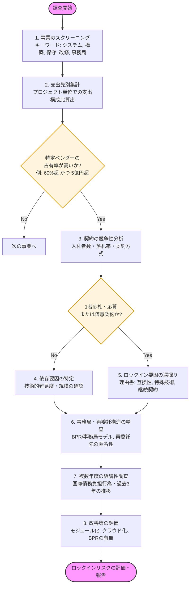

# 行政システムにおけるベンダーロックイン調査フロー

このドキュメントでは、行政事業レビュー（RS）データを用いて、特定のベンダーへの依存（ベンダーロックイン）が発生している事業を効率的に抽出・調査するためのフローを定義します。

## 1. 調査フロー図 (Mermaid)

## 2. 各ステップの詳細

### ステップ1: 事業のスクリーニング
大規模ITシステムや大規模補助金事務局に関連する事業を抽出します。
- **データソース**: `2-1_RS_2024_予算・執行_サマリ.csv` 等
- **抽出条件**: 事業名に「システム」「ネットワーク」「データベース」「保守」「運用」「構築」に加え、「事務局」「支援事業」「交付金」「代行」などのキーワードを含む。

### ステップ2: 支出先別集計
プロジェクトごとに支出額の上位ベンダーを特定し、集中度を算出します。
- **指標**: `(特定ベンダーへの支出額) / (事業全体の総支出額)`
- **しきい値例**: 占有率60%以上、かつ年間支出額が5億円以上を「高リスク」として抽出。

### ステップ3 & 4: 契約の競争性分析
入札が適切に行われているかを確認します。
- **データソース**: `5-1_RS_2024_支出先_支出情報.csv`
- **チェックポイント**:
    - **入札者数**: 1社のみ（1者応札）が常態化していないか。
    - **落札率**: 95%を超える高水準な落札率が続いていないか。
    - **契約方式**: 随意契約が多用されていないか。

### ステップ5: ロックイン要因の深掘り
なぜ競争が働かないのか、CSV内の「一者応札・一者応募又は競争性のない随意契約となった理由」欄を精査します。
- **キーワード**: 「互換性の確保」「既存システムの詳細を把握しているため」「他社による履行が困難」など。

### ステップ6: 事務局・再委託構造の精査
受託者が実質的な業務遂行者か、あるいは単なる「事務局」として他社に再委託を前提としているかを確認します。
- **チェックポイント**:
    - **再委託率**: 契約額の大部分が再委託（BPRモデル）されていないか（5-1 CSVや理由書から推測）。
    - **再委託先の匿名性**: 5-2 CSV（支出のつながり）で再委託先が「民間企業」等で伏せられていないか。
    - **事業局モデル**: 公益法人や広告代理店が受託し、実務をITベンダーやコールセンターに再委託する構造になっていないか。

### ステップ7: 複数年度の継続性調査
単発ではなく、長期的に固定化されているかを確認します。
- **チェックポイント**:
    - **国庫債務負担行為**: 複数年度にわたる支払契約（リース等）が含まれているか。
    - **経年比較**: 過去3〜5年分のレビューシートを比較し、メインベンダーが不動であるかを確認。

### ステップ8: 改善策の評価
政府側がロックインを認識し、対策を講じているかを評価します。
- **チェックポイント**:
    - モジュール分割による新規参入の促進。
    - ガバメントクラウド（Gov-Cloud）への移行計画。
    - オープンスタンダードの採用。

## 3. 評価結果の分類例

| リスクレベル | 判定基準 | 推奨アクション |
| :--- | :--- | :--- |
| **高 (Critical)** | 1社占有80%超、入札者1社、理由が「互換性」のみ | 抜本的なアーキテクチャ見直しと分割発注の提言 |
| **中 (Warning)** | 1社占有60-80%、入札者2-3社、落札率高止まり | 次回更改時の仕様公開レベルの向上を確認 |
| **低 (Monitor)** | 複数社による競争あり、クラウド化着手済み | 継続的なモニタリング |

---
**作成者**: Antigravity
**更新日**: 2026年1月31日
