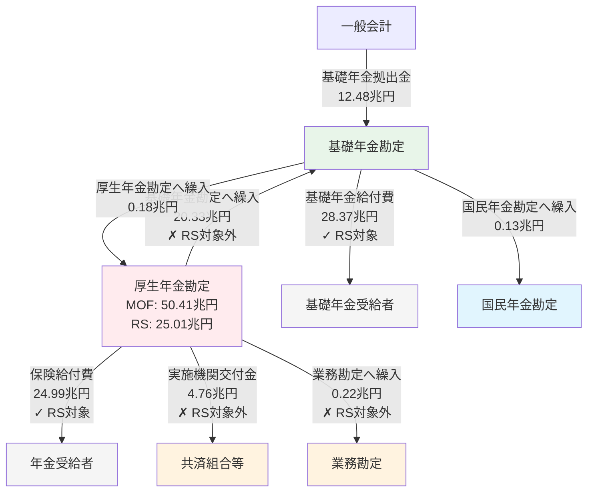
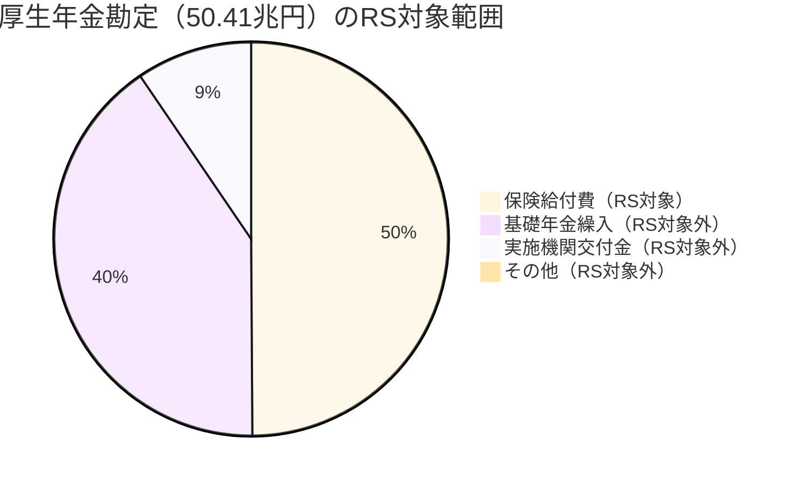
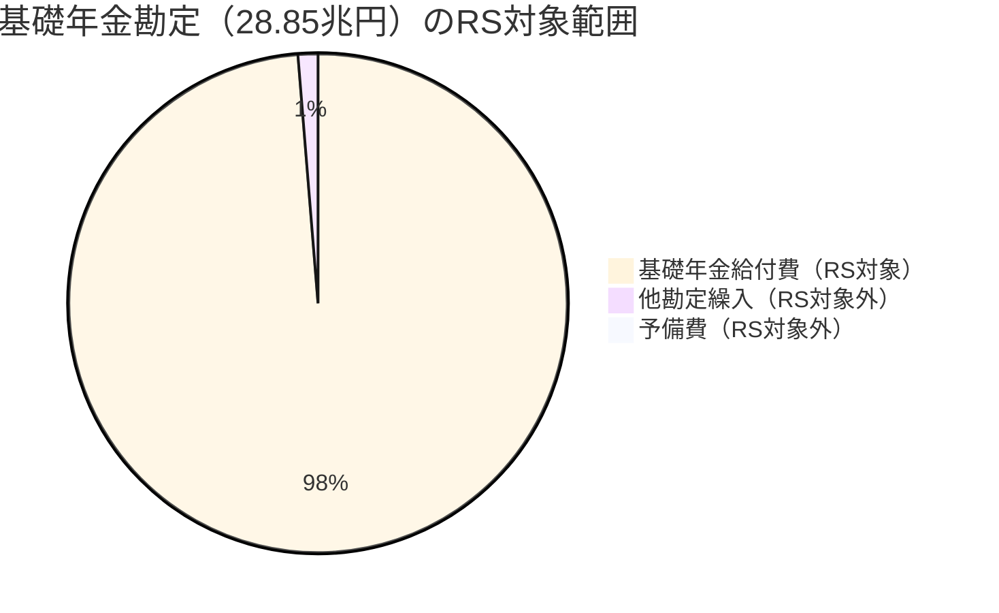
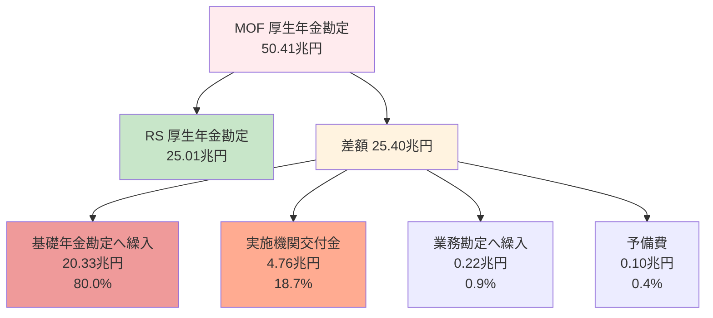
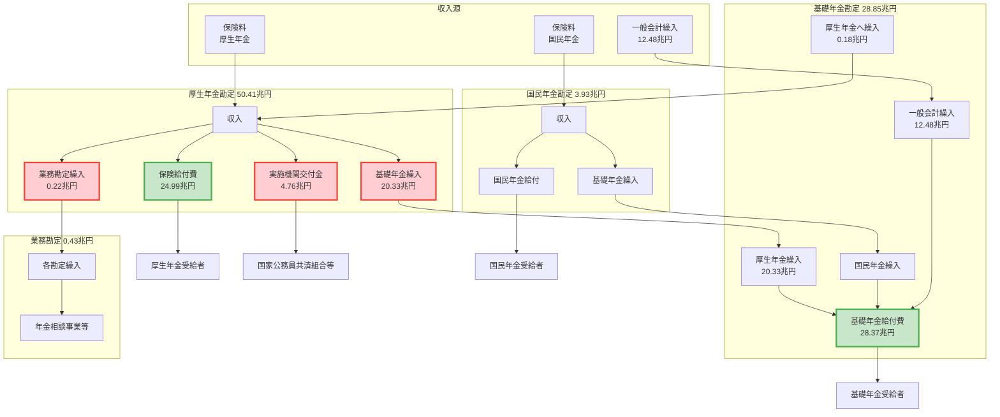
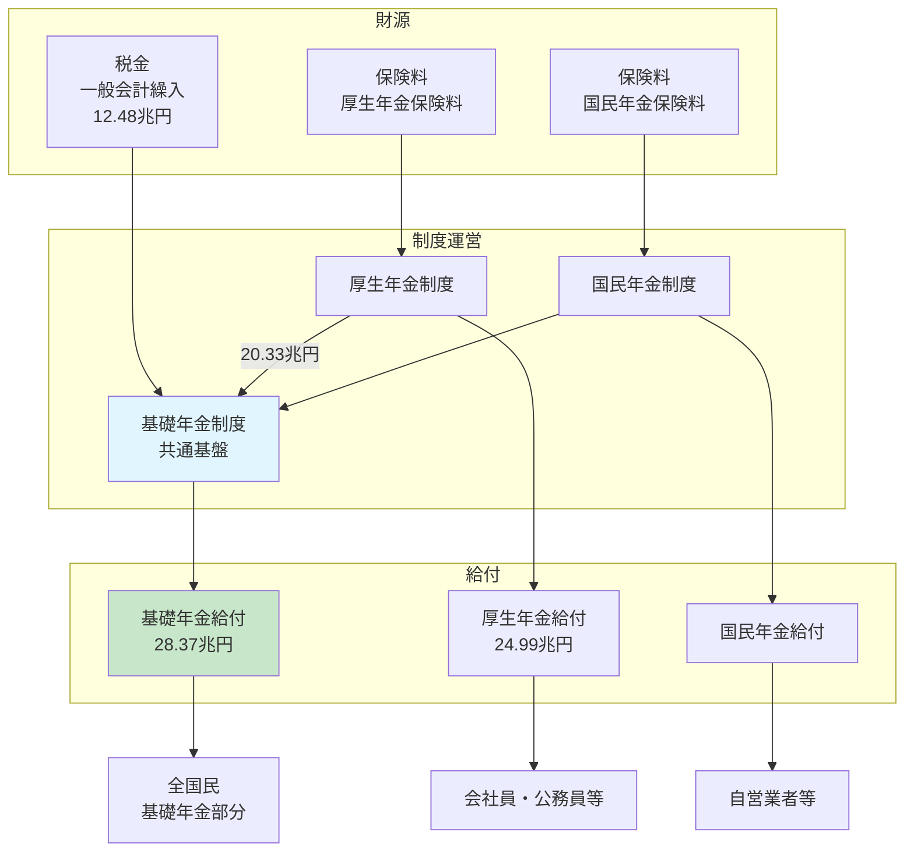

# 年金特別会計の資金フロー可視化

## 概要

このドキュメントでは、2023年度（令和5年度）の年金特別会計における資金の流れをMermaid図で可視化します。

特に以下の点を明確にします：
- 一般会計から年金特別会計への繰入（12.48兆円）
- 厚生年金勘定から基礎年金勘定への繰入（20.33兆円）← **差額の80%を占める重要なフロー**
- 実施機関（共済組合等）への交付金（4.76兆円）
- RSシステムの対象範囲と対象外の範囲

---

## 1. 年金特別会計全体のフロー図

### 1.1 基本フロー図（主要な資金の流れ）



**凡例**:
- 🔴 赤色（厚生年金勘定）: MOFとRSで大きな差異がある勘定
- 🟢 緑色（基礎年金勘定）: MOFとRSでほぼ一致する勘定
- ✓ RS対象: RSシステムに含まれる支出
- ✗ RS対象外: RSシステムに含まれない支出（勘定間繰入、交付金等）

---

### 1.2 詳細フロー図（全勘定を含む）

```mermaid
flowchart LR
    subgraph 一般会計
        A[一般会計歳出]
    end

    subgraph 年金特別会計
        subgraph 厚生年金勘定_50.41兆円
            C1[保険料収入]
            C2[保険給付費<br/>24.99兆円]
            C3[基礎年金繰入<br/>20.33兆円]
            C4[実施機関交付金<br/>4.76兆円]
            C5[業務勘定繰入<br/>0.22兆円]
            C6[予備費 0.10兆円]
        end

        subgraph 基礎年金勘定_28.85兆円
            B1[一般会計繰入<br/>12.48兆円]
            B2[厚生年金繰入<br/>20.33兆円]
            B3[国民年金繰入]
            B4[基礎年金給付費<br/>28.37兆円]
            B5[他勘定繰入<br/>0.37兆円]
        end

        subgraph 国民年金勘定_3.93兆円
            G1[保険料収入]
            G2[国民年金給付]
        end

        subgraph 健康勘定_12.51兆円
            H1[保険料収入]
            H2[後期高齢者医療]
        end

        subgraph 子ども・子育て支援勘定_3.34兆円
            I1[一般会計繰入<br/>2.50兆円]
            I2[子育て支援事業]
        end

        subgraph 業務勘定_0.43兆円
            F1[各勘定繰入]
            F2[年金相談事業]
        end
    end

    A -->|12.48兆円| B1
    A -->|2.50兆円| I1
    C3 --> B2
    C5 --> F1
    C2 --> 受給者1
    C4 --> 共済組合
    B4 --> 受給者2

    style C2 fill:#c8e6c9
    style C3 fill:#ffcdd2
    style C4 fill:#ffcdd2
    style C5 fill:#ffcdd2
    style B4 fill:#c8e6c9
```

---

## 2. RS対象範囲の可視化

### 2.1 厚生年金勘定のRS対象範囲



**RS対象率**: 49.6%（24.99兆円 / 50.41兆円）

---

### 2.2 基礎年金勘定のRS対象範囲



**RS対象率**: 98.3%（28.37兆円 / 28.85兆円）← **ほぼ完全一致**

---

## 3. 差額25.40兆円の内訳（厚生年金勘定）



**結論**: 差額の80%は「基礎年金勘定への財源移転」であり、これは事業レビュー対象ではない制度間の財源調整である。

---

## 4. 年金特別会計の勘定間フロー（詳細版）



---

## 5. 年金制度全体の財源構造



---

## 6. 図の説明

### 6.1 基本フロー図の解説

1. **一般会計からの繰入（12.48兆円）**
   - 国民の税金から基礎年金財源として投入される
   - 基礎年金勘定で管理される

2. **厚生年金勘定から基礎年金勘定への繰入（20.33兆円）**
   - **これが差額25.40兆円の80%を占める**
   - 会社員の厚生年金保険料から基礎年金部分を財源として移転
   - RSシステムの「事業レビュー」対象外（制度間の財源調整）

3. **実施機関交付金（4.76兆円）**
   - 国家公務員共済組合連合会等への交付金
   - 差額の18.7%を占める
   - RSシステム対象外

4. **保険給付費（厚生年金: 24.99兆円、基礎年金: 28.37兆円）**
   - 実際の年金給付
   - **RSシステムに含まれる唯一の支出**
   - 事業レビューの対象

### 6.2 RS対象範囲の違い

| 勘定 | MOF総額 | RS対象額 | 差額 | RS対象率 | 理由 |
|------|---------|----------|------|----------|------|
| 厚生年金勘定 | 50.41兆円 | 25.01兆円 | 25.40兆円 | 49.6% | 勘定間繰入・交付金がRS対象外 |
| 基礎年金勘定 | 28.85兆円 | 28.37兆円 | 0.48兆円 | 98.3% | 給付費中心でほぼ一致 |

**重要な発見**:
- 基礎年金勘定は「給付金支払い」が中心 → RSとMOFがほぼ一致
- 厚生年金勘定は「勘定間繰入」が多い → RSとMOFで大きな差

---

## 7. データソース

### 7.1 MOFデータ
- **ファイル**: `data/download/mof_2023/DL202312001b.csv`
- **内容**: 令和5年度特別会計歳出（当初予算）
- **分析スクリプト**: `scripts/analyze-mof-kousei-nenkin.ts`

### 7.2 RSシステムデータ
- **ファイル**: `data/year_2024/2-2_RS_2024_予算・執行_予算種別・歳出予算項目.csv`
- **内容**: 令和5年度（2023年度）当初予算の事業別歳出項目
- **分析スクリプト**: `scripts/analyze-nenkin-kanjou.ts`

### 7.3 厚生労働省公式資料
- [令和5年度当初予算（年金特別会計厚生年金勘定）](https://www.mhlw.go.jp/wp/yosan/kaiji/nenkin30-03.html)
- [年金特別会計](https://www.mhlw.go.jp/wp/yosan/kaiji/nenkin01.html)

---

## 8. 参考ドキュメント

- [20260201_2111_厚生年金勘定と基礎年金勘定の詳細分析.md](20260201_2111_厚生年金勘定と基礎年金勘定の詳細分析.md)
  - 差額25.40兆円の詳細な内訳分析

- [20260201_1423_RSシステムとMOF歳入歳出データの対応関係分析.md](20260201_1423_RSシステムとMOF歳入歳出データの対応関係分析.md)
  - RSシステムとMOFデータの全体的な対応関係

---

## 9. まとめ

### 9.1 年金特別会計の資金フローの特徴

1. **複雑な勘定間繰入構造**
   - 厚生年金勘定 → 基礎年金勘定（20.33兆円）
   - 国民年金勘定 → 基礎年金勘定
   - 基礎年金勘定 → 厚生年金勘定（0.18兆円）← 逆流も存在

2. **基礎年金勘定が中心ハブ**
   - 一般会計、厚生年金、国民年金から資金が集約
   - 全国民への基礎年金給付（28.37兆円）を実施

3. **RSシステムの対象範囲**
   - 「実際の給付金支払い」のみを対象
   - 「勘定間の財源移転」は対象外
   - これにより、厚生年金勘定でMOFとRSに50%の差が発生

### 9.2 可視化の効果

Mermaid図により以下が明確になった：
- 25.40兆円の差額の80%（20.33兆円）が基礎年金勘定への繰入であること
- 厚生年金勘定と基礎年金勘定の役割の違い
- RS対象範囲と対象外の範囲の明確な区別
- 年金制度全体の財源構造（保険料 + 税金 → 給付）

---

**作成日**: 2026年2月1日 22:00
**データ年度**: 2023年度（令和5年度）当初予算
**分析スクリプト**: `scripts/analyze-mof-kousei-nenkin.ts`, `scripts/analyze-nenkin-kanjou.ts`
