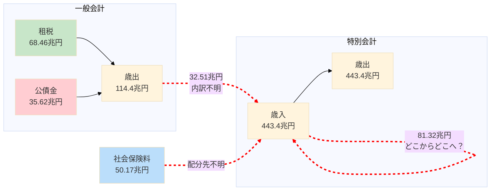
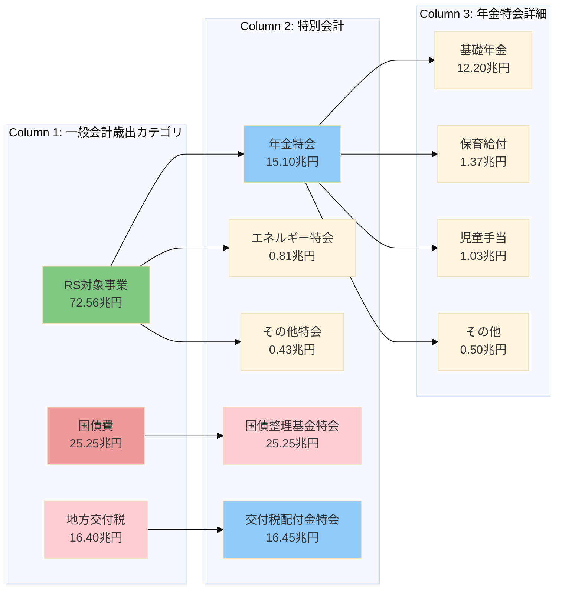
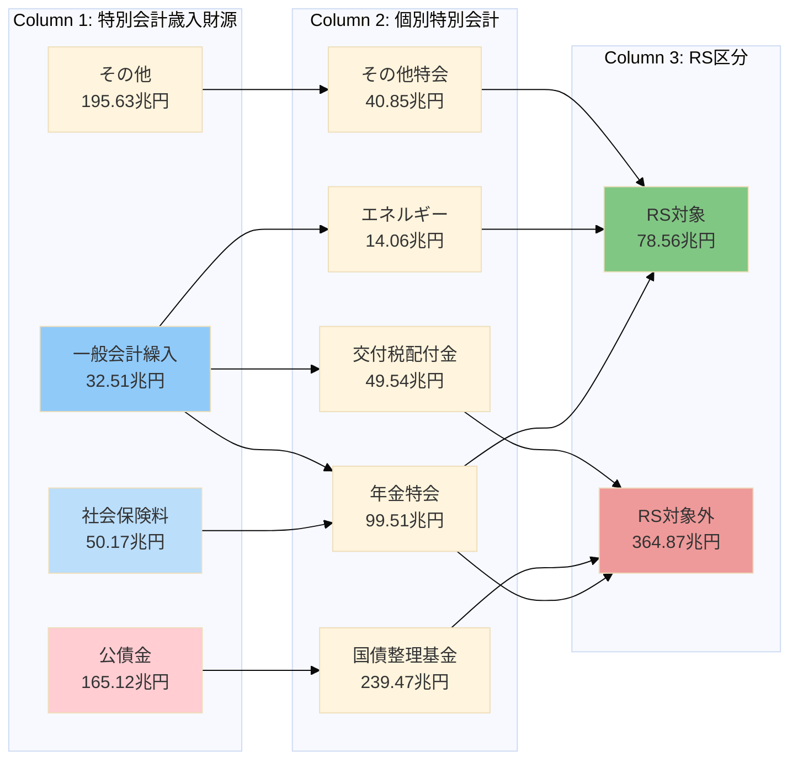

# MOF繰入データ構造拡張と複数サンキー図実装提案

## 概要

一般会計と特別会計の繰入関係は複雑に絡み合っており、単一のサンキー図では全体像を把握しにくい状況です。このドキュメントでは、**スパゲッティコードをリファクタリングするように**、データ構造を整理し、複数の視点から可視化する実装案を提案します。

---

## 1. 現状の問題分析（スパゲッティ構造）

### 1.1 現在のデータ構造の課題

```typescript
// 現在のMOFBudgetData（簡略版）
interface MOFBudgetData {
  generalAccount: {
    revenue: {
      taxes: { total: number };           // 68.46兆円
      publicBonds: number;                 // 35.62兆円
      // ...
    };
    expenditure: {
      rsTarget: number;                    // 72.56兆円（中に繰入が混在）
      debtService: number;                 // 25.25兆円
      localAllocationTax: number;          // 16.40兆円
      // ...
    };
  };
  specialAccount: {
    revenue: {
      insurancePremiums: { total: number };   // 50.17兆円
      transferFromGeneral: number;            // 32.51兆円（総額のみ、内訳不明）
      publicBonds: number;                    // 165.12兆円
      transferFromOther: number;              // 81.32兆円（どこからどこへ？）
      // ...
    };
    expenditure: {
      accounts: { /* 個別特会 */ };
      // ...
    };
  };
}
```

**問題点**:
1. **繰入の内訳が不明**: `transferFromGeneral: 32.51兆円`は総額のみ
2. **フローが追跡不能**: どの一般会計歳出がどの特会に流れているか不明
3. **特会間繰入が謎**: `transferFromOther: 81.32兆円`の詳細が不明
4. **社会保険料の行方が不明**: 50.17兆円がどの特会に配分されているか不明

### 1.2 複雑性の可視化（Mermaid）



**赤い破線**: 詳細が不明な複雑なフロー（スパゲッティ部分）

---

## 2. リファクタリング方針（関心の分離）

### 2.1 単一責任の原則を適用

複雑なフローを**3つの独立したサンキー図**に分離：

1. **一般会計フロー**: 税収 → 一般会計歳出 → RS対象/対象外
2. **一般会計→特別会計繰入フロー**: 一般会計歳出 → 個別特会
3. **特別会計全体フロー**: 社会保険料 → 特会 → RS対象/対象外

### 2.2 データ構造の階層化

```
Level 1: 原子データ（Raw Data）
  ├─ 一般会計歳入（税目別）
  ├─ 一般会計歳出（項目別）
  ├─ 特別会計歳入（財源別×会計別）
  └─ 特別会計歳出（項目別×会計別）

Level 2: 集約データ（Aggregated Data）
  ├─ 繰入内訳（一般→特別）
  ├─ 特会間繰入（特別→特別）
  └─ 社会保険料配分

Level 3: サンキーデータ（Visualization Data）
  ├─ 一般会計フロー
  ├─ 繰入詳細フロー
  └─ 特別会計フロー
```

---

## 3. 拡張データ構造の設計

### 3.1 繰入詳細の型定義

```typescript
/**
 * 一般会計から特別会計への繰入詳細
 */
export interface TransferFromGeneralAccount {
  /** 実質的な繰入総額（国債整理基金除く） */
  total: number;

  /** 繰入総額（国債整理基金含む、参考値） */
  totalIncludingDebt: number;

  /** 個別特会への配分 */
  breakdown: {
    /** 年金特別会計への繰入 */
    pension: {
      total: number;
      details: {
        basicPension: number;          // 基礎年金
        nurseryBenefit: number;        // 子どものための教育・保育給付
        childAllowance: number;        // 児童手当
        pensionAdministration: number; // 年金制度関連その他
      };
    };

    /** 交付税及び譲与税配付金特別会計への繰入 */
    localAllocationTax: {
      total: number;
      details: {
        generalTransfer: number;       // 一般交付税交付金
        specialTransfer: number;       // 地方特例交付金
        trafficViolationFund: number;  // 交通反則者納金財源
      };
    };

    /** 国債整理基金特別会計への繰入（別枠参考値） */
    debtRetirement: {
      total: number;
      details: {
        ordinaryBondRedemption: number;  // 普通国債等償還財源
        pensionBondRedemption: number;   // 年金特例公債償還財源
        investmentBondRedemption: number; // 出資国債等償還財源
      };
    };

    /** エネルギー対策特別会計への繰入 */
    energy: {
      total: number;
      details: {
        petroleumCoalTax: number;      // 石油石炭税財源
        powerDevelopmentTax: number;   // 電源開発促進税財源
      };
    };

    /** 食料安定供給特別会計への繰入 */
    foodSupply: number;

    /** 労働保険特別会計への繰入 */
    laborInsurance: number;

    /** 自動車安全特別会計への繰入 */
    automotiveSafety: number;

    /** 東日本大震災復興特別会計への繰入 */
    reconstruction: number;

    /** 国有林野事業債務管理特別会計への繰入 */
    forestryDebtManagement: number;

    /** 特許特別会計への繰入 */
    patent: number;
  };
}

/**
 * 社会保険料の特別会計別配分
 */
export interface InsurancePremiumAllocation {
  total: number;

  breakdown: {
    /** 年金特別会計（年金保険料） */
    pension: number;

    /** 労働保険特別会計（労働保険料） */
    labor: number;

    /** その他特別会計（健康保険料等） */
    other: number;
  };
}

/**
 * 特別会計間の繰入詳細
 */
export interface TransferBetweenSpecialAccounts {
  total: number;

  /** 主要な繰入フロー */
  majorFlows: Array<{
    from: string;          // 繰入元特別会計
    to: string;            // 繰入先特別会計
    amount: number;        // 金額
    purpose: string;       // 目的・用途
  }>;
}
```

### 3.2 拡張MOFBudgetData

```typescript
export interface MOFBudgetDataV2 {
  fiscalYear: number;
  dataType: 'budget' | 'settlement';

  // 一般会計（既存構造維持）
  generalAccount: {
    revenue: {
      taxes: { /* ... */ };
      publicBonds: number;
      stampRevenue: number;
      otherRevenue: number;
      total: number;
    };
    expenditure: {
      rsTarget: number;
      debtService: number;
      localAllocationTax: number;
      reserves: number;
      total: number;
    };
  };

  // 特別会計（拡張版）
  specialAccount: {
    revenue: {
      /** 社会保険料（配分詳細付き） */
      insurancePremiums: InsurancePremiumAllocation;

      /** 一般会計繰入（詳細内訳付き） */
      transferFromGeneral: TransferFromGeneralAccount;

      /** 特別会計間繰入（フロー詳細付き） */
      transferFromOther: TransferBetweenSpecialAccounts;

      publicBonds: number;
      other: number;
      total: number;
    };

    expenditure: {
      accounts: { /* ... */ };
      rsTarget: { total: number };
      rsExcluded: { total: number };
      total: number;
    };
  };
}
```

---

## 4. 複数サンキー図の設計

### 4.1 サンキー図1: 一般会計フロー（既存）

**目的**: 税収から一般会計歳出へのフロー、RS対象/対象外の区分

```
Column 1: 税目別歳入
  - 消費税（23.38兆円）
  - 所得税（21.05兆円）
  - 法人税（14.60兆円）
  - 公債金（35.62兆円）
  - その他
  ↓
Column 2: 一般会計集約
  - 一般会計（114.4兆円）
  ↓
Column 3: RS区分
  - RS対象（72.56兆円）
  - 国債費（25.25兆円）
  - 地方交付税（16.40兆円）
  - その他
  ↓
Column 4-5: 詳細・集約（既存フロー）
```

**実装状況**: ✅ 既に実装済み（現在のMOF予算概要ページ）

---

### 4.2 サンキー図2: 一般会計→特別会計繰入フロー（新規）

**目的**: 一般会計歳出のどの項目がどの特別会計に繰り入れられているかを可視化



**ノード構成**:

```typescript
// Column 1: 一般会計歳出カテゴリ
{ id: 'gen-rs', name: 'RS対象事業', value: 72.56兆円, type: 'general-expenditure' }
{ id: 'gen-debt', name: '国債費', value: 25.25兆円, type: 'general-expenditure' }
{ id: 'gen-local', name: '地方交付税', value: 16.40兆円, type: 'general-expenditure' }

// Column 2: 繰入先特別会計
{ id: 'sa-pension', name: '年金特会', value: 15.10兆円, type: 'special-account' }
{ id: 'sa-local', name: '交付税配付金特会', value: 16.45兆円, type: 'special-account' }
{ id: 'sa-debt', name: '国債整理基金特会', value: 25.25兆円, type: 'special-account' }
{ id: 'sa-energy', name: 'エネルギー特会', value: 0.81兆円, type: 'special-account' }

// Column 3: 年金特会内訳
{ id: 'pension-basic', name: '基礎年金', value: 12.20兆円, type: 'pension-detail' }
{ id: 'pension-nursery', name: '保育給付', value: 1.37兆円, type: 'pension-detail' }
{ id: 'pension-child', name: '児童手当', value: 1.03兆円, type: 'pension-detail' }
```

**リンク構成**:

```typescript
// 一般会計 → 特別会計
{ source: 'gen-rs', target: 'sa-pension', value: 15.10兆円 }
{ source: 'gen-rs', target: 'sa-energy', value: 0.81兆円 }
{ source: 'gen-local', target: 'sa-local', value: 16.45兆円 }
{ source: 'gen-debt', target: 'sa-debt', value: 25.25兆円 }

// 年金特会 → 内訳
{ source: 'sa-pension', target: 'pension-basic', value: 12.20兆円 }
{ source: 'sa-pension', target: 'pension-nursery', value: 1.37兆円 }
{ source: 'sa-pension', target: 'pension-child', value: 1.03兆円 }
```

**実装ページ**: `/mof-budget-overview/transfer-detail`

---

### 4.3 サンキー図3: 特別会計全体フロー（新規）

**目的**: 社会保険料を含む特別会計の全体像を可視化



**ノード構成**:

```typescript
// Column 1: 特別会計歳入財源
{ id: 'sa-rev-insurance', name: '社会保険料', value: 50.17兆円, type: 'sa-revenue' }
{ id: 'sa-rev-transfer', name: '一般会計繰入', value: 32.51兆円, type: 'sa-revenue' }
{ id: 'sa-rev-bonds', name: '公債金（借換債）', value: 165.12兆円, type: 'sa-revenue' }
{ id: 'sa-rev-other', name: 'その他収入', value: 195.63兆円, type: 'sa-revenue' }

// Column 2: 個別特別会計
{ id: 'sa-pension', name: '年金特会', value: 99.51兆円, type: 'special-account' }
{ id: 'sa-debt', name: '国債整理基金', value: 239.47兆円, type: 'special-account' }
{ id: 'sa-local', name: '交付税配付金', value: 49.54兆円, type: 'special-account' }

// Column 3: RS区分
{ id: 'sa-rs-target', name: 'RS対象', value: 78.56兆円, type: 'rs-category' }
{ id: 'sa-rs-excluded', name: 'RS対象外', value: 364.87兆円, type: 'rs-category' }
```

**実装ページ**: `/mof-budget-overview/special-accounts`

---

## 5. 実装ロードマップ

### Phase 1: データ生成スクリプト拡張（1週間）

**タスク1-1: MOF CSVパーサーの作成**

```typescript
// scripts/parse-mof-transfer-data.ts

interface MOFTransferData {
  generalToSpecial: Array<{
    specialAccount: string;
    accountName: string;
    amount: number;
    source: string;  // 一般会計歳出項目名
  }>;

  specialToSpecial: Array<{
    fromAccount: string;
    toAccount: string;
    amount: number;
    purpose: string;
  }>;
}

async function parseMOFTransferData(): Promise<MOFTransferData> {
  // DL202311001b.csv から特別会計繰入を抽出
  const generalToSpecial = await parseGeneralAccountTransfers();

  // DL202312001a.csv から特会間繰入を抽出
  const specialToSpecial = await parseSpecialAccountTransfers();

  return { generalToSpecial, specialToSpecial };
}
```

**タスク1-2: データ生成スクリプト更新**

```typescript
// scripts/generate-mof-budget-overview-data.ts

function generateMOFBudgetData(): MOFBudgetDataV2 {
  // MOF CSVから繰入データを抽出
  const transferData = parseMOFTransferData();

  // 一般会計繰入の詳細を構築
  const transferFromGeneral = buildTransferFromGeneral(transferData);

  // 社会保険料配分を構築
  const insurancePremiums = buildInsurancePremiumAllocation();

  return {
    // ... existing fields
    specialAccount: {
      revenue: {
        insurancePremiums,
        transferFromGeneral,
        // ...
      },
      // ...
    },
  };
}
```

---

### Phase 2: 型定義とデータ構造拡張（3日）

**タスク2-1: 型定義の追加**

```bash
# 新しい型定義ファイル作成
touch types/mof-transfer.ts
```

```typescript
// types/mof-transfer.ts

export interface TransferFromGeneralAccount { /* ... */ }
export interface InsurancePremiumAllocation { /* ... */ }
export interface TransferBetweenSpecialAccounts { /* ... */ }
```

**タスク2-2: 既存型の拡張**

```typescript
// types/mof-budget-overview.ts

import type {
  TransferFromGeneralAccount,
  InsurancePremiumAllocation,
  TransferBetweenSpecialAccounts,
} from './mof-transfer';

export interface MOFBudgetData {
  // ... existing fields

  specialAccount: {
    revenue: {
      insurancePremiums: number | InsurancePremiumAllocation;  // Union型で後方互換性
      transferFromGeneral: number | TransferFromGeneralAccount;
      transferFromOther: number | TransferBetweenSpecialAccounts;
      // ...
    };
    // ...
  };
}
```

**後方互換性の確保**:
- Union型 (`number | DetailedType`) で既存コードを壊さない
- データ生成時に詳細版を生成
- 既存コードは`number`として扱える

---

### Phase 3: サンキー生成ロジック拡張（1週間）

**タスク3-1: 繰入詳細サンキー生成器**

```typescript
// app/lib/mof-transfer-sankey-generator.ts

export function generateTransferDetailSankey(
  mofData: MOFBudgetDataV2
): { nodes: SankeyNode[]; links: SankeyLink[] } {
  const nodes: SankeyNode[] = [];
  const links: SankeyLink[] = [];

  // Column 1: 一般会計歳出カテゴリ
  nodes.push({
    id: 'gen-rs',
    name: 'RS対象事業',
    value: mofData.generalAccount.expenditure.rsTarget,
    type: 'general-expenditure',
  });

  // Column 2: 繰入先特別会計
  const transfer = mofData.specialAccount.revenue.transferFromGeneral;
  if (typeof transfer !== 'number') {
    // 詳細データが利用可能
    nodes.push({
      id: 'sa-pension',
      name: '年金特会',
      value: transfer.breakdown.pension.total,
      type: 'special-account',
    });

    // リンク作成
    links.push({
      source: 'gen-rs',
      target: 'sa-pension',
      value: transfer.breakdown.pension.total,
    });
  }

  return { nodes, links };
}
```

**タスク3-2: 特別会計全体サンキー生成器**

```typescript
// app/lib/mof-special-account-sankey-generator.ts

export function generateSpecialAccountSankey(
  mofData: MOFBudgetDataV2
): { nodes: SankeyNode[]; links: SankeyLink[] } {
  // Column 1: 特別会計歳入財源
  // Column 2: 個別特別会計
  // Column 3: RS区分
  // ...
}
```

---

### Phase 4: UI実装（1週間）

**タスク4-1: 新規ページ作成**

```bash
# 繰入詳細ページ
mkdir -p app/mof-budget-overview/transfer-detail
touch app/mof-budget-overview/transfer-detail/page.tsx

# 特別会計全体ページ
mkdir -p app/mof-budget-overview/special-accounts
touch app/mof-budget-overview/special-accounts/page.tsx
```

**タスク4-2: ページ実装**

```typescript
// app/mof-budget-overview/transfer-detail/page.tsx

'use client';

import { generateTransferDetailSankey } from '@/app/lib/mof-transfer-sankey-generator';

export default function TransferDetailPage() {
  const [data, setData] = useState<MOFBudgetDataV2 | null>(null);

  useEffect(() => {
    fetch('/data/mof-budget-overview-2023.json')
      .then(res => res.json())
      .then(setData);
  }, []);

  if (!data) return <LoadingSpinner />;

  const sankeyData = generateTransferDetailSankey(data);

  return (
    <div>
      <h1>一般会計から特別会計への繰入詳細</h1>
      <ResponsiveSankey
        data={sankeyData}
        // ... Nivo設定
      />
    </div>
  );
}
```

**タスク4-3: ナビゲーション追加**

```typescript
// app/mof-budget-overview/page.tsx

<nav>
  <Link href="/mof-budget-overview">全体フロー</Link>
  <Link href="/mof-budget-overview/transfer-detail">一般→特別繰入</Link>
  <Link href="/mof-budget-overview/special-accounts">特別会計全体</Link>
</nav>
```

---

### Phase 5: テスト・検証（3日）

**タスク5-1: データ整合性チェック**

```typescript
// scripts/validate-mof-transfer-data.ts

function validateTransferData(data: MOFBudgetDataV2): ValidationResult {
  const transfer = data.specialAccount.revenue.transferFromGeneral;

  if (typeof transfer === 'number') {
    return { valid: false, error: 'Detailed data not available' };
  }

  // 合計値チェック
  const breakdownTotal = Object.values(transfer.breakdown)
    .reduce((sum, item) => sum + (typeof item === 'number' ? item : item.total), 0);

  if (Math.abs(breakdownTotal - transfer.total) > 1e9) {  // 10億円の誤差許容
    return { valid: false, error: `Total mismatch: ${breakdownTotal} vs ${transfer.total}` };
  }

  return { valid: true };
}
```

**タスク5-2: サンキー図視覚確認**

- 各サンキー図でノードの合計値が一致するか確認
- リンクの太さが金額に比例しているか確認
- 色分けが適切か確認

---

## 6. マイグレーション戦略

### 6.1 段階的移行（Breaking Changeなし）

```typescript
// 既存コード（v1）は引き続き動作
if (typeof mofData.specialAccount.revenue.transferFromGeneral === 'number') {
  // 旧データ構造
  const total = mofData.specialAccount.revenue.transferFromGeneral;
} else {
  // 新データ構造
  const { total, breakdown } = mofData.specialAccount.revenue.transferFromGeneral;
}
```

### 6.2 データバージョニング

```typescript
export interface MOFBudgetDataV2 {
  version: 2;  // データバージョン識別
  // ...
}

// 型ガード
function isMOFBudgetDataV2(data: any): data is MOFBudgetDataV2 {
  return data.version === 2;
}
```

### 6.3 JSONスキーマバリデーション

```json
{
  "$schema": "http://json-schema.org/draft-07/schema#",
  "title": "MOFBudgetDataV2",
  "type": "object",
  "properties": {
    "version": { "const": 2 },
    "specialAccount": {
      "properties": {
        "revenue": {
          "properties": {
            "transferFromGeneral": {
              "type": "object",
              "properties": {
                "total": { "type": "number" },
                "breakdown": { "type": "object" }
              },
              "required": ["total", "breakdown"]
            }
          }
        }
      }
    }
  }
}
```

---

## 7. パフォーマンス最適化

### 7.1 データサイズ削減

**現在のデータサイズ**:
- `mof-budget-overview-2023.json`: 約4KB

**拡張後の推定サイズ**:
- 繰入詳細追加: +3KB
- 社会保険料配分追加: +1KB
- 特会間繰入追加: +5KB
- **合計**: 約13KB

**最適化策**:
- 数値を千円単位で保存（桁数削減）
- 不要な小数点以下を切り捨て
- 必要に応じてgzip圧縮

### 7.2 遅延読み込み

```typescript
// メインデータ
const mainData = await fetch('/data/mof-budget-overview-2023.json');

// 詳細データは必要時のみ読み込み
const transferDetail = await fetch('/data/mof-transfer-detail-2023.json');
```

---

## 8. 実装スケジュール

| フェーズ | タスク | 期間 | 担当 |
|---------|--------|------|------|
| **Phase 1** | データ生成スクリプト拡張 | 1週間 | Backend |
| **Phase 2** | 型定義とデータ構造拡張 | 3日 | Backend |
| **Phase 3** | サンキー生成ロジック拡張 | 1週間 | Frontend |
| **Phase 4** | UI実装 | 1週間 | Frontend |
| **Phase 5** | テスト・検証 | 3日 | QA |
| **合計** | - | **約3週間** | - |

---

## 9. 期待される効果

### 9.1 ユーザー体験の向上

**Before（現在）**:
- 一般会計繰入32.51兆円の内訳が不明
- どの税収がどの特会に流れているか追跡不能
- 社会保険料の行方が不明

**After（実装後）**:
- ✅ 繰入詳細が特会別に可視化
- ✅ 基礎年金12.20兆円が一般会計から繰入されていることが明確
- ✅ 社会保険料50.17兆円がどの特会に配分されているか一目瞭然

### 9.2 データ分析の深化

**新たに可能になる分析**:
1. **財源トレーサビリティ**: 消費税 → 一般会計 → 年金特会 → 基礎年金の流れを追跡
2. **繰入依存度分析**: 各特会の財源構成（保険料 vs 一般会計繰入）を比較
3. **年度間比較**: 繰入額の推移を年度別に分析

### 9.3 透明性の向上

- 国民に対する予算情報の透明性向上
- 一般会計と特別会計の関係を明確化
- 「特別会計は複雑で分からない」という印象を改善

---

## 10. リスクと対策

### 10.1 データ精度リスク

**リスク**: MOF CSVからの自動抽出で誤差が発生
**対策**:
- 複数データソースでクロスチェック
- 合計値の整合性検証
- 手動確認プロセスの導入

### 10.2 パフォーマンスリスク

**リスク**: データサイズ増加でページ読み込みが遅延
**対策**:
- 遅延読み込み（Lazy Loading）
- データ分割（メイン + 詳細）
- gzip圧縮

### 10.3 メンテナンスリスク

**リスク**: 複雑性増加でバグが発生しやすくなる
**対策**:
- ユニットテストの充実
- TypeScript型安全性の活用
- ドキュメント整備

---

## 11. まとめ

### 11.1 実装提案のポイント

1. **関心の分離**: 複雑なフローを3つの独立したサンキー図に分離
2. **データ構造の階層化**: 原子データ → 集約データ → 可視化データ
3. **後方互換性**: Union型とバージョニングで既存コードを保護
4. **段階的実装**: 3週間のロードマップで着実に進める

### 11.2 スパゲッティからの脱却

**Before**: 複雑に絡み合った単一のデータ構造
**After**: 責任が明確な独立したコンポーネント群

これは、まさに**レガシーコードのリファクタリング**と同じアプローチです。

---

## 12. 次のアクション

### 即座に着手可能なタスク

1. **Phase 1スタート**: MOF CSVパーサーの実装
   ```bash
   npx tsx scripts/parse-mof-transfer-data.ts
   ```

2. **型定義の作成**: `types/mof-transfer.ts`の実装

3. **プロトタイプ作成**: 小規模データでサンキー図をテスト

### 中長期タスク

1. **複数年度対応**: 2021-2024年度のデータ拡張
2. **インタラクティブ機能**: 特定フローのハイライト機能
3. **エクスポート機能**: CSV/PDF出力

---

**作成日**: 2026年2月7日 08:27
**対象システム**: marumie-rssystem MOF予算概要ビュー
**提案者**: Claude Code
**ステータス**: 提案（実装待ち）
