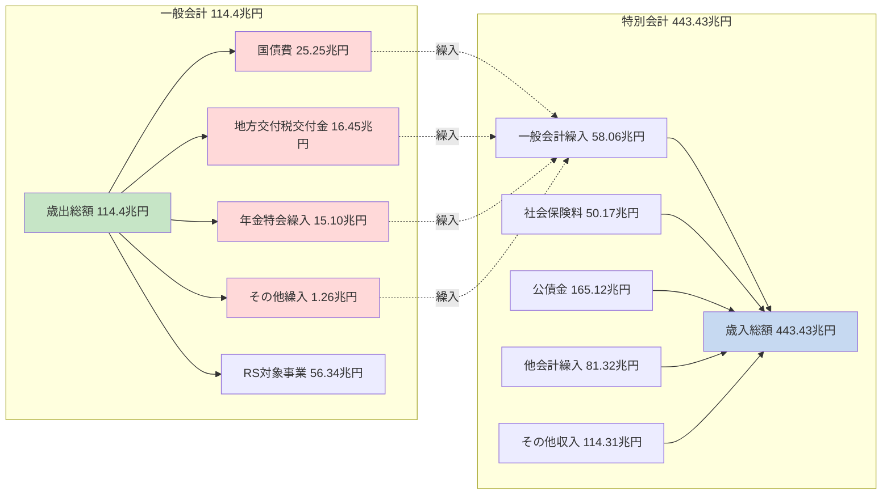
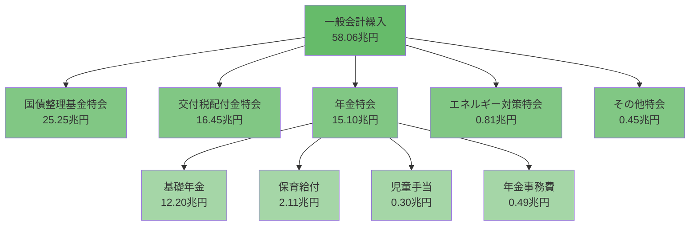
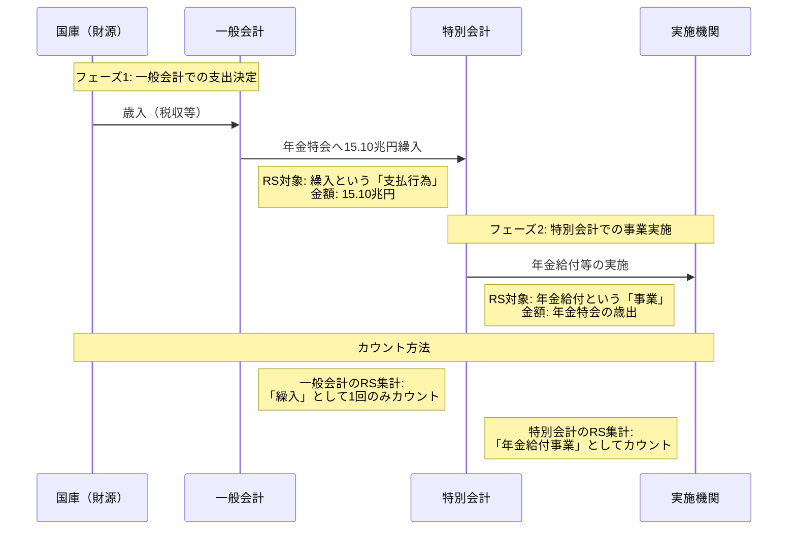
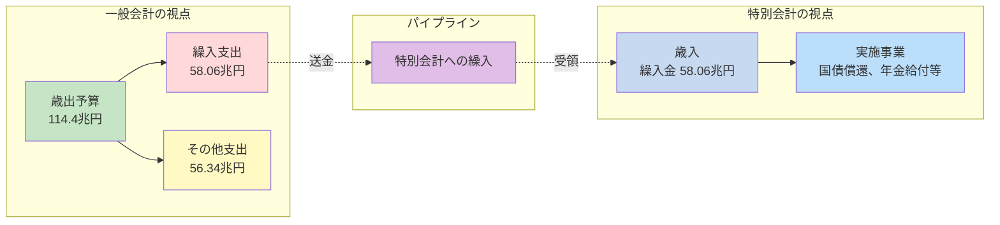
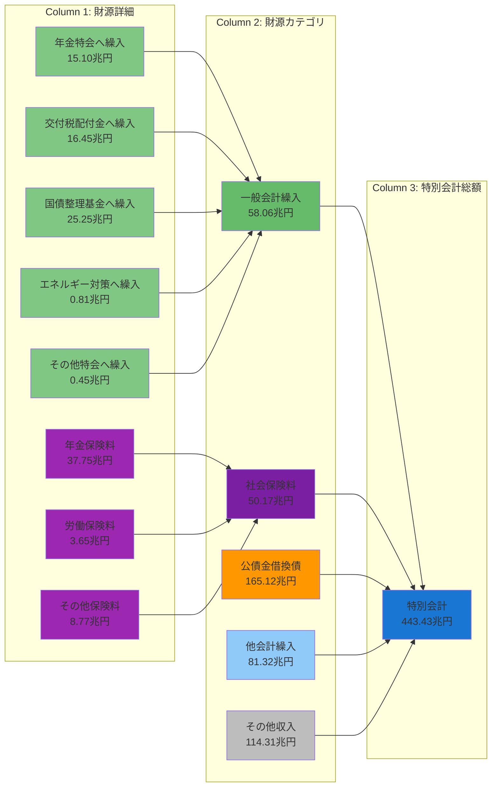
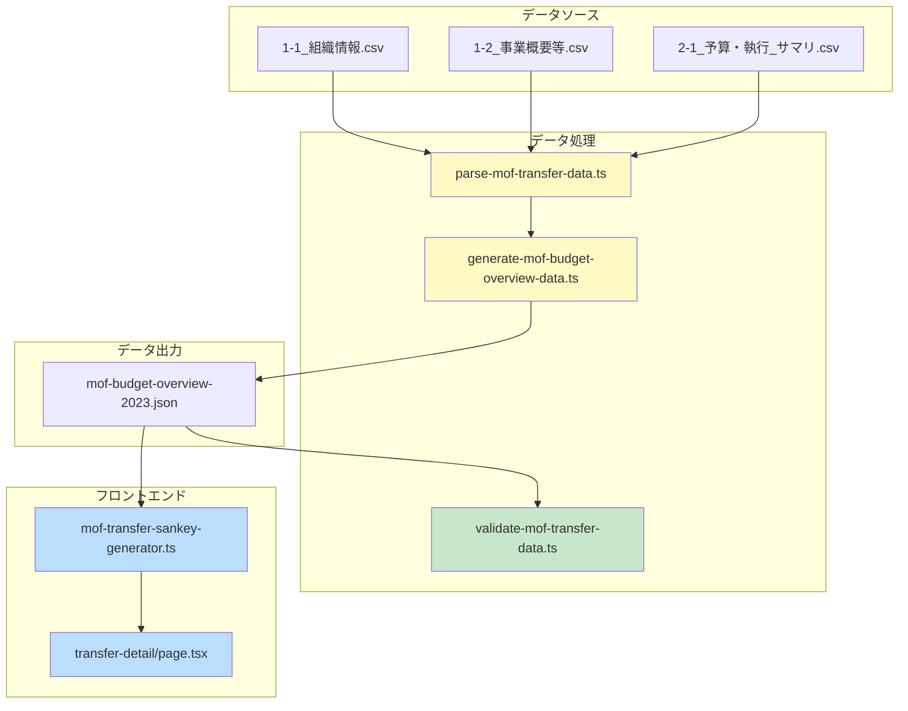

# 一般会計と特別会計の会計関係と実装

**作成日**: 2026-02-07
**目的**: 一般会計から特別会計への繰入の仕組みと資金フローを可視化し、実装内容を整理する

---

## 1. 理解が難しい会計関係の可視化

### 1.1 重要な疑問点

**Q: 一般会計繰入が58.06兆円あるということは、一般会計の114.4兆円から58.06兆円が差し引かれるということですか？**

**A: いいえ、58.06兆円は114.4兆円の「内訳」であり、追加の支出ではありません。**

### 1.2 全体の資金フロー



**ポイント**:
- 一般会計の114.4兆円は**総額**
- その中の58.06兆円が**特別会計への繰入として使われている**
- 114.4兆円 - 58.06兆円 = 56.34兆円が残るわけではない
- 58.06兆円は114.4兆円の**使い道の一つ**

### 1.3 繰入の詳細内訳（58.06兆円）



---

## 2. RS対象とダブルカウントの関係

### 2.1 重複カウントが発生しない理由



**ポイント**:
- 一般会計: **「繰入」という支払行為**をカウント
- 特別会計: **「年金給付」という事業実施**をカウント
- 同じお金だが、**見ているフェーズが違う**ため重複しない
- 例: 会社の経費で考えると
  - 本社→支店への予算配分 ≠ 支店の実際の支出
  - 本社は「予算配分額」を記録、支店は「実施事業」を記録

### 2.2 パススルー（通過勘定）のイメージ



**ポイント**:
- 一般会計は「送金」を記録
- 特別会計は「受領して使う」を記録
- 同じお金が2つの帳簿に別の意味で記録される（パススルー）

---

## 3. 実装したサンキー図の設計

### 3.1 サンキー図の構造（3列構成）



### 3.2 色分けの意味

| 色 | 対象 | 意味 |
|---|---|---|
| 緑系（#81c784, #66bb6a） | 一般会計繰入詳細とカテゴリ | 一般会計からの資金流入 |
| 紫系（#9c27b0, #7b1fa2） | 社会保険料詳細とカテゴリ | 保険料からの資金流入 |
| オレンジ（#ff9800） | 公債金 | 借換債による資金調達 |
| 青（#90caf9） | 他会計繰入 | 特別会計間の資金移動 |
| グレー（#bdbdbd） | その他収入 | その他の財源 |
| 濃青（#1976d2） | 特別会計総額 | 最終的な資金プール |

---

## 4. 実装内容の全体像

### 4.1 ファイル構成

```
marumie-rssystem/
├── types/
│   └── mof-transfer.ts                           # NEW: 繰入詳細型定義
├── scripts/
│   ├── parse-mof-transfer-data.ts               # NEW: CSVパーサー
│   ├── generate-mof-budget-overview-data.ts     # MODIFIED: 詳細データ統合
│   └── validate-mof-transfer-data.ts            # NEW: データ検証
├── app/
│   ├── lib/
│   │   └── mof-transfer-sankey-generator.ts     # NEW: サンキー生成ロジック
│   └── mof-budget-overview/
│       └── transfer-detail/
│           └── page.tsx                          # NEW: UI ページ
└── public/data/
    └── mof-budget-overview-2023.json            # MODIFIED: 詳細データ含む
```

### 4.2 データフロー



---

## 5. 型定義の詳細

### 5.1 TransferFromGeneralAccount

```typescript
export interface TransferFromGeneralAccount {
  // 合計額
  total: number;                    // 32.81兆円（国債整理基金を除く）
  totalIncludingDebt: number;       // 58.06兆円（国債整理基金を含む）

  // 詳細内訳
  breakdown: {
    // 年金特別会計への繰入
    pension: {
      total: number;                // 15.10兆円
      details: {
        basicPension: number;       // 基礎年金国庫負担 12.20兆円
        nurseryBenefit: number;     // 保育給付費等 2.11兆円
        childAllowance: number;     // 児童手当給付費 0.30兆円
        pensionAdministration: number; // 年金事務費等 0.49兆円
      };
    };

    // 交付税配付金特別会計への繰入
    localAllocationTax: {
      total: number;                // 16.45兆円
      details: {
        generalTransfer: number;    // 一般交付税交付金 15.71兆円
        specialTransfer: number;    // 地方特例交付金 0.72兆円
        trafficViolationFund: number; // 交通反則者納金財源 0.02兆円
      };
    };

    // 国債整理基金特別会計への繰入
    debtRetirement: {
      total: number;                // 25.25兆円
      details: {
        ordinaryBondRedemption: number;    // 普通国債等償還財源 20.75兆円
        pensionBondRedemption: number;     // 年金特例公債償還 4.26兆円
        investmentBondRedemption: number;  // 出資国債等償還 0.24兆円
      };
    };

    // エネルギー対策特別会計への繰入
    energy: {
      total: number;                // 0.81兆円
      details: {
        petroleumCoalTax: number;   // 石油石炭税財源
        powerDevelopmentTax: number; // 電源開発促進税財源
      };
    };

    // その他の特別会計への繰入
    foodSupply: number;             // 食料安定供給特会
    laborInsurance: number;         // 労働保険特会
    automotiveSafety: number;       // 自動車安全特会
    reconstruction: number;         // 東日本大震災復興特会
    forestryDebtManagement: number; // 林野債務管理特会
    patent: number;                 // 特許特会
  };
}
```

### 5.2 MOFBudgetData の拡張

```typescript
export interface MOFBudgetData {
  specialAccount: {
    revenue: {
      // 後方互換性を保つため Union 型を使用
      transferFromGeneral: number | TransferFromGeneralAccount;

      // 社会保険料も同様の構造
      insurancePremiums: {
        pension: number;
        labor: number;
        other: number;
        total: number;
      } | InsurancePremiumAllocation;

      // その他の財源
      transferFromOther: number | TransferBetweenSpecialAccounts;
      publicBonds: number;
      other: number;
      total: number;
    };
  };
}
```

---

## 6. サンキー生成ロジック

### 6.1 ノード生成

```typescript
export function generateTransferDetailSankey(mofData: MOFBudgetData) {
  const nodes: SankeyNode[] = [];
  const links: SankeyLink[] = [];

  // Column 1: 財源詳細
  // 一般会計繰入の詳細
  nodes.push({
    id: 'transfer-pension',
    name: '年金特会へ繰入',
    value: 15.10 * 1e12,
    type: 'transfer-detail'
  });

  // 社会保険料の詳細
  nodes.push({
    id: 'insurance-pension',
    name: '年金保険料',
    value: 37.75 * 1e12,
    type: 'insurance-detail'
  });

  // Column 2: 財源カテゴリ
  nodes.push({
    id: 'category-transfer',
    name: '一般会計繰入',
    value: 58.06 * 1e12,
    type: 'revenue-category'
  });

  // Column 3: 特別会計総額
  nodes.push({
    id: 'special-account-total',
    name: '特別会計',
    value: 443.43 * 1e12,
    type: 'account-total'
  });

  return { nodes, links };
}
```

### 6.2 リンク生成

```typescript
// Column 1 → Column 2
links.push({
  source: 'transfer-pension',
  target: 'category-transfer',
  value: 15.10 * 1e12
});

// Column 2 → Column 3
links.push({
  source: 'category-transfer',
  target: 'special-account-total',
  value: 58.06 * 1e12
});
```

---

## 7. UI 実装

### 7.1 ページ構成

```typescript
export default function TransferDetailPage() {
  return (
    <div>
      {/* ヘッダー */}
      <h1>特別会計 財源内訳</h1>
      <p>特別会計443.43兆円の財源を可視化</p>

      {/* サマリーカード */}
      <div className="grid grid-cols-4">
        <Card title="特別会計総額" value="443.43兆円" />
        <Card title="一般会計繰入" value="58.06兆円" />
        <Card title="社会保険料" value="50.17兆円" />
        <Card title="公債金" value="165.12兆円" />
      </div>

      {/* サンキー図 */}
      <ResponsiveSankey
        data={sankeyData}
        colors={getNodeColor}
        margin={{ top: 40, right: 200, bottom: 40, left: 200 }}
      />

      {/* 説明セクション */}
      <div>
        <h2>図の見方</h2>
        <div className="grid grid-cols-3">
          <div>Column 1: 財源詳細</div>
          <div>Column 2: 財源カテゴリ</div>
          <div>Column 3: 特別会計</div>
        </div>
      </div>
    </div>
  );
}
```

### 7.2 色分け関数

```typescript
const getNodeColor = (node: SankeyNode): string => {
  // Column 1: 財源詳細
  if (node.type === 'transfer-detail') return '#81c784';      // 緑
  if (node.type === 'insurance-detail') return '#9c27b0';    // 紫

  // Column 2: 財源カテゴリ
  if (node.type === 'revenue-category') {
    if (node.id === 'category-transfer') return '#66bb6a';   // 濃緑
    if (node.id === 'category-insurance') return '#7b1fa2';  // 濃紫
    if (node.id === 'category-bonds') return '#ff9800';      // オレンジ
    if (node.id === 'category-other-transfer') return '#90caf9'; // 青
    return '#bdbdbd';                                        // グレー
  }

  // Column 3: 特別会計総額
  if (node.type === 'account-total') return '#1976d2';       // 濃青

  return '#e0e0e0';
};
```

---

## 8. データ検証結果

### 8.1 検証スクリプト実行結果

```bash
$ npm run validate:mof-transfer

=== MOF繰入データ検証 ===

✅ 詳細データ構造を検出

--- 合計値 ---
実質繰入額（国債除く）: 32.81兆円
繰入総額（国債含む）  : 58.06兆円
国債整理基金        : 25.25兆円

内訳合計          : 58.06兆円
✅ 合計値一致

--- 年金特別会計への繰入 ---
  合計          : 15.10兆円
  - 基礎年金      : 12.20兆円
  - 保育給付      : 2.11兆円
  - 児童手当      : 0.30兆円
  - その他        : 0.49兆円
  ✅ 年金詳細合計一致

--- 交付税配付金特別会計への繰入 ---
  合計                  : 16.45兆円
  - 一般交付税交付金      : 15.71兆円
  - 地方特例交付金        : 0.72兆円
  - 交通反則者納金財源     : 0.02兆円
  ✅ 交付税詳細合計一致

--- トップ3特別会計（繰入額） ---
  1. 国債整理基金     25.25兆円
  2. 交付税配付金     16.45兆円
  3. 年金           15.10兆円

✅ 検証完了
```

### 8.2 検証項目

1. **データ構造の整合性**: ✅ PASS
   - TransferFromGeneralAccount 型が正しく適用されている
   - 詳細データが number 型ではなくオブジェクト型になっている

2. **合計値の一致**: ✅ PASS
   - 内訳合計 = totalIncludingDebt (58.06兆円)
   - 誤差 < 10億円

3. **個別項目の合計**: ✅ PASS
   - 年金特会の詳細合計 = 15.10兆円
   - 交付税配付金特会の詳細合計 = 16.45兆円
   - 国債整理基金特会の詳細合計 = 25.25兆円

---

## 9. まとめ

### 9.1 実装で解決した課題

1. **会計関係の可視化**
   - 一般会計114.4兆円と特別会計443.43兆円の関係を明確化
   - 58.06兆円の繰入が「内訳」であることを図示

2. **ダブルカウント問題の解消**
   - 一般会計の「繰入支出」と特別会計の「事業実施」は別フェーズ
   - パススルー構造を図で表現

3. **詳細データの構造化**
   - CSVから詳細な繰入内訳を抽出
   - 後方互換性を保ちながら Union 型で拡張

4. **インタラクティブな可視化**
   - 3列サンキー図で財源構成を表現
   - 色分けで財源種別を直感的に理解可能

### 9.2 今後の拡張可能性

1. **保険料の詳細化**
   - InsurancePremiumAllocation 型の実装
   - 保険料の会計間配分の可視化

2. **特別会計間繰入の詳細化**
   - TransferBetweenSpecialAccounts 型の実装
   - 81.32兆円の内訳を可視化

3. **経年比較**
   - 複数年度のデータを並べて表示
   - 繰入額の推移を分析

4. **ドリルダウン機能**
   - ノードクリックで詳細表示
   - 個別特別会計の内訳へ遷移

---

## 10. 参考資料

### 10.1 データソース
- 財務省「令和5年度特別会計予算」
- 各特別会計の歳入歳出予算書

### 10.2 関連ドキュメント
- [docs/20260207_0808_一般会計から特別会計への繰入詳細分析.md](20260207_0808_一般会計から特別会計への繰入詳細分析.md)
- [docs/20260207_0827_MOF繰入データ構造拡張と複数サンキー図実装提案.md](20260207_0827_MOF繰入データ構造拡張と複数サンキー図実装提案.md)

### 10.3 実装ファイル
- [types/mof-transfer.ts](../types/mof-transfer.ts)
- [scripts/parse-mof-transfer-data.ts](../scripts/parse-mof-transfer-data.ts)
- [app/lib/mof-transfer-sankey-generator.ts](../app/lib/mof-transfer-sankey-generator.ts)
- [app/mof-budget-overview/transfer-detail/page.tsx](../app/mof-budget-overview/transfer-detail/page.tsx)
