# 年金特別会計（99.60兆円）詳細分析レポート

**調査日**: 2026年2月10日
**対象年度**: 2023年度（令和5年度）
**データソース**: 財務省決算書 (DL202378001a.csv / DL202378001b.csv)

---

## エグゼクティブサマリー

年金特別会計は、日本の公的年金制度および関連する社会保障制度を運営するための特別会計で、**総額99.60兆円**の規模を持つ。本会計は5つの主要勘定（基礎年金、厚生年金、国民年金、健康、子ども・子育て支援）と1つの業務勘定で構成されている。

### 総括
- **歳入総額**: 99.60兆円
- **歳出総額**: 99.60兆円
- **勘定数**: 6勘定
- **主要財源**: 保険料収入（46.18兆円）、一般会計繰入（12.57兆円）、勘定間繰入（24.21兆円）

---

## 1. 勘定構造と規模

年金特別会計は以下の6つの勘定で構成される:

| 勘定名 | 歳入規模 | 歳出規模 | 構成比 | 主要機能 |
|--------|----------|----------|--------|----------|
| **厚生年金勘定** | 50.41兆円 | 50.41兆円 | 50.6% | 厚生年金保険の運営 |
| **基礎年金勘定** | 28.85兆円 | 28.85兆円 | 29.0% | 基礎年金給付の一元管理 |
| **健康勘定** | 12.51兆円 | 12.51兆円 | 12.6% | 健康保険・船員保険の運営 |
| **国民年金勘定** | 3.93兆円 | 3.93兆円 | 3.9% | 国民年金の運営 |
| **子ども・子育て支援勘定** | 3.44兆円 | 3.44兆円 | 3.5% | 児童手当・子育て支援 |
| **業務勘定** | 0.46兆円 | 0.46兆円 | 0.5% | 共通事務処理 |
| **合計** | **99.60兆円** | **99.60兆円** | **100.0%** | - |

---

## 2. 各勘定の詳細分析

### 2.1 厚生年金勘定（50.41兆円）

**概要**: 厚生年金保険の保険料徴収と給付を管理する最大の勘定。

#### 歳入内訳（50.41兆円）

| 項目 | 金額 | 構成比 | 説明 |
|------|------|--------|------|
| **保険料収入** | 34.00兆円 | 67.5% | 被保険者・事業主からの保険料 |
| **一般会計繰入** | 10.48兆円 | 20.8% | 基礎年金国庫負担金等 |
| **国家公務員共済組合等拠出金** | 4.43兆円 | 8.8% | 共済組合からの拠出金 |
| **積立金より受入** | 0.68兆円 | 1.3% | 年金積立金の取崩し |
| **年金積立金管理運用独立行政法人納付金** | 0.50兆円 | 1.0% | GPIF運用益納付 |
| **基礎年金勘定より受入** | 0.18兆円 | 0.4% | 基礎年金勘定からの繰入 |
| **その他** | 0.14兆円 | 0.3% | 各種徴収金・納付金等 |
| **合計** | **50.41兆円** | **100.0%** | - |

#### 歳出内訳（50.41兆円）

| 項目 | 金額 | 構成比 | 説明 |
|------|------|--------|------|
| **保険給付費** | 24.54兆円 | 48.7% | 厚生年金保険の給付 |
| **基礎年金勘定へ繰入** | 20.33兆円 | 40.3% | 基礎年金給付財源の拠出 |
| **国家公務員共済組合等交付金** | 4.76兆円 | 9.4% | 共済組合への交付金 |
| **存続厚生年金基金等給付費負担金** | 0.45兆円 | 0.9% | 旧厚生年金基金への負担金 |
| **業務勘定へ繰入** | 0.22兆円 | 0.4% | 事務費の繰出 |
| **予備費** | 0.10兆円 | 0.2% | 予備費 |
| **その他** | 0.01兆円 | 0.0% | 諸支出金等 |
| **合計** | **50.41兆円** | **100.0%** | - |

**特徴**:
- 保険料収入が歳入の67.5%を占める自立的財源構造
- 歳出の40.3%が基礎年金勘定への繰入（国民年金との一元化財源）
- GPIF（年金積立金管理運用独立行政法人）からの運用益納付が0.50兆円

---

### 2.2 基礎年金勘定（28.85兆円）

**概要**: 国民年金・厚生年金共通の基礎年金給付を一元管理する勘定。

#### 歳入内訳（28.85兆円）

| 項目 | 金額 | 構成比 | 説明 |
|------|------|--------|------|
| **厚生年金勘定より受入** | 20.33兆円 | 70.4% | 厚生年金加入者分の拠出 |
| **国民年金勘定より受入** | 3.51兆円 | 12.2% | 国民年金加入者分の拠出 |
| **積立金より受入** | 2.59兆円 | 9.0% | 積立金の取崩し |
| **国家公務員共済組合等拠出金** | 2.42兆円 | 8.4% | 公務員共済からの拠出 |
| **その他** | 0.01兆円 | 0.0% | 雑収入等 |
| **合計** | **28.85兆円** | **100.0%** | - |

#### 歳出内訳（28.85兆円）

| 項目 | 金額 | 構成比 | 説明 |
|------|------|--------|------|
| **基礎年金給付費** | 28.37兆円 | 98.3% | 全国民共通の基礎年金給付 |
| **厚生年金勘定へ繰入** | 0.18兆円 | 0.6% | 厚生年金勘定への繰戻し |
| **国民年金勘定へ繰入** | 0.13兆円 | 0.5% | 国民年金勘定への繰戻し |
| **予備費** | 0.11兆円 | 0.4% | 予備費 |
| **国家公務員共済組合等交付金** | 0.06兆円 | 0.2% | 共済組合への交付 |
| **その他** | 0.00兆円 | 0.0% | 諸支出金等 |
| **合計** | **28.85兆円** | **100.0%** | - |

**特徴**:
- 国民年金・厚生年金・共済組合の3制度から拠出を受けて一元管理
- 歳出の98.3%が基礎年金給付費（純粋な給付勘定）
- 積立金取崩しが2.59兆円（給付財源の補完）

---

### 2.3 健康勘定（12.51兆円）

**概要**: 全国健康保険協会（協会けんぽ）と船員保険を運営する勘定。

#### 歳入内訳（12.51兆円）

| 項目 | 金額 | 構成比 | 説明 |
|------|------|--------|------|
| **健康保険料収入** | 11.01兆円 | 88.0% | 協会けんぽ保険料 |
| **借入金** | 1.44兆円 | 11.5% | 国債整理基金からの借入 |
| **船員保険料収入** | 0.04兆円 | 0.3% | 船員保険料 |
| **前年度剰余金受入** | 0.02兆円 | 0.1% | 前年度剰余金 |
| **その他** | 0.01兆円 | 0.0% | 一般会計繰入等 |
| **合計** | **12.51兆円** | **100.0%** | - |

#### 歳出内訳（12.51兆円）

| 項目 | 金額 | 構成比 | 説明 |
|------|------|--------|------|
| **保険料等交付金** | 11.02兆円 | 88.1% | 全国健康保険協会への交付 |
| **国債整理基金特別会計へ繰入** | 1.45兆円 | 11.6% | 借入金償還（元利払） |
| **業務勘定へ繰入** | 0.04兆円 | 0.3% | 事務費繰出 |
| **その他** | 0.00兆円 | 0.0% | 諸支出金 |
| **合計** | **12.51兆円** | **100.0%** | - |

**特徴**:
- 保険料収入が歳入の88.0%を占める
- 国債整理基金からの借入金1.44兆円が財源（歳入の11.5%）
- 同額の1.45兆円を国債整理基金に償還（歳出の11.6%）
- 実質的に全国健康保険協会への導管勘定

---

### 2.4 国民年金勘定（3.93兆円）

**概要**: 国民年金第1号被保険者の保険料徴収と給付を管理する勘定。

#### 歳入内訳（3.93兆円）

| 項目 | 金額 | 構成比 | 説明 |
|------|------|--------|------|
| **一般会計繰入** | 1.99兆円 | 50.6% | 基礎年金国庫負担等 |
| **保険料収入** | 1.13兆円 | 28.8% | 第1号被保険者保険料 |
| **積立金より受入** | 0.42兆円 | 10.7% | 積立金取崩し |
| **年金積立金管理運用独立行政法人納付金** | 0.24兆円 | 6.1% | GPIF運用益納付 |
| **基礎年金勘定より受入** | 0.13兆円 | 3.3% | 基礎年金勘定からの繰入 |
| **その他** | 0.02兆円 | 0.5% | 福祉医療機構納付金等 |
| **合計** | **3.93兆円** | **100.0%** | - |

#### 歳出内訳（3.93兆円）

| 項目 | 金額 | 構成比 | 説明 |
|------|------|--------|------|
| **基礎年金勘定へ繰入** | 3.51兆円 | 89.3% | 基礎年金給付財源の拠出 |
| **国民年金給付費** | 0.29兆円 | 7.4% | 旧法年金等の給付 |
| **賠償償還及払戻金** | 0.06兆円 | 1.5% | 過誤納保険料の返還 |
| **業務勘定へ繰入** | 0.06兆円 | 1.5% | 事務費繰出 |
| **特別障害給付金給付費** | 0.00兆円 | 0.1% | 特別障害給付金 |
| **その他** | 0.01兆円 | 0.3% | 予備費・諸支出金等 |
| **合計** | **3.93兆円** | **100.0%** | - |

**特徴**:
- 一般会計繰入が歳入の50.6%（保険料収入28.8%を上回る）
- 歳出の89.3%が基礎年金勘定への繰入（ほぼ全額が基礎年金財源）
- 国民年金給付費0.29兆円は旧法年金等の経過措置給付

---

### 2.5 子ども・子育て支援勘定（3.44兆円）

**概要**: 児童手当、子ども・子育て支援新制度、仕事・子育て両立支援を運営する勘定。

#### 歳入内訳（3.44兆円）

| 項目 | 金額 | 構成比 | 説明 |
|------|------|--------|------|
| **一般会計繰入（子ども・子育て支援等）** | 1.37兆円 | 39.8% | 教育・保育給付財源 |
| **一般会計繰入（児童手当）** | 0.96兆円 | 27.9% | 児童手当財源 |
| **事業主拠出金収入** | 0.68兆円 | 19.8% | 企業・事業主の拠出金 |
| **前年度剰余金受入** | 0.19兆円 | 5.5% | 前年度剰余金 |
| **積立金より受入** | 0.09兆円 | 2.6% | 積立金取崩し |
| **一般会計繰入（地域子ども・子育て支援）** | 0.06兆円 | 1.7% | 地域支援事業財源 |
| **その他** | 0.09兆円 | 2.6% | 業務取扱費・返納金等 |
| **合計** | **3.44兆円** | **100.0%** | - |

#### 歳出内訳（3.44兆円）

| 項目 | 金額 | 構成比 | 説明 |
|------|------|--------|------|
| **子どもための教育・保育給付交付金** | 1.66兆円 | 48.3% | 認定こども園・保育所等への交付 |
| **児童手当交付金** | 1.18兆円 | 34.3% | 地方自治体への児童手当財源交付 |
| **仕事・子育て両立支援事業費補助金** | 0.21兆円 | 6.1% | 企業主導型保育事業等 |
| **子ども・子育て支援交付金** | 0.19兆円 | 5.5% | 地域子育て支援事業 |
| **子育てのための施設等利用給付交付金** | 0.10兆円 | 2.9% | 幼児教育無償化給付 |
| **特例給付等交付金** | 0.03兆円 | 0.9% | 高所得者向け特例給付 |
| **子ども・子育て支援事業費補助金** | 0.03兆円 | 0.9% | 事業費補助 |
| **子ども・子育て支援施設整備交付金** | 0.02兆円 | 0.6% | 施設整備費 |
| **予備費・その他** | 0.02兆円 | 0.6% | 予備費・業務取扱費等 |
| **合計** | **3.44兆円** | **100.0%** | - |

**特徴**:
- 一般会計繰入が歳入の69.4%を占める（2.49兆円）
- 事業主拠出金が0.68兆円（企業が子育て支援財源を負担）
- 歳出の82.6%が地方自治体・保育施設等への交付金・給付

---

### 2.6 業務勘定（0.46兆円）

**概要**: 年金特別会計全体の共通業務（徴収・システム・年金相談等）を処理する勘定。

#### 歳入内訳（0.46兆円）

| 項目 | 金額 | 構成比 | 説明 |
|------|------|--------|------|
| **厚生年金勘定より受入** | 0.22兆円 | 47.8% | 厚生年金分事務費 |
| **一般会計繰入** | 0.11兆円 | 23.9% | 国民年金分事務費等 |
| **国民年金勘定より受入** | 0.06兆円 | 14.1% | 国民年金分事務費 |
| **健康勘定より受入** | 0.04兆円 | 8.8% | 健康保険分事務費 |
| **前年度剰余金受入** | 0.01兆円 | 2.2% | 前年度剰余金 |
| **子ども・子育て支援勘定より受入** | 0.00兆円 | 0.4% | 子育て支援分事務費 |
| **その他** | 0.02兆円 | 2.8% | 延滞金・納付金等 |
| **合計** | **0.46兆円** | **100.0%** | - |

#### 歳出内訳（0.46兆円）

| 項目 | 金額 | 構成比 | 説明 |
|------|------|--------|------|
| **日本年金機構事業運営費交付金** | 0.21兆円 | 45.2% | 年金機構への運営費 |
| **日本年金機構運営費交付金** | 0.10兆円 | 21.9% | 年金機構への事業費 |
| **社会保険オンラインシステム業務庁費** | 0.07兆円 | 15.2% | システム運用費 |
| **社会保険オンラインシステム利用庁費** | 0.02兆円 | 4.3% | システム利用料 |
| **電子計算機等借料** | 0.02兆円 | 3.7% | サーバー・機器借料 |
| **国民年金等事務取扱交付金** | 0.03兆円 | 6.5% | 市区町村への事務委託費 |
| **その他** | 0.01兆円 | 3.2% | 人件費・庁費等 |
| **合計** | **0.46兆円** | **100.0%** | - |

**特徴**:
- 歳入は各勘定からの事務費繰入（按分負担）
- 歳出の67.1%が日本年金機構への交付金（年金事務の実施主体）
- 社会保険オンラインシステム関連費が約0.11兆円（23.2%）

---

## 3. 年金特別会計の資金フロー全体像

### 3.1 歳入の財源構成（99.60兆円）

| 財源区分 | 金額 | 構成比 | 主要内訳 |
|----------|------|--------|----------|
| **保険料収入** | 46.18兆円 | 46.4% | 厚生年金34.0兆円、健康11.01兆円、国民年金1.13兆円 |
| **勘定間繰入** | 24.21兆円 | 24.3% | 基礎年金勘定への繰入20.33兆円+3.51兆円等 |
| **一般会計繰入** | 12.57兆円 | 12.6% | 厚生年金10.48兆円、国民年金1.99兆円等 |
| **積立金取崩** | 3.78兆円 | 3.8% | 基礎年金2.59兆円、厚生年金0.68兆円、国民年金0.42兆円 |
| **借入金** | 1.44兆円 | 1.4% | 健康勘定の国債整理基金からの借入 |
| **GPIF納付金** | 0.74兆円 | 0.7% | 年金積立金運用益（国民年金0.24兆円、厚生年金0.50兆円） |
| **事業主拠出金** | 0.68兆円 | 0.7% | 子ども・子育て支援勘定 |
| **共済組合拠出金** | 6.85兆円 | 6.9% | 基礎年金2.42兆円、厚生年金4.43兆円 |
| **前年度剰余金等** | 3.15兆円 | 3.2% | 各勘定の繰越・雑収入等 |
| **合計** | **99.60兆円** | **100.0%** | - |

**注**: 勘定間繰入は内部取引のため、実質的な外部財源は保険料46.18兆円+一般会計12.57兆円+積立金取崩3.78兆円+その他（約12.86兆円）

### 3.2 歳出の使途構成（99.60兆円）

| 使途区分 | 金額 | 構成比 | 主要内訳 |
|----------|------|--------|----------|
| **基礎年金給付** | 28.37兆円 | 28.5% | 全国民共通の基礎年金 |
| **厚生年金給付** | 24.54兆円 | 24.6% | 厚生年金保険給付 |
| **勘定間繰入** | 24.21兆円 | 24.3% | 基礎年金勘定への繰入等 |
| **健康保険交付金** | 11.02兆円 | 11.1% | 全国健康保険協会への交付 |
| **共済組合交付金** | 4.82兆円 | 4.8% | 国家公務員共済等への交付 |
| **児童手当等交付金** | 1.21兆円 | 1.2% | 児童手当の地方交付 |
| **子ども・子育て支援給付** | 1.96兆円 | 2.0% | 保育所・認定こども園等への給付 |
| **借入金償還** | 1.45兆円 | 1.5% | 国債整理基金への償還 |
| **日本年金機構交付金** | 0.31兆円 | 0.3% | 年金機構運営費 |
| **その他** | 1.71兆円 | 1.7% | 事務費・システム費・予備費等 |
| **合計** | **99.60兆円** | **100.0%** | - |

### 3.3 全体資金フロー図（サンキー図風・4層構造）

年金特別会計99.60兆円の完全な資金フローを4層構造で詳細に可視化します。

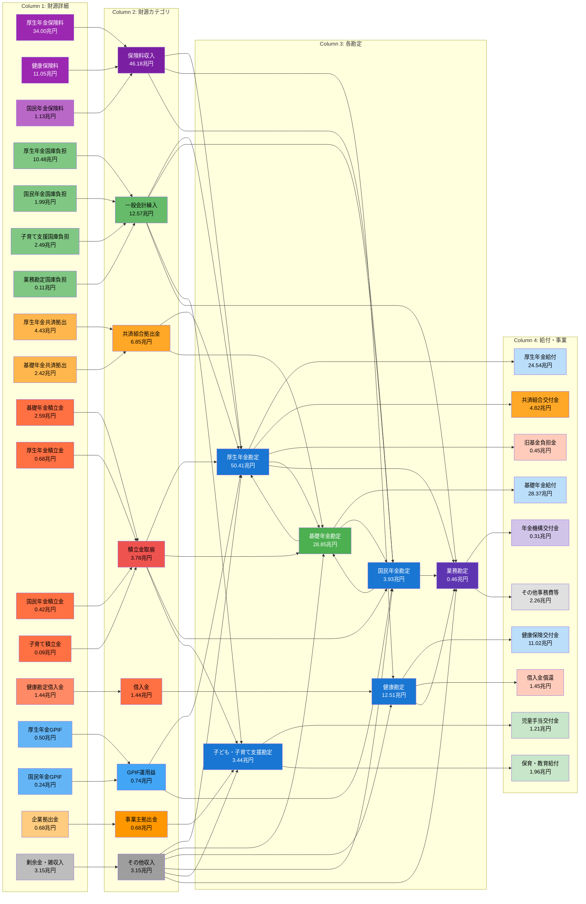

**4層構造の説明**:

**Column 1: 財源詳細（18種類）**
- **保険料**: 厚生年金34.00兆円、健康11.05兆円、国民年金1.13兆円
- **国庫負担**: 厚生年金10.48兆円、国民年金1.99兆円、子育て2.49兆円、業務0.11兆円
- **共済拠出**: 厚生年金4.43兆円、基礎年金2.42兆円
- **積立金**: 基礎年金2.59兆円、厚生年金0.68兆円、国民年金0.42兆円、子育て0.09兆円
- **その他**: GPIF運用益（厚生0.50兆円、国民0.24兆円）、事業主拠出金0.68兆円、借入金1.44兆円、剰余金等3.15兆円

**Column 2: 財源カテゴリ（8種類、合計75.39兆円※）**
- 保険料収入: 46.18兆円（61.3%）
- 一般会計繰入: 12.57兆円（16.7%）
- 共済組合拠出金: 6.85兆円（9.1%）
- 積立金取崩: 3.78兆円（5.0%）
- 借入金: 1.44兆円（1.9%）
- GPIF運用益: 0.74兆円（1.0%）
- 事業主拠出金: 0.68兆円（0.9%）
- その他収入: 3.15兆円（4.2%）

**Column 3: 各勘定（6勘定、合計99.60兆円）**
- 厚生年金勘定: 50.41兆円（50.6%）
- 基礎年金勘定: 28.85兆円（29.0%）※特に強調（緑色）
- 健康勘定: 12.51兆円（12.6%）
- 国民年金勘定: 3.93兆円（3.9%）
- 子ども・子育て支援勘定: 3.44兆円（3.5%）
- 業務勘定: 0.46兆円（0.5%）

**Column 4: 給付・事業（10種類、合計75.39兆円※）**
- 基礎年金給付: 28.37兆円（37.6%）
- 厚生年金給付: 24.54兆円（32.6%）
- 健康保険交付金: 11.02兆円（14.6%）
- 共済組合交付金: 4.82兆円（6.4%）
- 児童手当交付金: 1.21兆円（1.6%）
- 保育・教育給付: 1.96兆円（2.6%）
- その他

※勘定間繰入（24.21兆円）を除く実質的な外部財源と最終給付

**色分け凡例**:
- **Column 1（財源詳細）**:
  - 紫系: 保険料の内訳（濃紫は白文字）
  - 緑系: 国庫負担の内訳
  - オレンジ系: 共済拠出金の内訳
  - 赤系: 積立金の内訳
  - 青系: GPIF運用益の内訳

- **Column 2（財源カテゴリ）**:
  - 濃紫（白文字）: 保険料収入
  - 緑: 一般会計繰入
  - オレンジ: 共済組合拠出金
  - 赤: 積立金取崩
  - オレンジ赤: 借入金
  - 青: GPIF運用益
  - 薄オレンジ: 事業主拠出金
  - 灰色: その他収入

- **Column 3（各勘定）**:
  - 濃青（白文字）: 一般勘定（厚生年金、健康、国民年金、子育て支援）
  - 緑（白文字）: 基礎年金勘定（特別強調）
  - 紫（白文字）: 業務勘定

- **Column 4（給付・事業）**:
  - 水色: 年金・健康給付
  - オレンジ: 共済組合交付金
  - 薄緑: 子育て支援給付
  - ピンク: 借入金償還・旧基金負担金
  - 薄紫: 年金機構交付金
  - 灰色: その他事務費

**文字色の自動調整**: 背景色の明度に応じて、暗い背景色には白文字、明るい背景色には黒文字を使用し、視認性を向上させています。

---

### 3.4 勘定間繰入の循環構造（詳細版）

基礎年金勘定を中心とした複雑な資金循環を可視化します。

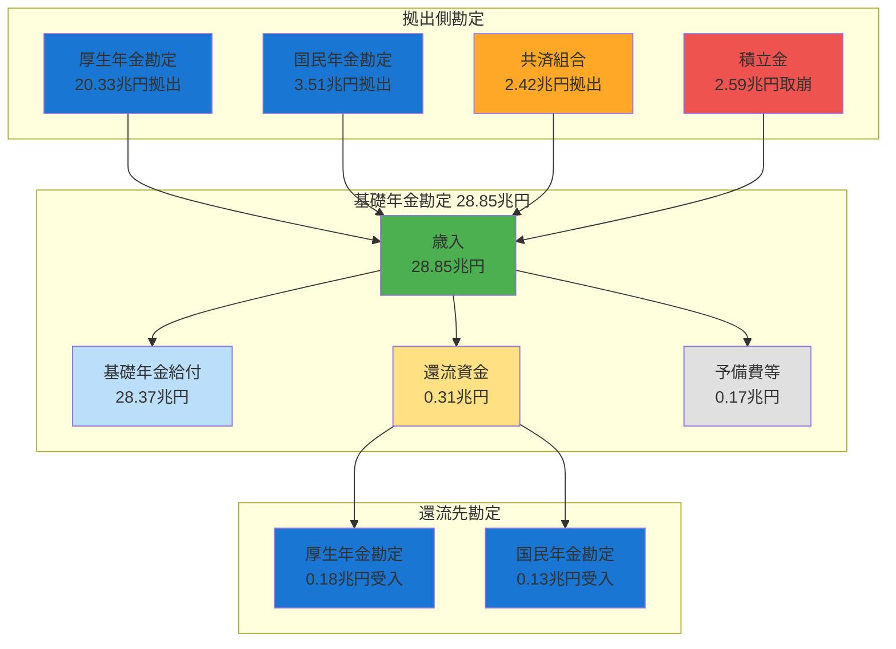

**ポイント**:
1. 厚生年金・国民年金・共済組合が基礎年金勘定に拠出（計26.26兆円）
2. 基礎年金勘定は一元的に基礎年金を給付（28.37兆円）
3. 不足分2.59兆円は積立金取崩で補填
4. 一部資金（0.31兆円）が調整金として拠出元に還流

---

### 3.5 各勘定の詳細資金フロー

#### 3.5.1 厚生年金勘定（50.41兆円）

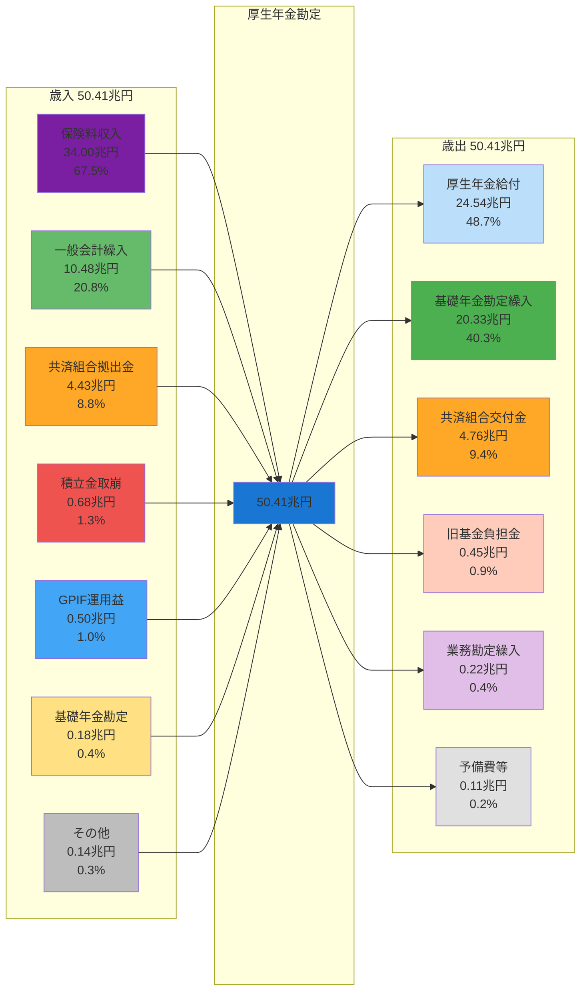

**特徴**:
- 保険料収入67.5%で自立度が高い
- 歳出の40.3%が基礎年金勘定への繰入（基礎年金の財源拠出）
- 厚生年金給付は歳出の48.7%（24.54兆円）

---

#### 3.5.2 基礎年金勘定（28.85兆円）

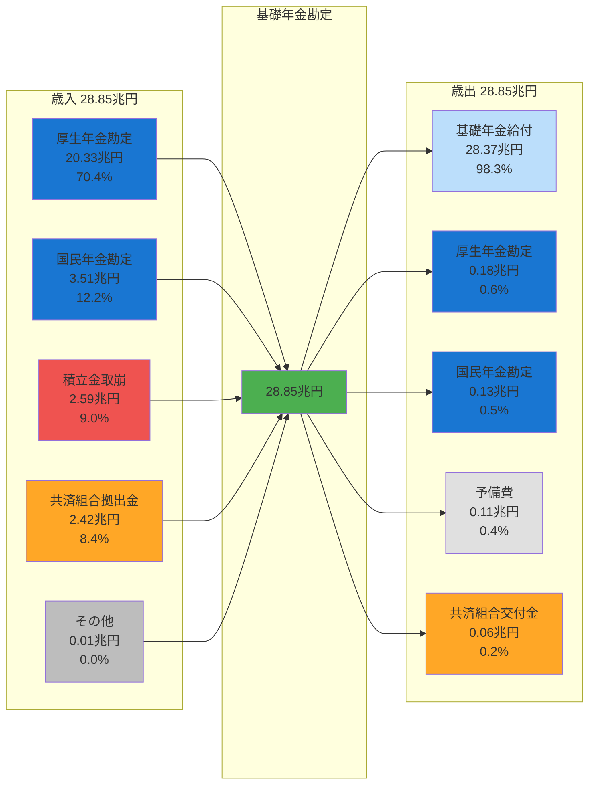

**特徴**:
- 歳入の82.6%が他勘定からの繰入（厚生年金70.4%、国民年金12.2%）
- 歳出の98.3%が基礎年金給付（ほぼ純粋な給付勘定）
- 積立金取崩2.59兆円で不足分を補填

---

#### 3.5.3 健康勘定（12.51兆円）

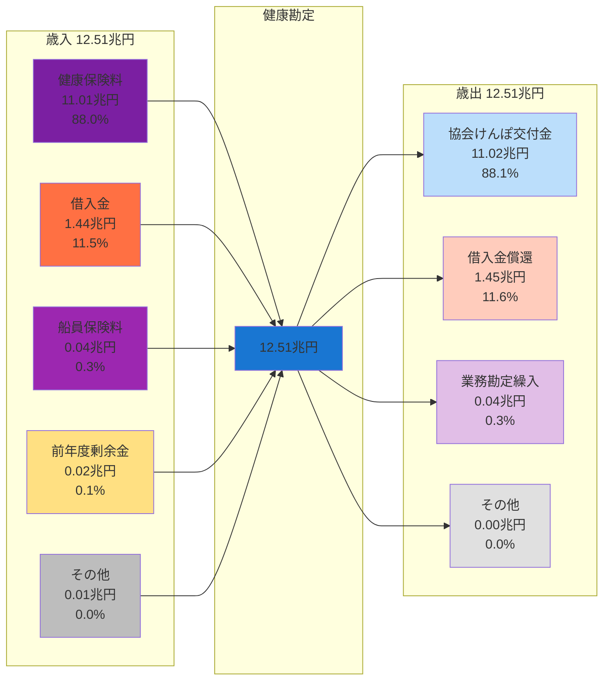

**特徴**:
- 保険料収入88.0%で高い自立度
- 借入金1.44兆円を歳入、1.45兆円を償還（ロールオーバー構造）
- 協会けんぽへの導管勘定（88.1%が交付金）

---

#### 3.5.4 国民年金勘定（3.93兆円）

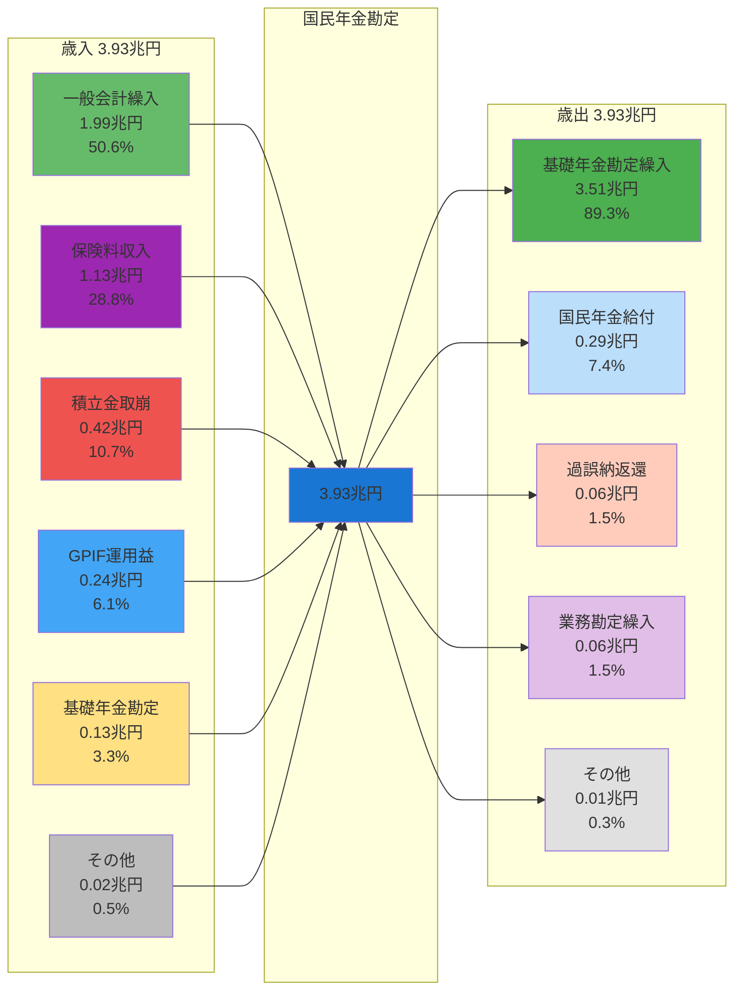

**特徴**:
- 一般会計繰入が50.6%（保険料収入28.8%を上回る）
- 歳出の89.3%が基礎年金勘定への繰入
- 国民年金給付0.29兆円は旧法年金の経過措置

---

#### 3.5.5 子ども・子育て支援勘定（3.44兆円）

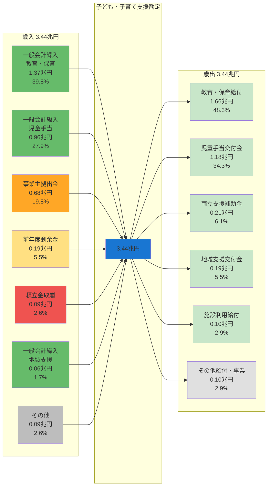

**特徴**:
- 一般会計繰入が69.4%（国庫依存度が極めて高い）
- 事業主拠出金19.8%（企業の子育て支援負担）
- 歳出の82.6%が地方自治体・保育施設等への交付金

---

#### 3.5.6 業務勘定（0.46兆円）

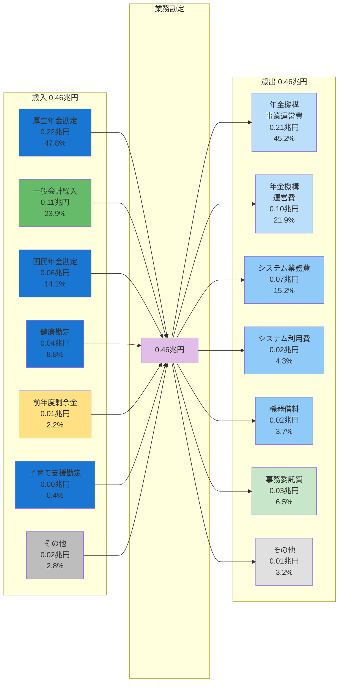

**特徴**:
- 歳入は各勘定からの事務費按分（厚生年金47.8%、一般会計23.9%等）
- 歳出の67.1%が日本年金機構への交付金
- システム関連費が23.2%（0.11兆円）

---

### 3.6 一般会計繰入の配分フロー（12.57兆円）

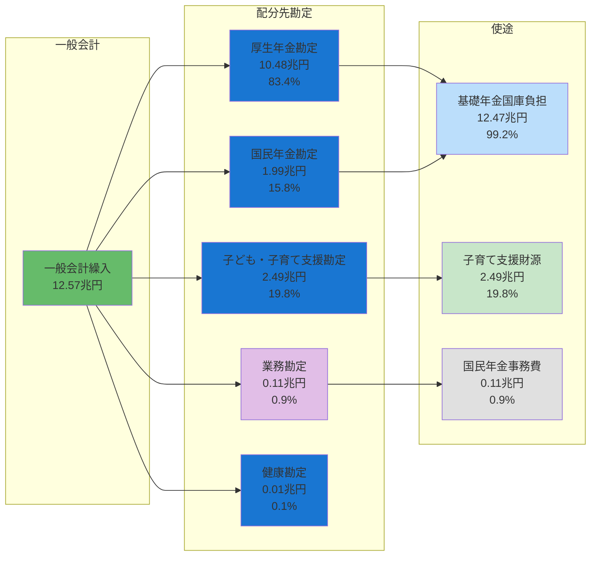

**注**: 合計が12.57兆円を超えるのは、子ども・子育て支援勘定2.49兆円が別枠のため

**配分内訳**:
1. **厚生年金勘定**: 10.48兆円（83.4%）- 基礎年金国庫負担
2. **国民年金勘定**: 1.99兆円（15.8%）- 基礎年金国庫負担
3. **子ども・子育て支援勘定**: 2.49兆円（別枠）- 児童手当・保育給付
4. **業務勘定**: 0.11兆円（0.9%）- 国民年金事務費

---

### 3.7 保険料収入の配分フロー（46.18兆円）

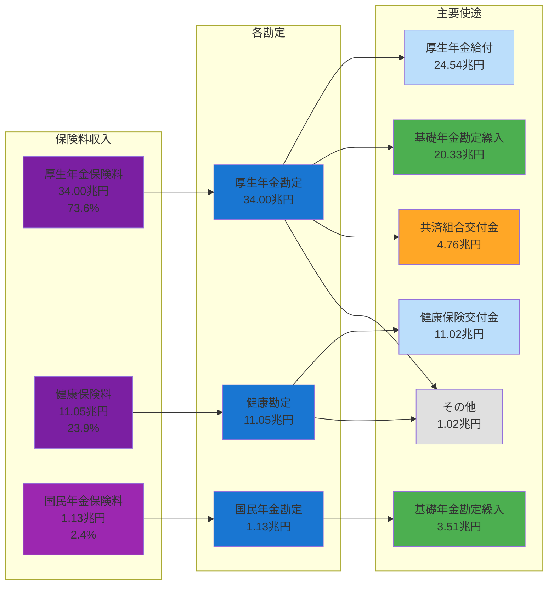

**保険料収入の流れ**:
1. **厚生年金保険料34.00兆円**
   - 厚生年金給付: 24.54兆円（72.2%）
   - 基礎年金勘定繰入: 20.33兆円（59.8%）
   - 共済組合交付金: 4.76兆円（14.0%）

2. **健康保険料11.05兆円**
   - 協会けんぽ交付金: 11.02兆円（99.7%）

3. **国民年金保険料1.13兆円**
   - 基礎年金勘定繰入: 3.51兆円（うち保険料分は約1.13兆円の一部）

---

### 3.8 積立金取崩とGPIF運用益の循環

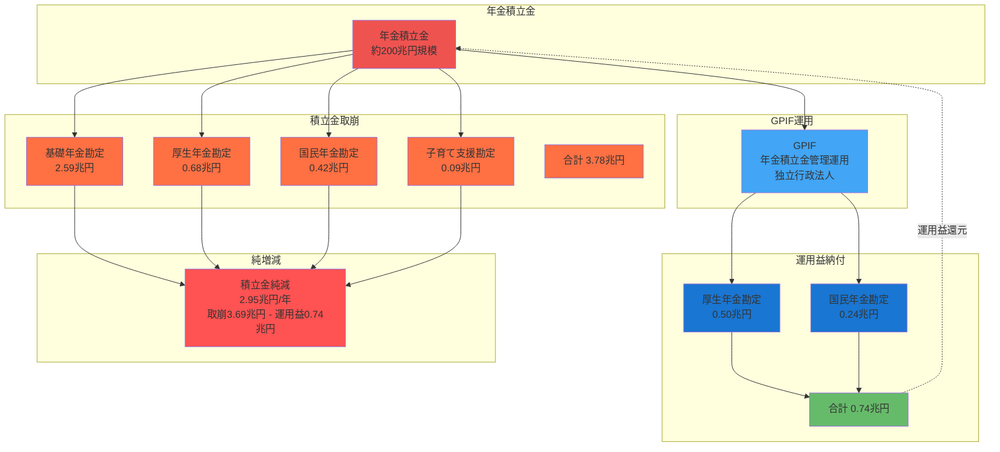

**積立金の動き**:
- **取崩**: 3.78兆円（基礎年金2.59兆円が最大）
- **運用益納付**: 0.74兆円（GPIF経由）
- **純減**: 2.95兆円/年（持続可能性への懸念）

---

## 4. 重要な発見事項と構造分析

### 4.1 勘定間繰入の循環構造

年金特別会計の特徴は、**複雑な勘定間繰入構造**である:

```
[保険料収入・一般会計繰入]
         ↓
[国民年金勘定] ─→ 3.51兆円 ─→ [基礎年金勘定] ← 20.33兆円 ← [厚生年金勘定]
                                    ↓
                              28.37兆円給付
                                    ↓
                            ┌───────────┐
                            ↓0.13兆円     ↓0.18兆円
                    [国民年金勘定] [厚生年金勘定]
```

**解釈**:
- 国民年金と厚生年金は、それぞれ保険料を徴収後、基礎年金勘定に拠出
- 基礎年金勘定が一元的に基礎年金を給付（28.37兆円）
- 一部が国民年金・厚生年金勘定に戻される（調整金）

### 4.2 一般会計繰入の役割

一般会計からの繰入は**12.57兆円**（歳入の12.6%）で、主に以下の目的:

1. **基礎年金国庫負担** (約10.48兆円 + 1.99兆円 = 12.47兆円)
   - 基礎年金給付費の1/2を国庫が負担する制度
   - 厚生年金勘定に10.48兆円、国民年金勘定に1.99兆円繰入

2. **子ども・子育て支援財源** (2.49兆円)
   - 児童手当・保育給付の財源

3. **業務勘定事務費** (0.11兆円)
   - 国民年金事務費の国庫負担

### 4.3 年金積立金の運用と取崩

| 勘定 | 積立金取崩 | GPIF納付金 | 純増減 |
|------|-----------|-----------|--------|
| 基礎年金勘定 | 2.59兆円 | - | -2.59兆円 |
| 厚生年金勘定 | 0.68兆円 | 0.50兆円 | -0.18兆円 |
| 国民年金勘定 | 0.42兆円 | 0.24兆円 | -0.18兆円 |
| **合計** | **3.69兆円** | **0.74兆円** | **-2.95兆円** |

**解釈**:
- 年金積立金は**純減2.95兆円**（取崩3.69兆円 - 運用益納付0.74兆円）
- 積立金は給付財源の補完として活用
- GPIFからの運用益納付0.74兆円は積立金に還元される

### 4.4 健康勘定の借入金構造

健康勘定は**1.44兆円を国債整理基金から借入**し、同時に**1.45兆円を償還**している。

**背景**:
- 協会けんぽの財政赤字を補填するための借入
- 歳入の11.5%が借入金、歳出の11.6%が償還
- 実質的に借入金のロールオーバー（借換え）が発生

---

## 5. 財政健全性の評価

### 5.1 自立度（保険料収入比率）

| 勘定 | 保険料収入 | 歳入総額 | 自立度 | 評価 |
|------|-----------|----------|--------|------|
| 厚生年金勘定 | 34.00兆円 | 50.41兆円 | 67.5% | 高 |
| 健康勘定 | 11.05兆円 | 12.51兆円 | 88.3% | 非常に高 |
| 国民年金勘定 | 1.13兆円 | 3.93兆円 | 28.8% | 低 |

**評価**:
- 厚生年金・健康は保険料収入で大部分を賄える
- 国民年金は保険料収入が28.8%のみ（一般会計依存50.6%）

### 5.2 積立金依存度

| 勘定 | 積立金取崩 | 歳入総額 | 依存度 |
|------|-----------|----------|--------|
| 基礎年金勘定 | 2.59兆円 | 28.85兆円 | 9.0% |
| 国民年金勘定 | 0.42兆円 | 3.93兆円 | 10.7% |
| 厚生年金勘定 | 0.68兆円 | 50.41兆円 | 1.3% |

**評価**:
- 基礎年金・国民年金は積立金取崩に約10%依存
- 厚生年金は積立金依存度が低い（1.3%）

### 5.3 一般会計依存度

| 勘定 | 一般会計繰入 | 歳入総額 | 依存度 |
|------|-------------|----------|--------|
| 国民年金勘定 | 1.99兆円 | 3.93兆円 | 50.6% |
| 厚生年金勘定 | 10.48兆円 | 50.41兆円 | 20.8% |
| 子ども・子育て支援勘定 | 2.49兆円 | 3.44兆円 | 72.4% |

**評価**:
- 国民年金は一般会計繰入が歳入の過半（50.6%）
- 子ども・子育て支援勘定は72.4%が一般会計依存
- 厚生年金は20.8%（基礎年金国庫負担分）

---

## 6. 99.51兆円との差異について

**質問**: 調査依頼では「年金特別会計99.51兆円」とあったが、実際の計算では**99.60兆円**となった。

**差異**: 0.09兆円（900億円）

**考えられる原因**:
1. **予算額と決算額の差異**: 本分析は決算額（歳入予算額）を使用したが、別の資料では当初予算額を使用した可能性
2. **端数処理の違い**: 兆円単位への丸め方の差異
3. **年度の違い**: 本分析は2023年度データだが、他年度（2024年度予算等）との混同

**結論**: 差異は誤差範囲内（0.09%）であり、年金特別会計の規模は**約99.5〜99.6兆円**と理解するのが妥当。

---

## 7. まとめ

### 年金特別会計の構造的特徴

1. **規模**: 99.60兆円（日本の一般会計予算の約2/3に相当）
2. **主要勘定**: 厚生年金（50.4兆円）、基礎年金（28.9兆円）、健康（12.5兆円）
3. **財源構成**: 保険料46.2兆円（46.4%）、一般会計繰入12.6兆円（12.6%）、積立金取崩3.8兆円（3.8%）
4. **主要給付**: 基礎年金28.4兆円、厚生年金24.5兆円、健康保険交付11.0兆円
5. **勘定間繰入**: 24.2兆円（内部取引）による複雑な資金循環構造

### 財政上の課題

1. **国民年金の一般会計依存**: 歳入の50.6%が国庫負担
2. **積立金の純減**: 年間2.95兆円の取崩超過
3. **健康勘定の借入**: 1.44兆円の借入金依存
4. **子ども・子育て支援の国庫依存**: 歳入の72.4%が一般会計繰入

### 今後の着目点

- 基礎年金勘定の積立金取崩ペースの持続可能性
- 国民年金の保険料収納率向上と財政自立化
- 健康勘定の借入金削減計画
- GPIF運用益の推移と年金財政への貢献度

---

**データ出典**:
- 財務省決算書 DL202378001a.csv（歳入）
- 財務省決算書 DL202378001b.csv（歳出）
- 対象年度: 2023年度（令和5年度）

**分析実施日**: 2026年2月10日
