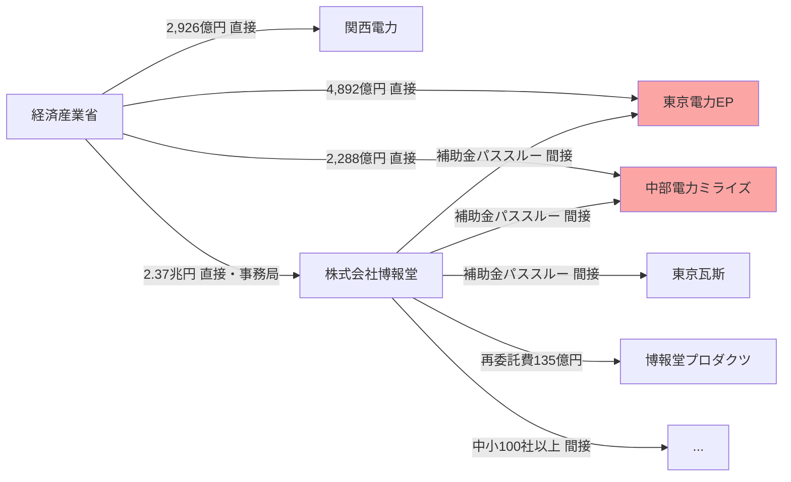
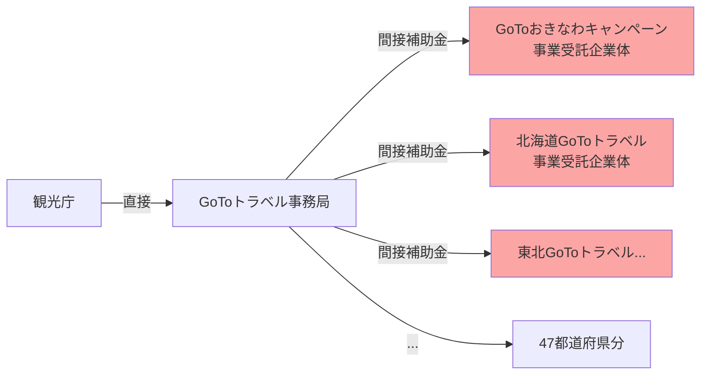
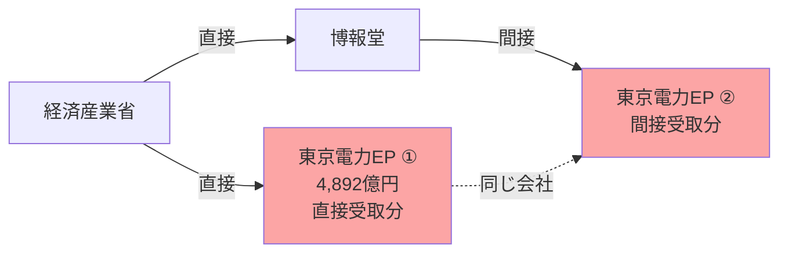
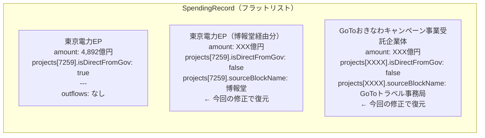

# 支出先データがDAG（グラフ）である理由

**作成日**: 2026年2月14日
**目的**: 支出先データをツリー構造ではなくフラット＋隣接リストで管理すべき理由の解説

---

## 例1: 電気・ガス価格激変緩和対策等事業（プロジェクト7259）

> 🔴 **東京電力EP・中部電力ミライズは2つの矢印が入ってくる（親が2つ）**
> → ツリー構造にできない

---

## 例2: GoToトラベル（地域観光事業支援）

> 🔴 **GoToおきなわは親が1つなのでツリーでも表現できる**
> しかし例1と混在するため、データ構造全体をツリーにはできない

---

## ツリー構造にしようとすると（問題の可視化）

> ❌ 同一の会社が2ノードに分裂
> ❌「東京電力EPの合計受取額は？」が答えられない
> ❌ JSONサイズが膨張（同一支出先が何十回も複製される）

---

## 現在の設計（フラット＋隣接リスト）が正しい形

> ✅ 1エントリで管理・重複なし
> ✅「東京電力EPの合計受取額は？」→ `record.amount` を見るだけ
> ✅「GoToおきなわはどこから委託された？」→ `project.sourceBlockName` を見るだけ
> ✅ 委託元列で直接/間接を区別

---

## データ構造の比較まとめ

| 観点 | ツリー構造 | 現在の設計（隣接リスト） |
|------|-----------|------------------------|
| 実態との一致 | ✗ DAGを木に強制 | ✓ DAGをそのまま表現 |
| 同一支出先の重複 | ✗ 複数ノードに分裂 | ✓ 1エントリで管理 |
| 合計金額の集計 | ✗ 全ツリー走査が必要 | ✓ `record.amount` 参照のみ |
| 検索 | ✗ 再帰的走査が必要 | ✓ 配列フィルタで即検索 |
| JSONサイズ | ✗ 重複により膨張 | ✓ コンパクト |
| Sankey生成 | ✗ 複雑なデノーマライズ | ✓ 現在の実装がそのまま使える |
| 委託元の把握 | △ 親ノードを辿る | ✓ `sourceBlockName` で直参照 |

---

## 今回の修正方針

`generate-structured-json.ts` の `continue` を削除し、間接支出先も `SpendingRecord` に含める。
`SpendingProject.isDirectFromGov` と `SpendingProject.sourceBlockName` で直接/間接を区別する。

詳細設計: [20260214_1310_支出先一覧に再委託先を追加する設計.md](20260214_1310_支出先一覧に再委託先を追加する設計.md)
