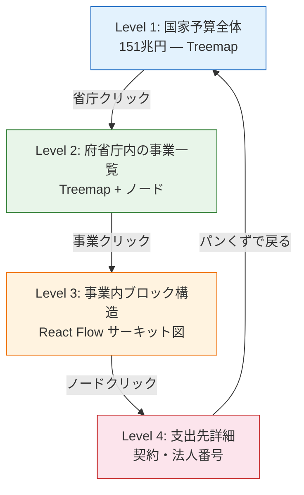
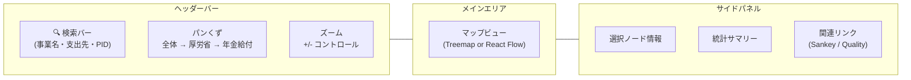
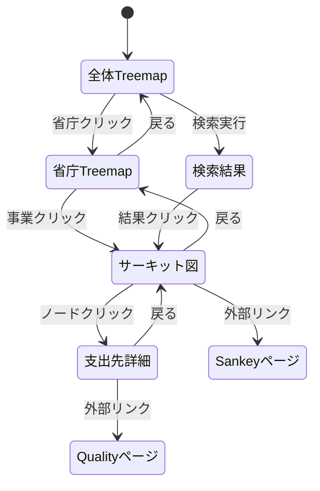
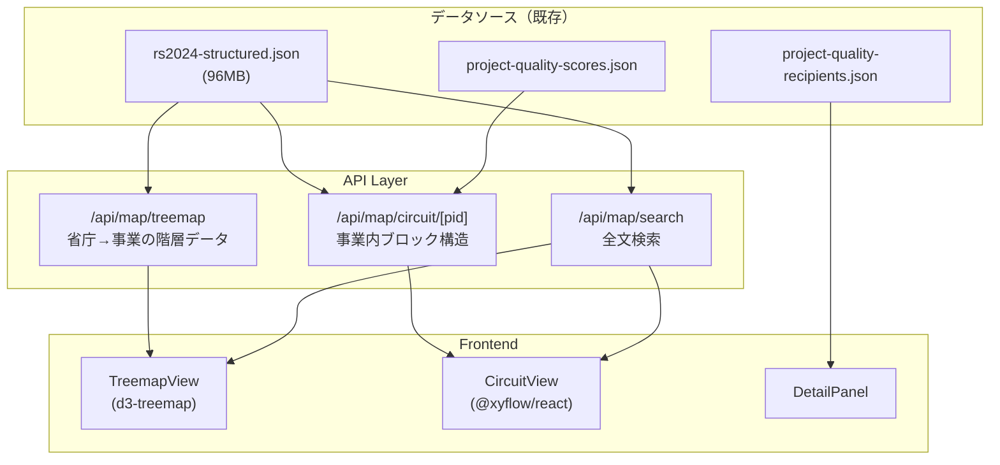
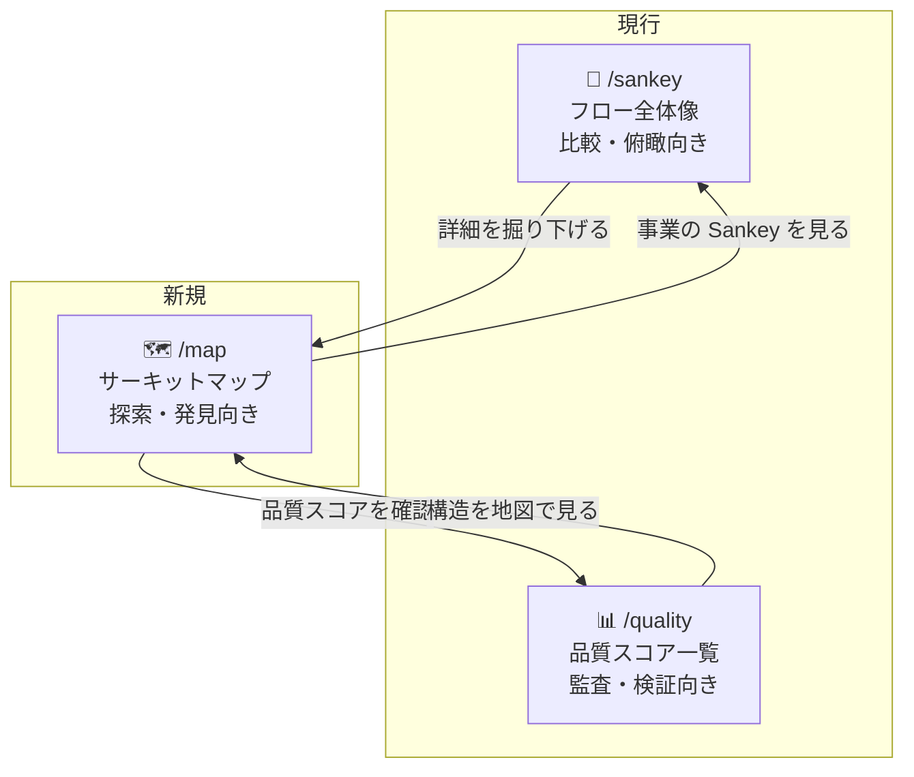

# 予算サーキットマップ UI 設計

**作成日**: 2026-03-12
**ステータス**: 構想段階

## 1. 背景と動機

### 現行 Sankey 図の限界

- 左→右の線形フローのみで、**fan-in（収束）/ fan-out（分散）構造が見えにくい**
- 全体を俯瞰しながら個別事業を深掘りする操作ができない
- ノード数が増えると視認性が急激に低下する

### サーキットボードからの着想

予算の資金フローは半導体回路と構造的に類似している：

| 半導体回路 | 予算・支出 |
|---|---|
| 電源（VCC） | 一般会計・特別会計 |
| IC チップ | 府省庁 |
| サブ回路 | 事業 |
| トレース（配線） | 資金フロー |
| ファンイン（多入力ゲート） | 複数省庁→同一受取先（59事業） |
| ファンアウト（出力分岐） | 中間機関→複数下位受取先（850事業） |
| 出力ピン | 最終支出先（法人・個人・自治体） |

### Google Maps 的探索モデル

地図アプリのように「ズーム＆パン」で予算全体から個別契約まで自在に移動できる UI を目指す。

---

## 2. ズームレベル設計



### Level 1: 国家予算俯瞰（Treemap）

```
┌──────────────────────┬──────────┬─────────┐
│                      │          │         │
│    厚生労働省         │ 国土交通省│  文科省  │
│    33.5兆            │  6.8兆   │  5.3兆  │
│                      │          │         │
│                      ├────┬─────┤         │
│                      │防衛│ 総務 │         │
│                      │5.3兆│4.2兆│         │
├──────────────────────┼────┴─────┼─────────┤
│    財務省 3.8兆       │ 農水省   │ 経産省   │
│                      │  2.3兆   │  1.8兆  │
└──────────────────────┴──────────┴─────────┘
```

- **面積 ∝ 予算額**（大きい省庁 = 大きい領域）
- **色 = 会計種別**（一般会計 / 特別会計 / 混合）
- **ホバー**: 省庁名・予算額・事業数をツールチップ表示
- **クリック**: Level 2 へズームイン

### Level 2: 府省庁内の事業構造

```
┌─ 厚生労働省 33.5兆 ──────────────────────────┐
│                                               │
│  ┌────────────┐  ┌────────┐  ┌──────────┐    │
│  │年金給付     │  │医療保険 │  │生活保護   │    │
│  │12.8兆      │  │10.0兆  │  │3.7兆     │    │
│  │ ●━━━━━●   │  │ ●━●━●  │  │  ●━━●   │    │
│  └────────────┘  └────────┘  └──────────┘    │
│                                               │
│  ┌──────┐ ┌──────┐ ┌──────┐ ┌──────┐        │
│  │雇用保険│ │介護保険│ │障害福祉│ │...    │        │
│  │2.1兆  │ │1.5兆  │ │0.9兆  │ │      │        │
│  └──────┘ └──────┘ └──────┘ └──────┘        │
└───────────────────────────────────────────────┘
```

- Treemap 内にミニチュアのフロー図（ノード+エッジ）を描画
- 事業間のリンク（1-5 関連事業）があれば点線で接続
- フィルタ: 会計種別 / 金額レンジ / 品質スコア

### Level 3: 事業内サーキット図（React Flow）

```
┌─ 福島再生加速化交付金（PID=500）──────────────────────────┐
│                                                           │
│   ┌──────┐                                                │
│   │復興庁 ├──┬──→ 内閣府(B) ──────┐                      │
│   │  (A)  │  ├──→ 総務省(C) ──────┤                      │
│   │629億  │  ├──→ 文科省(D) ──────┤     ┌──────────────┐ │
│   └──────┘  ├──→ 厚労省(E) ──────┼────→│地方公共団体   │ │
│              ├──→ 農水省(F) ──────┤     │ (K) 629億    │ │
│              ├──→ 経産省(G) ──────┤     │ 56市町村等    │ │
│              ├──→ 国交省(H) ──────┤     └──────────────┘ │
│              ├──→ 原子力(I) ──────┤        fan-in ×10    │
│              └──→ こども(J) ──────┘                      │
│                                                           │
│  [エッジの太さ ∝ 金額]  [ノードの色 = ブロック種別]        │
└───────────────────────────────────────────────────────────┘
```

- **React Flow** でノード＆エッジをインタラクティブに配置
- **fan-in / fan-out の自動検出マーカー** 表示
- エッジ太さ = 金額比率、色 = フロー種別（移替 / 再委託 / 補助金等交付）
- ノードクリック → Level 4（支出先詳細）

### Level 4: 支出先詳細パネル

```
┌─ 南相馬市 ──────────────────────────────────┐
│ 法人番号: 2000020072125                      │
│ 所在地: 福島県南相馬市原町区本町2丁目27       │
│                                              │
│ ┌ 受領プロジェクト ─────────────────────────┐│
│ │ PID=500  福島再生加速化交付金   36,053,000 ││
│ │ PID=18672 1福島再生加速化(帰還) 36,053,000 ││
│ │ PID=497  被災者支援総合交付金   12,500,000 ││
│ └───────────────────────────────────────────┘│
│                                              │
│ [Sankey で見る]  [法人番号検索]  [品質スコア] │
└──────────────────────────────────────────────┘
```

---

## 3. 画面構成



### ナビゲーションフロー



---

## 4. データフロー



---

## 5. 技術スタック

| レイヤー | 技術 | 選定理由 |
|---|---|---|
| Treemap 描画 | **d3-treemap** + **d3-zoom** | 面積比例レイアウト＋スムーズズーム、既存 d3 知見活用 |
| サーキット図 | **@xyflow/react v12** | ノード/エッジ/ミニマップ/ズーム内蔵、React エコシステム |
| レイアウト計算 | **dagre** or **elkjs** | 階層グラフの自動レイアウト（fan-in/fan-out 対応） |
| 状態管理 | React useState + URL パラメータ | ズームレベル・選択ノードを URL に反映（共有可能） |
| パフォーマンス | 仮想化 + 遅延読み込み | Level 1-2 は軽量サマリー、Level 3-4 はオンデマンド取得 |

### ライブラリサイズ見積もり

| パッケージ | gzip サイズ |
|---|---|
| d3-hierarchy + d3-scale + d3-zoom | ~15KB |
| @xyflow/react | ~40KB |
| dagre | ~10KB |
| **合計追加分** | **~65KB** |

---

## 6. 実装フェーズ

```mermaid
gantt
    title 実装ロードマップ
    dateFormat X
    axisFormat Phase %s

    section Phase 1 — Treemap
    省庁レベル Treemap           :p1a, 0, 1
    事業レベル ズームイン         :p1b, 1, 2
    会計種別フィルタ             :p1c, 2, 3

    section Phase 2 — サーキット図
    React Flow 基本表示          :p2a, 3, 4
    fan-in/fan-out 自動検出      :p2b, 4, 5
    エッジ太さ・色の金額連動     :p2c, 5, 6

    section Phase 3 — 統合
    ズームレベル間の遷移         :p3a, 6, 7
    検索・パンくず               :p3b, 7, 8
    Sankey/Quality 相互リンク    :p3c, 8, 9
```



### Phase 1: Treemap ビュー（MVP）

- `/map` ページ新設
- `rs2024-structured.json` の `budgetTree` からツリー構築
- d3-treemap で府省庁→事業の2階層ズーム
- クリックでズームイン/アウト（アニメーション付き）

### Phase 2: サーキット図

- 事業クリック → React Flow でブロック構造を描画
- 5-2 CSV のブロック接続データを API で返却
- dagre で自動レイアウト
- fan-in / fan-out ノードにバッジ表示

### Phase 3: 統合・UX 改善

- Level 間のスムーズな遷移アニメーション
- グローバル検索（事業名・支出先名・PID）
- URL にズーム状態を保存（`/map?ministry=厚生労働省&pid=500&block=K`）
- 既存ページ（Sankey / Quality）との相互リンク

---

## 7. 既存ページとの役割分担



| ページ | 目的 | 強み |
|---|---|---|
| `/sankey` | フロー全体像の俯瞰 | 金額比率の直感的把握 |
| `/quality` | データ品質の監査 | 一覧性・フィルタ・ソート |
| `/map` | **構造の探索・発見** | **ズーム・パン・fan-in/out 可視化** |
