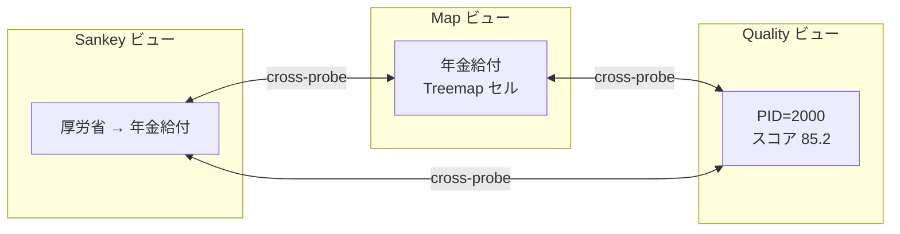
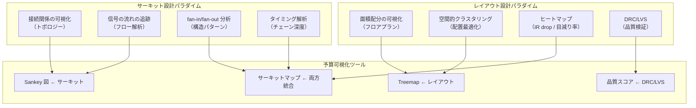

# 半導体設計アナロジーによる予算可視化の考察

**作成日**: 2026-03-12
**目的**: 半導体設計の各階層・概念を深掘りし、予算可視化 UI への応用可能性を探る

---

## 1. 半導体設計の全体像

半導体チップは「仕様→論理→回路→物理→製造」という抽象度の異なる複数の階層を経て設計される。各階層で異なるツール・手法・視点が使われ、それぞれが予算分析の異なる側面に対応する。

```
仕様設計 (System Level)
  │  「何を実現するか」
  ▼
論理設計 (Logic Design)
  │  「どう動くか」— RTL, ゲートレベル
  ▼
回路設計 (Circuit Design)
  │  「どう流れるか」— トランジスタ, 配線
  ▼
物理設計 (Physical Design / Layout)
  │  「どう配置するか」— フロアプラン, 配線経路
  ▼
ウエハ製造 (Fabrication)
     「どう作るか」— マスク, リソグラフィ
```

---

## 2. サーキット設計とレイアウト設計の違い

### 2.1 サーキット設計（Circuit Design）

**「信号（電流）がどう流れるか」** を設計する。

- **関心事**: ノード間の接続関係、信号の方向、電圧・電流の値
- **表現**: 回路図（Schematic）— 抽象的なシンボルと線
- **ツール**: SPICE シミュレータ, 回路図エディタ
- **物理的位置は無関係**: 同じ回路図を異なるレイアウトで実装できる

```
       ┌───┐         ┌───┐
 IN ──→│ A │──┬──→──→│ D │──→ OUT
       └───┘  │      └───┘
              │  ┌───┐
              └─→│ B │──→──┐
                 └───┘     │  ┌───┐
                           └─→│ C │──→ OUT2
                              └───┘

※ 位置に意味はない。接続関係（トポロジー）だけが重要。
```

**予算との対応**:
- ノード = 省庁・事業・支出先
- エッジ = 資金フロー
- 電流値 = 金額
- **現行の Sankey 図はこの階層に相当する**

### 2.2 レイアウト設計（Physical Design / Layout）

**「物理的にどこに何を置くか」** を設計する。

- **関心事**: 面積配分、配置の最適化、配線の実現可能性
- **表現**: フロアプラン、配線図 — 実際の座標と寸法
- **ツール**: Place & Route (P&R) ツール, DRC/LVS 検証
- **位置が意味を持つ**: 近接性、面積、配線長がすべて設計制約

```
┌──────────────────────────────────┐
│  ┌──────────┐  ┌───────┐        │
│  │    A     │  │   D   │        │
│  │  (大面積) │  │       │        │
│  │          │──│───────│───→OUT │
│  └──────────┘  └───────┘        │
│       │                         │
│  ┌────┴─────┐  ┌───────┐        │
│  │    B     │──│   C   │──→OUT2│
│  │          │  │       │        │
│  └──────────┘  └───────┘        │
└──────────────────────────────────┘

※ 面積がリソース量を表し、配置が最適化対象になる。
```

**予算との対応**:
- **面積 = 予算額**（大きい省庁 = 大きい領域）
- 配置 = 組織階層・会計区分による空間グルーピング
- 配線 = 省庁間の資金移動（移替、繰入）
- **提案している Treemap ビューはこの階層に相当する**

### 2.3 両者の本質的な違い

| 観点 | サーキット設計 | レイアウト設計 |
|---|---|---|
| 主な問い | 「何と何がつながっているか」 | 「どこに何があるか」 |
| 空間の意味 | なし（トポロジーのみ） | あり（座標・面積が制約） |
| 最適化対象 | 信号の正確性・タイミング | 面積・配線長・熱分布 |
| 抽象度 | 高い（概念的） | 低い（物理的） |
| 見つけやすい問題 | 論理エラー、デッドロック | 混雑、ホットスポット、未接続 |

---

## 3. 半導体設計の7つのキーコンセプトと予算可視化への写像

### 3.1 フロアプランニング（Floorplanning）

**半導体**: チップ上の大ブロック（CPU コア、メモリ、I/O）の配置を決める最初のステップ。面積配分と近接性が鍵。

**予算への適用**: Treemap の Level 1 がまさにフロアプラン。151兆円のチップ面積を府省庁に割り当てる。

```
チップ全体 = 国家予算 151兆円

┌───────────────────┬────────────┬──────────┐
│                   │            │          │
│   CPU コア        │  GPU       │  メモリ   │
│  (厚労省 33.5兆)  │ (国交省)   │ (文科省)  │
│                   │  6.8兆     │  5.3兆   │
│                   │            │          │
├───────────────────┼────┬───────┼──────────┤
│   I/O コントローラ │DSP │キャッシュ│          │
│  (財務省 3.8兆)    │(防衛)│(総務) │          │
└───────────────────┴────┴───────┴──────────┘
```

### 3.2 ネットリスト（Netlist）

**半導体**: 全コンポーネントとその接続関係を記述したテキストファイル。回路の「設計図」そのもの。

```verilog
// 半導体のネットリスト
module budget_flow(
  input  wire [63:0] tax_revenue,
  output wire [63:0] service_delivery
);
  wire [63:0] general_account;
  wire [63:0] special_account;

  ministry_mhlw u_mhlw (.in(general_account), .out(pension, medical));
  ministry_mlit u_mlit (.in(general_account), .out(road, river));
endmodule
```

**予算への適用**: `rs2024-structured.json` がネットリストに相当。全事業・全支出先・全接続を記述。5-2 CSV のブロック接続情報がまさにネットリストの wire 定義。

### 3.3 信号伝搬とタイミング解析（Timing Analysis）

**半導体**: 信号がゲート A → B → C → D と伝搬するとき、各ゲートの遅延が累積する。クリティカルパス（最長経路）がチップ全体の性能を決定する。

```
         遅延
  A ──→ B ──→ C ──→ D
  │  2ns   3ns   1ns = 6ns (クリティカルパス)
  │
  └──→ E ──→ F
     1ns   1ns = 2ns (余裕あり)
```

**予算への適用**: 資金が「組織→A→B→...→K」と流れるとき、チェーンの深さ（再委託深度）が「伝搬遅延」に相当する。深いチェーン = 資金到達までの中間搾取リスク、透明性の低下。

- **クリティカルパス** = 最長の委託チェーン（現在の最大深度はどこか？）
- **タイミング違反** = 中間で金額が大幅に目減りするケース
- **STA（静的タイミング解析）** = 全チェーンを網羅的に検査 → 品質スコアリングがこれに相当

### 3.4 ファンイン・ファンアウト（Fan-in / Fan-out）

**半導体**: ゲートの入力数（fan-in）と出力数（fan-out）。過大な fan-in/out は信号劣化・遅延増大を招く。

```
fan-in = 3:                    fan-out = 4:
  A ──┐                            ┌──→ X
  B ──┼──→ Y                  Z ──┼──→ Y
  C ──┘                            ├──→ W
                                   └──→ V
```

**予算での発見**:
- fan-in: 59事業、84件（最大10入力 — 福島再生加速化交付金）
- fan-out: 850事業、1,141件（最大21出力 — 補償経費等）
- fan-out は fan-in の約15倍 → **予算は本質的に「分配システム」**

**UI への示唆**: fan-in/fan-out の大きいノードを視覚的に強調（ゲートシンボルのように特別な形状にする）。

### 3.5 パワーグリッド（Power Distribution Network）

**半導体**: 電源（VCC/GND）からチップ全体に電力を供給する配電網。幹線から支線へ、ツリー状に分配。電圧降下（IR drop）が末端で問題になる。

```
VCC ━━━━━━━━━━━━━━━━━━━━━━━━━━━  幹線
     ┃        ┃        ┃
     ┃        ┃        ┃          支線
     ┣━━┓     ┣━━┓     ┣━━┓
     ┃  ┃     ┃  ┃     ┃  ┃      末端
    [A] [B]  [C] [D]  [E] [F]
```

**予算への適用**:
- **幹線** = 一般会計（税収 → 財務省 → 各省庁）
- **支線** = 省庁内の局・課への配分
- **末端** = 最終支出先（企業・自治体・個人）
- **IR drop** = 中間管理費・事務費による目減り
- **デカップリングコンデンサ** = 予備費・繰越金（急な需要変動を吸収）

### 3.6 DRC / LVS（Design Rule Check / Layout vs. Schematic）

**半導体**:
- **DRC**: レイアウトが製造ルール（最小配線幅、間隔など）に違反していないか検査
- **LVS**: レイアウトと回路図が一致しているか検査（設計意図 = 実装の検証）

```
DRC エラー例:
  ┌──────┐
  │ WIRE │  ← 幅 0.8μm（最小 1.0μm 違反！）
  └──────┘

LVS エラー例:
  回路図: A → B → C
  レイアウト: A → B → D  ← 接続先が違う！
```

**予算への適用**:
- **DRC** = 品質スコアリング（各事業が「ルール」に適合しているか）
  - 軸1: 支出先名の妥当性（配線幅の検証）
  - 軸2: 法人番号の有無（ビアの接続検証）
  - 軸5: 金額の整合性（電流値の検証）
- **LVS** = 予算と支出の突合（設計意図 = 実行結果の検証）
  - 予算額と執行額の乖離 = 回路図とレイアウトの不一致
  - 予算あり支出なし / 支出あり予算なし = 未接続ピン / 浮遊ノード

**現行の品質スコアリングは DRC に相当する。LVS（予算 vs 支出の構造的一致検証）はまだ実装されていない。**

### 3.7 階層設計（Hierarchical Design）

**半導体**: 大規模チップは1枚のフラット回路図では管理不能。サブ回路（モジュール）に分割し、階層的に設計する。

```
Top Level
├── CPU_Core (× 8)
│   ├── ALU
│   │   ├── Adder
│   │   └── Multiplier
│   ├── Register_File
│   └── Control_Unit
├── Memory_Controller
│   ├── DRAM_Interface
│   └── Cache_Controller
└── I/O_Block
    ├── PCIe_Controller
    └── USB_Controller
```

**予算への適用**: 予算の組織階層がまさにこれ。

```
国家予算 (Top Level)
├── 厚生労働省 (CPU_Core — 最大コンポーネント)
│   ├── 年金局
│   │   ├── 年金給付事業
│   │   └── 年金積立金管理
│   ├── 保険局
│   │   ├── 医療保険給付
│   │   └── 後期高齢者医療
│   └── ...
├── 国土交通省 (Memory_Controller)
│   ├── 道路局
│   └── 河川局
└── 外務省 (I/O_Block — 外部インタフェース)
    ├── 国際協力機構
    └── 在外公館
```

**UI への示唆**:
- 階層ブラウジングは Google Maps のズームと自然に対応
- 各階層で異なる「設計ビュー」を提供（フロアプラン → 回路図 → 詳細レイアウト）
- **インスタンス化**: 同じモジュールが複数回使われるケース（CPU コア ×8 = 同種事業の複数省庁展開）

---

## 4. EDA ツールの概念と予算分析ツールの対応

EDA（Electronic Design Automation）は半導体設計を支援するソフトウェア群。その概念は予算分析にも驚くほど適用できる。

| EDA 概念 | 説明 | 予算分析での対応 |
|---|---|---|
| **Schematic Editor** | 回路図の作成・編集 | Sankey エディタ（フロー構造の可視化） |
| **Simulator** | 回路の動作シミュレーション | What-if 分析（予算配分変更の影響予測） |
| **Place & Route** | コンポーネントの自動配置・配線 | Treemap + dagre による自動レイアウト |
| **DRC** | 設計ルール検査 | 品質スコアリング（5軸評価） |
| **LVS** | 回路図 vs レイアウトの一致検証 | 予算 vs 支出の突合検証 |
| **Netlist Browser** | 階層的なネット構造ブラウザ | 事業・ブロック・支出先の階層ブラウザ |
| **Waveform Viewer** | 信号波形の時系列表示 | 予算執行の時系列推移グラフ |
| **Cross-probing** | ツール間の連動選択 | Map ↔ Sankey ↔ Quality の相互ハイライト |
| **ECO (Engineering Change Order)** | 設計変更の差分適用 | 補正予算・流用の追跡 |

### Cross-probing の可能性

EDA では回路図上のノードをクリックすると、レイアウト上の対応箇所がハイライトされる（逆も同様）。



**同じ事業を3つのビューで同時に見る** — これは EDA の標準的なワークフロー。

---

## 5. ウエハレベルの視点 — マクロ構造分析

### 5.1 ウエハマップ

**半導体**: 1枚のウエハ上に数百個の同一チップがグリッド状に製造される。各チップのテスト結果をウエハマップとして表示し、不良パターン（クラスター、ストリーク）を分析する。

```
ウエハマップ（● = 良品、✕ = 不良）:

        ● ● ● ●
      ● ● ✕ ✕ ● ●
    ● ● ✕ ✕ ✕ ● ● ●
    ● ● ● ✕ ● ● ● ●
    ● ● ● ● ● ● ● ●
      ● ● ● ● ● ●
        ● ● ● ●

→ 左上にクラスター不良 → パーティクル汚染？
```

**予算への適用**: 全5,003事業を「ウエハマップ」のように品質スコアで色分けする。

```
品質スコアマップ（色 = スコア帯）:

  [厚労省]                    [国交省]
  🟢🟢🟢🟡🟢🟢              🟢🟢🟢🟢
  🟢🟡🟡🔴🟢🟢              🟢🟢🟡🟢
  🟢🟢🟢🟢🟢🟢              🟢🟢🟢🟢
  🟢🟢🟡🟢🟢🟢

→ 厚労省の一部にスコア低下のクラスター → 特定局の記入ルール問題？
```

### 5.2 歩留まり分析（Yield Analysis）

**半導体**: 全チップ中の良品率。不良原因の分類と改善が製造コスト直結。

| 不良カテゴリ | 半導体 | 予算 |
|---|---|---|
| ランダム欠陥 | パーティクル | 個別事業の記入ミス |
| 系統的欠陥 | マスクずれ | 省庁全体の運用ルール問題 |
| パラメトリック不良 | 特性ばらつき | 金額の端数不整合 |
| 設計起因不良 | 回路設計エラー | CSV フォーマットの構造的問題 |

**予算への適用**: 品質スコア < 80 の事業を「不良品」と見なし、不良原因を系統的に分類。省庁別の「歩留まり」を計算すれば、どの省庁のデータ品質が低いか一目瞭然。

### 5.3 ダイサイズとコスト

**半導体**: チップの面積（ダイサイズ）が大きいほど、1ウエハあたりの取れ数が減り、コストが上がる。面積の最適化は設計の重要課題。

**予算への適用**: 事業の「管理コスト密度」— 予算額あたりの事務費比率。小さい事業が多すぎると管理オーバーヘッドが増大する（小さいダイをたくさん切り出すより、適切にまとめた方が効率的）。

---

## 6. 新しい可視化アイデア（半導体アナロジーから）

### 6.1 ヒートマップビュー（IR Drop 解析風）

パワーグリッドの電圧降下を可視化するように、資金の「目減り率」をヒートマップで表示。

```
省庁 → ... → 最終支出先

■■■■■■■■■■  100% （省庁支出額）
 ■■■■■■■■■   95%  中間機関A
  ■■■■■■■■   88%  中間機関B
   ■■■■■■    72%  最終受取先  ← 28% 目減り（赤くなる）
```

### 6.2 クロック・ドメイン分析風ビュー

半導体では異なるクロック周波数で動く領域（クロックドメイン）があり、ドメイン間の信号受け渡しには特別な処理が必要。

**予算での対応**: 「会計ドメイン」 — 一般会計・特別会計・政府関係機関の間の資金移動は、クロックドメイン境界と同じ。ドメイン境界を強調表示し、繰入・繰出を「ドメインクロッシング」として可視化。

### 6.3 テストカバレッジ分析

半導体ではテストパターンがゲートの何%をカバーしているかを測定する。

**予算での対応**: 品質スコアの「カバレッジ」 — 全支出先のうち何%が法人番号で照合済みか、何%が契約方式を記入済みか。省庁別のカバレッジマップを表示。

---

## 7. まとめ：2つの設計パラダイムと予算可視化



### 核心的な洞察

1. **現行の Sankey 図はサーキット設計（回路図ビュー）に相当する** — 接続関係とフロー量の可視化に優れるが、全体の空間構造が見えない

2. **提案中の Treemap はレイアウト設計（フロアプランビュー）に相当する** — 面積比率と階層構造の可視化に優れるが、個別の接続関係が見えない

3. **両者を統合した「サーキットマップ」は EDA の統合環境に相当する** — cross-probing で回路図とレイアウトを行き来するように、Sankey と Treemap を連動させる

4. **品質スコアリングは DRC であり、予算 vs 支出の突合は LVS** — 半導体設計では両方が必須。予算分析でも同様に、ルール検査（DRC）と構造一致検証（LVS）の両方が必要

5. **ウエハマップ的な俯瞰は、系統的な品質問題の発見に有効** — 個別事業の検査だけでは見えない「省庁レベルのパターン」を浮かび上がらせる
