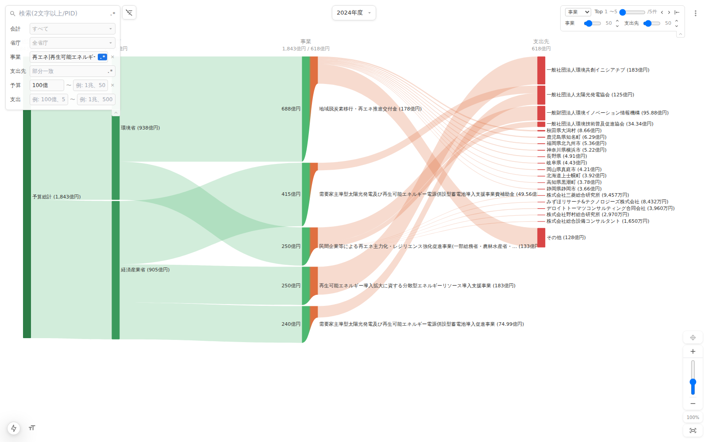

# 実験①: エージェント自律探索レポート — 再エネ関連の大型事業とデータ品質

日時: 2026-07-02
位置づけ: [20260702_1537_検討メモ](20260702_1537_エージェント自律探索レポートと予算組み替えシミュレーション検討メモ.md) の「1. 自律探索レポート」の初回実走。エージェント（Claude Code）がローカルサイト（`http://localhost:3000`）の公開APIのみを使い、探索→レポートまでを自律実行した。

依頼文（想定）: **「再エネ関連の大型事業を調べて、データ品質の懸念も含めてレポートして」**

---

## レポート本体（エージェントの成果物）

### 調査方法

`/api/sankey/query` で事業名 `再エネ|再生可能エネルギー`（正規表現）+ 予算100億円以上に絞り込み、マッチした5事業について品質スコア・事業概要・再委託構造・支出先逆引きAPIで深掘りした。データは2024事業年度（= **2023年度予算の執行実績**）、金額は1円単位を億円換算で表記。

### サンキー図



対話用URL（ローカル）:

```text
/sankey-svg?yr=2024&fp=1&fnp=再エネ|再生可能エネルギー&fnpr=1&fmb=100億
```

### 全体像

| 項目 | 値 |
|------|-----|
| 対象事業 | 5事業（環境省2・経済産業省3） |
| 予算合計 | 1,843億円 |
| 支出合計（把握分） | 618億円 |
| 支出先 | 20先 |

| pid | 事業名 | 府省庁 | 予算 | 支出 | 品質スコア※ |
|-----|--------|--------|------|------|------------|
| 1900 | 地域脱炭素移行・再エネ推進交付金 | 環境省 | 688億 | 178億 | **76.1** |
| 7118 | 需要家主導型太陽光発電…導入支援事業費補助金 | 経産省 | 415億 | 50億 | 94 |
| 4752 | 民間企業等による再エネ主力化・レジリエンス強化促進事業 | 環境省 | 250億 | 133億 | 88.6 |
| 7262 | 再エネ導入拡大に資する分散型エネルギーリソース導入支援事業 | 経産省 | 250億 | 183億 | 86.7 |
| 6029 | 需要家主導型太陽光発電…導入促進事業 | 経産省 | 240億 | 75億 | 94 |

※ 全5,003事業の平均スコアは88.0

### 発見1: 最大の事業ほど資金の行き先が見えない（pid=1900）

予算最大の「地域脱炭素移行・再エネ推進交付金」（688億円、2022年開始、環境省大臣官房）は品質スコア76.1と平均を大きく下回る。支出178億円の内訳:

- **「その他」名義が127.6億円（支出の72%）** — 支出先名が文字通り「その他」と報告されており（86.1億+41.5億の2行、法人番号なし・判定invalid）、資金の行き先を事実上追跡できない
- 名前が判明するのは北海道上士幌町・秋田県大潟村・横浜市など**地方自治体12件・計約50億円**のみ

交付金という制度上、多数の自治体への少額交付が「その他」に集約された可能性が高いが、688億円規模の事業で7割が不透明なのはレビューデータとして大きな品質懸念。

### 発見2: 補助金執行は少数の一般社団法人に集中している

5事業の支出先上位は事業会社ではなく**補助金執行団体**が占める:

- **一般社団法人環境共創イニシアチブ（SII）**: 本件では pid=7262 の183億円のほぼ全額を受領。逆引きの結果、SIIは2024年度に**府省庁横断で18事業・直接受注1,747億円**（経産省15事業1,542億+環境省3事業206億）を受ける補助金執行の中核ハブと判明
- **一般社団法人太陽光発電協会**: 「需要家主導型」2事業（6029・7118、予算計655億）の支出は**各1先のみ**で、計約125億円が同協会に流れる

### 発見3: 「支出先1件・スコア94」の解釈には注意が要る

6029・7118は品質スコア94（法人番号100%・不透明0%）だが、これは「協会1団体への支出が完全に記録されている」ことを意味するに過ぎない。**その先（協会→個々の採択事業者）はレビューデータの再委託情報に現れず**（両事業とも再委託なし・深度0）、実質的な資金の流れの解像度はスコアほど高くない。スコアは「報告の形式品質」であり「資金経路の透明性」そのものではない。

### データ留意事項

- 対象は行政事業レビュー対象事業のみ（国の全予算の約27%。国債費・地方交付税等を含まない）
- 「その他」（支出先名としての報告）と「その他の支出先」（表示件数制限による集約ノード）は別物。本レポートの127.6億円は前者
- 予算と支出の差（1,843億 vs 618億）には翌年度繰越・基金積み残し・支出先未報告分が含まれ、「未執行」とは限らない

---

## 実験観察（メタ: 公開判断・API改善の材料）

### API呼び出し実績

計13回（内訳: sankey/query 1、quality-scores 1、project-details 5、subcontracts 2、search/recipients 1、recipients/[key] 1、quality-scores/recipients 1、疎通確認 1）。1レポートあたり10〜15回が目安になりそう。

### うまく機能した点

- **summary → 深掘りの連鎖**: query API の summary（件数・上位・pid）だけで深掘り対象を決められた。`detail=full` は不要だった
- **HATEOAS リンク**: search/recipients の応答に `links.recipient` があり、逆引きAPIへ迷わず遷移できた
- **metadata.notes の効果**: 「その他」の二義性・予算年度のズレを notes の記載どおりに正しく解釈できた（レポートの留意事項に反映）

### 見つかったギャップ

1. **quality-scores に pid フィルタがない** — 5事業のスコアを得るために全5,003件（数MB）を取得した。`?pids=1900,4752,...` があれば数KBで済む。公開時の帯域・レイテンシ課題
2. **summary の top は10件固定** — 今回は5事業で足りたが、マッチが数十件の調査では pid 一覧の取得手段が別途必要になる（`detail=full` から拾うか、top件数の指定パラメータか）
3. **「支出先1件」構造の先が見えない** — 発見3のとおり、基金・執行団体経由の事業は subcontracts データにも先がなく、探索がそこで止まる。データ自体の限界（レビューシートの報告範囲）でありAPIでは解決できないが、notes への明記を検討する価値あり
4. **品質スコアの意味の注記** — スコアが「形式品質」であることをエージェントが誤読しかけた（発見3で自力補正）。quality-scores API の notes に一文足すとよい

### 結論

**実験①は成功**。既存API群のみで「自然言語の依頼 → 探索 → 図と数値を伴う調査レポート」が完結した。フィルタクエリAPIは探索の起点（全体像の数値化と対象特定）として機能し、探索チェーンの中で唯一図（webView）に接続できる要でもあった。
